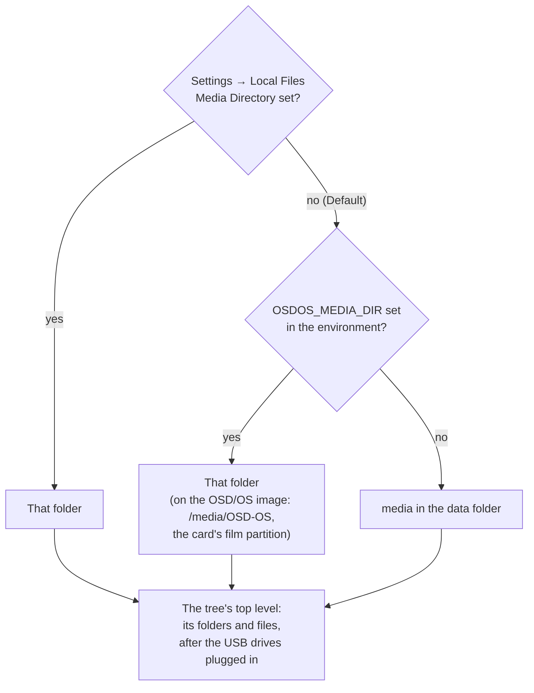

# Local Files

Local Files plays the films, videos, photos and playlists you keep yourself: in a folder on the device, on the OSD/OS image's own film partition, or on a USB drive plugged in. You browse them as a horizontal tree, the way a deck's menu would show a shelf of tapes, and the tree opens on what you played last. This page covers what it plays, where it looks, every screen and option, how playback behaves, every setting with its config key, the files it keeps, and what to do when something doesn't show up.

Local Files is on by default. Its code is in [modules/local_files](https://github.com/mehmetraif/OSD-OS/tree/main/modules/local_files) (views and manifest) and [src/modules/local_files](https://github.com/mehmetraif/OSD-OS/tree/main/src/modules/local_files) (the backend).

<table>
<tr><th width="50%">Recently Watched</th><th width="50%">Favorites</th></tr>
<tr><td></td><td></td></tr>
<tr><td>The tree opens on what you played last, then Favorites, Search and your folders. The entry under the cursor branches out to its contents in full; the other folders' branches are faint.</td><td>Files and playlists you marked from their options.</td></tr>
</table>

## What it plays

| Kind | File types | Notes |
|---|---|---|
| Video | `mp4` `mkv` `avi` `mov` `m4v` `webm` `wmv` `flv` `f4v` `mpg` `mpeg` `vob` | Played by mpv, so any codec your mpv decodes |
| Still image | `jpg` `jpeg` `png` `gif` `webp` `bmp` `tif` `tiff` | Shown for **Image Duration**, see [Still images](#still-images) |
| Playlist | `m3u` `m3u8` | Played in order or shuffled, see [Playlists (m3u)](#playlists-m3u-and-m3u8) |

- The extension decides, in any case (`FILM.MKV` counts). A file with any other extension (`.ts`, `.m2ts`, `.iso`, an audio file) is not listed. mpv plays what an m3u names whatever its extension, so a `.ts` recording plays when an m3u lists it.
- Hidden files and folders (names starting with a dot) are left out, and so are the file systems' own folders: `lost+found`, `System Volume Information` and `$RECYCLE.BIN`.
- Folders come first, then files, each sorted by name.

## Where it looks



### The media folder

**Settings → Local Files → Media Directory** names the folder Local Files shows. Until you pick one it reads **Default**, which is:

| Where OSD/OS runs | Default media folder |
|---|---|
| The OSD/OS image | `/media/OSD-OS`, the card's own **OSD-OS** partition (see [below](#the-film-partition-on-the-osdos-image)) |
| Raspberry Pi OS, Linux, SteamOS | `~/.local/share/OSD-OS/media` |
| macOS | `~/Library/Application Support/OSD-OS/media` |
| Any of them, with `DATA_ROOT` set | `media` in that folder |

The image sets the environment variable `OSDOS_MEDIA_DIR=/media/OSD-OS` for the app's service (`/etc/systemd/system/osdos.service.d/osdos-media.conf`); OSD/OS takes it as the default whenever it is set (and `MP240_MEDIA_DIR`, 240-MP's name for it, when it isn't). The folder is created if it isn't there.

Selecting **Media Directory** opens the folder picker: the same tree you browse Local Files with, starting from the places there are on the system.

| Place | Folder | There on |
|---|---|---|
| **Default Folder** | (saves the default above) | everywhere |
| Home | your home folder | everywhere |
| Media | `/media` (the image's OSD-OS partition and USB drives, udisks' drives on a desktop) | Linux |
| Drives | `/run/media/<user>` | Linux desktops that mount there |
| Volumes | `/Volumes` | macOS |
| Root | `/` | everywhere |

Each folder's first entry is **Use This Folder**, which picks the folder it is in. Back at the top leaves the setting as it was. The new folder is used at once: the tree, the search and the USB drive list all follow it.

<table>
<tr><th width="50%">A module's settings</th><th width="50%">Picking a folder</th></tr>
<tr><td></td><td></td></tr>
<tr><td>Local Files: its folder, looping, shuffle, resume, subtitles, and its own Scaling.</td><td>Folders are picked on the same tree Local Files is browsed with, from home, the drives and the root down: USE THIS FOLDER picks the one open, Default Folder the module's own.</td></tr>
</table>

### The film partition on the OSD/OS image

On its first boot the [OSD/OS image](https://github.com/mehmetraif/OSD-OS/wiki/The-OSD-OS-Image) keeps 8 GiB of the card for the system and turns the rest into a partition of its own, in exFAT, labelled **OSD-OS**. Windows and macOS read exFAT, so films go onto the card from any computer:

1. Quit OSD/OS (Settings → Quit; on the image, **Power Off**) and take the card out.
2. Put it in the computer's card reader. It shows up as two drives, **bootfs** and **OSD-OS**. Copy your films onto **OSD-OS**, in folders if you like.
3. Windows also offers to format the system's partition, which it can't read. Always answer **Cancel**: formatting it erases the system.
4. Put the card back in the Pi. Local Files opens **OSD-OS** until Media Directory names another folder.

How it is mounted (`/etc/fstab`): at `/media/OSD-OS`, read-write (the Playlists module downloads offline videos into it), `noexec,nosuid,nodev` (nothing on it can run), owned by the user the app runs as, and checked with `fsck.exfat` at every boot before it is mounted, in case the Pi was switched off at the wall mid-download. A card with less than 2 GiB to spare past the system gets no film partition; `/media/OSD-OS` is then an ordinary folder on the system's partition. The image's [os/README.md](https://github.com/mehmetraif/OSD-OS/blob/main/os/README.md#films-on-the-card) has the details.

### USB drives

A USB stick, disk or card reader plugged in shows up at the top of the tree, after Recently Watched, Favorites and Search, as a folder named after its label: `USB: KINGSTON`. Pulled out, its row goes, and any folders open on it close back to the top. The cursor stays on the entry it was on while rows come and go above it.

What counts as a drive (`RemovableDrives`):

- **Linux:** a block device (`/dev/…`) mounted under `/media/` or `/run/media/`, read from the kernel's mount table (`/proc/self/mountinfo`), which OSD/OS watches, so a drive appears the moment it is mounted. That covers the image's `/media/usb/<label>` and a desktop's `/media/<user>/<label>` or `/run/media/<user>/<label>`.
- **macOS:** a volume mounted under `/Volumes/`.
- **Never:** a mount that `/etc/fstab` makes (the image's own OSD-OS partition), the drive that holds the media folder, or one mounted inside it: the tree shows those already. A drive mounted twice is listed once.

On the **OSD/OS image** a drive is mounted by itself as it is plugged in, **read-only**, under `/media/usb/<label>`, so it can be pulled out at any moment, mid-film included, with nothing half written. It reads FAT32, exFAT, NTFS, ext2/3/4, HFS+, XFS, btrfs, F2FS, ISO 9660 and UDF. Two drives with one label: the second is named after its device too (`KINGSTON (sdb1)`). A drive without a label is named after its UUID. To see what a drive was mounted as, or why it wasn't:

```sh
journalctl -u 'osdos-usb-mount@*'
```

A manual install on Raspberry Pi OS Lite mounts nothing by itself; a drive you mount under `/media` some other way is still listed. On a desktop or a Mac, whatever the system mounts is there.

A video playing from a drive that is pulled out ends the way a video that fails does (mpv gets read errors). A drive's files drop out of Recently Watched and Favorites while it is out, and come back when it is plugged in again.

## The tree

<table>
<tr><th width="50%">Folders</th><th width="50%">Back to the menus</th></tr>
<tr><td></td><td></td></tr>
<tr><td>The open folders run along the line through the middle. The folder under the cursor branches out once more: Action › Rambo Movies › its films.</td><td>With Transparent Background the tree lies over a video playing on behind it.</td></tr>
</table>

The folders you have opened run left to right along a line through the middle of the screen. Every folder in the one you are in branches off to the right on a dotted line to all of its entries, and the folder under the cursor branches once more, from each folder in it. Only the branches of the folder under the cursor are drawn in full; the others are faint, so whole folders side by side don't run together. An empty folder has no branch, but the folder under the cursor says `(empty)`. The title bar names the open folder.

| Action | Keyboard | Gamepad | What it does |
|---|---|---|---|
| Move | ▲ ▼ | D-pad up, down | The entry above or below; the list wraps round |
| Open | ► or Enter | D-pad right, or the bottom face button (A on an Xbox pad) | Opens the folder under the cursor |
| Close | ◄, Esc or Backspace | D-pad left, or the right face button (B on an Xbox pad) | Closes the open folder; at the top, back leaves Local Files |
| Play | Enter | Bottom face button | Plays the file under the cursor |
| Options | ► | D-pad right | On a file: its [options](#options) |

The hint bar at the foot says what select does on the entry under the cursor: `OPEN` on a folder, `PLAY` on a file, `SEARCH` on Search. A gamepad's own button names replace the keyboard's there as soon as you use it.

### What the top level holds

In this order:

1. **Recently Watched**
2. **Favorites**
3. **Search**
4. The USB drives plugged in, `USB: <label>`, by name
5. The media folder's folders, then its files

The first three are there whenever anything else is (a drive alone is enough). With an empty media folder and no drive, the screen reads **No items found — Please add items in the local files media directory**.

### Recently Watched

What you played, newest first: a file goes to the top of the list as it starts, and the list keeps the last 30. Entries whose file has gone (deleted, or on a drive that is out) are hidden, not forgotten: they come back with the drive. A file played from Search, a USB drive or a playlist folder lands here too, so it is one step away next time.

### Favorites

The files and playlists you marked, newest first, up to 100. Add or remove one from its [options](#options) or from the [player's menu](#the-players-menu). Favorites are kept per module, so a YouTube favourite never shows up here. Like Recently Watched, an entry whose file is gone is hidden until it is back.

### Search

<table>
<tr><th width="50%">Search</th><th width="50%">Search results</th></tr>
<tr><td></td><td></td></tr>
<tr><td>An on-screen keyboard: the arrows move, select types.</td><td>Names that match anywhere under the media folder.</td></tr>
</table>

Select on **Search** opens the on-screen keyboard, titled **Search Local Files**: the letters A to Z, the digits and `-` `'` `.` `&`, with **SPACE**, **DEL** and **OK** on the last row. The arrows move the box, select types the key in it, back cancels. A real keyboard types straight in, and the box then jumps to **OK**, so Enter finishes; Backspace deletes. Up to 40 characters.

What it searches:

- **Names, not paths.** Every file and folder name under the media folder, then under each USB drive plugged in, at any depth.
- **Every word must match.** The words you type are split at spaces; a name matches when it contains every one of them, upper or lower case alike. `kill vol` finds `Kill Bill Vol 1 (2003).mp4` and `Kill Bill Vol 2 (2004).mp4`.
- **Folders and media files.** A matching folder is listed (open it to browse it), and so is a matching file of a type Local Files plays. Other files are skipped, and so are hidden ones.
- **Not through symbolic links.** A symlinked folder inside the media folder can be browsed, but Search doesn't walk into it (a link pointing back up would never end).
- **The first 200, by name.** It keeps the 200 matches that come first alphabetically. When a search finds more, type more words.

The results open as a folder of their own, `Search: <words>`, at the end of the open folders, with `loading…` while the search runs. It runs in the background, so a big library never holds the screen still; a new search, or a new media folder, cancels one under way. Each search starts afresh, so it sees files added since the last one.

### Folders

Any folder of the media folder or a drive. Select or ► opens it; ◄ or back closes it again. Coming back from a video lands in the same folders, on the same entry.

### Playlists (m3u and m3u8)

An `.m3u` or `.m3u8` file is played as one item: mpv plays its entries in turn, in order or shuffled (**Shuffle Playback**), looping or not (**Loop Playback**). An entry can be:

- a path relative to the playlist's own folder (mpv resolves it from there), or an absolute path;
- a video, a still image (shown for **Image Duration**), or any other file mpv plays, whatever its extension.

Lines starting with `#` (`#EXTM3U`, `#EXTINF:…`) are comments to OSD/OS; mpv reads the titles from `#EXTINF` lines. Local Files passes no YouTube support to mpv (its yt-dlp hook is off here), so YouTube links in an m3u don't play: put YouTube videos on a [Playlists](https://github.com/mehmetraif/OSD-OS/wiki/Playlists) list instead.

**A playlist folder.** A folder whose name ends in `.m3u` or `.m3u8`, and that holds a playlist of the same name, shows up as that playlist rather than as a folder: `Anime Night.m3u/Anime Night.m3u` is listed as `Anime Night.m3u`, and select plays it. Keep a playlist's videos in that folder beside it and refer to them by name; the whole set then moves as one folder. See the [example](#a-playlist-folder).

During playback, the deck's menu (▲ or ▼) has **<** and **>** buttons for the previous and next entry whenever the playlist holds more than one.

### Hide File Extensions

With **Hide File Extensions** on, the tree shows `Terminator 2 (1991)` rather than `Terminator 2 (1991).mp4`. Folder names are left whole. The player's menu, the resume question and the main menu's row always leave the extension out.

## Options


► on a file (or a playlist) offers its options. Folders have none: ► opens them.

| Option | What it does |
|---|---|
| **Add to Favorites** / **Remove from Favorites** | Puts the file on Favorites, or takes it off. Taking off the file that plays at startup turns Play at Startup off too |
| **Play at Startup** / **Don't Play at Startup** | Makes the file the one OSD/OS plays straight after the boot screen, ahead of Settings → Start on Module. It goes on Favorites too. There is one for the whole app: choosing another replaces it |
| **Add to Playlist** | Puts the file on one of the [Playlists](https://github.com/mehmetraif/OSD-OS/wiki/Playlists) module's lists, or on a new one. Offered while the Playlists module is on |

The favourite played at startup begins without asking: where it was stopped, or from the beginning, as **Settings → Startup From** says (Resume or Beginning; the row shows while there is a startup favourite). **Settings → Play at Startup** shows which file it is and can only turn it off. It plays only while it is still one of Local Files' favourites.

## Playing a file

<table>
<tr><th width="50%">Resume</th><th width="50%">Loading</th></tr>
<tr><td></td><td></td></tr>
<tr><td>Pick up where you left off, or start from the beginning.</td><td>While a video starts, a tape loads. Settings → Loading Effect turns the noise off.</td></tr>
</table>

Select on a file puts it at the top of Recently Watched and hands it to mpv, full screen. While mpv starts, the loading screen shows a dubbing deck's display, with **LOCAL FILES** as the source.

### Where it starts

| Situation | What happens |
|---|---|
| The file is already playing behind the menus (Transparent Background) | It comes back full screen where it is, without asking |
| A playlist, with **Shuffle Playback** on **Always** | Shuffled, from the start (a shuffled list has no place to resume) |
| A single still image | Shown at once |
| The favourite played at startup | No question: **Startup From** decides |
| A saved position, **Resume Playback** on **Ask** | **Resume playback?** `Resume from 1:23` / `Start from the beginning`. For a playlist: `Resume video 3 at 1:23`, plus `Shuffle` when Shuffle Playback is Ask (the question then reads **Start playback?**) |
| A saved position, **Resume Playback** on **Always** | Resumes at once. A playlist with Shuffle Playback on Ask still asks: `Resume video 3 at 1:23` / `Shuffle` |
| No saved position (or **Resume Playback** on **Never**), a playlist with Shuffle Playback on **Ask** | **Start playback?** `Play in order` / `Shuffle` |
| Anything else | Plays from the beginning |

Back on the question leaves it without playing.

### Resume

OSD/OS keeps where each file was stopped, in `local_files_history.json` in the data folder:

- **A single video:** stopped after its first 5 seconds, the position is saved; stopped in its last 5% (or played to the end), the saved position is cleared, so it starts from the beginning next time.
- **A playlist:** the entry it was on and the position in it are saved whenever it stops before its end; played right through, its place is cleared.
- **A still image** keeps no position.

**Resume Playback** only decides whether to ask: positions are saved on **Never** too.

### Shuffle and loop

- **Shuffle Playback** applies to playlists only: **Ask** (the default) asks each time a playlist starts, **Always** shuffles without asking, **Never** plays in order. mpv does the shuffling (`--shuffle`).
- **Loop Playback** repeats a single file, or a playlist from its first entry, until you stop it (`--loop-playlist=inf`). A single still image then stays on screen until you stop it.

### Subtitles and audio tracks

**Auto Show Subtitles** decides which subtitles show as a video starts. **Subtitle Language** picks the language mpv looks for first.

| Auto Show Subtitles | What mpv is told | What you see |
|---|---|---|
| **Forced Only** (default) | `--subs-with-matching-audio=forced --subs-fallback-forced=always` | Only subtitles for dialogue in another language, where the file marks them forced |
| **On** | `--subs-with-matching-audio=yes --subs-fallback=yes --sid=auto` | A subtitle track always, even when it is in the language spoken |
| **Off** | `--sid=no` | None |

**Subtitle Language** is **Any** (no preference, the default) or one of 183 languages; the chosen one goes to mpv as `--slang=<code>` (`en` for English, `tr` for Turkish).

mpv also loads a subtitle file that sits beside the video under the same name (`Film.srt` or `Film.en.srt` next to `Film.mkv`): that is mpv's own default (`sub-auto=exact`), which OSD/OS leaves alone.

The audio track is mpv's choice (the file's default, or an `alang=` line in your `mpv.conf`, which an mpv process reads but libmpv with Transparent Background doesn't). During playback, ▲ or ▼ opens the deck's menu, whose **AUDIO** and **SUBTITLE** buttons step through the tracks the file has.


The deck's menu has the position bar (◄ ► seek 10 seconds while it is selected), then **AUDIO**, **SUBTITLE** (when the file has subtitles), **CROP** (the four Scalings in turn), **<** **>** (in a playlist) and **STOP**. It hides itself after 5 seconds. [Playback and mpv](https://github.com/mehmetraif/OSD-OS/wiki/Playback-and-mpv) has the rest of what the keys do during a video.

### Still images

A still image is shown for **Image Duration** (5, 10, 30 or 60 seconds; mpv's `--image-display-duration`), then mpv moves on: to the playlist's next entry, or, for an image chosen on its own, back to the tree. An animated GIF plays as a clip. A playlist of images is a slideshow; Shuffle Playback shuffles it and Loop Playback runs it round for good. For image content OSD/OS also loads `scripts/mpv-slideshow-redraw.lua`, without which mpv drawing straight to a Pi's screen (`--vo=drm`) wouldn't redraw between two pictures of the same size. A still image never moves mpv's clock, so the loading screen is taken down as soon as an image is handed to mpv.

### Scaling

**Scaling** sets how a 16:9 picture fills a 4:3 screen in Local Files only. **Default** follows **Settings → Scaling** (Letterbox unless changed); the others are:

| Scaling | mpv flag | What you see |
|---|---|---|
| Letterbox | (none) | All of the picture, bars above and below |
| 14:9 | `--panscan=0.43` | A little of the sides cut, thinner bars |
| Pan & Scan | `--panscan=1` | Fills the screen, the sides cut |
| Anamorphic | `--keepaspect=no` | Fills the screen squeezed, for a TV set to 16:9 |

It applies from the next video, or at once from the player's menu. The deck's **CROP** button steps through the four during playback without saving anything.

## The player's menu

<table>
<tr><th width="50%">The video's menu</th><th width="50%">Main menu</th></tr>
<tr><td></td><td></td></tr>
<tr><td>With Transparent Background, back during a video opens its menu over the picture, which plays on. ◄ ► change its module's settings for it, at once or as you go back to it. Close Video goes to the main menu; back, to the video.</td><td>The main menu leads with the video, the cursor on it: select takes it back to full screen where it is. Play/pause stops it (<code>[SPACE]:STOP</code>).</td></tr>
</table>

Back during a video (with the deck's menu closed) opens the video's own menu:

| Line | What it does |
|---|---|
| **Auto Show Subtitles** | ◄ ► change the module setting; the video reloads where it is as you go back to it |
| **Subtitle Language** | The same |
| **Loop Playback** | ◄ ► change it; with Transparent Background the playing video takes it at once |
| **Scaling** | ◄ ► change it; with Transparent Background the picture takes it at once |
| **Add to Favorites** / **Remove from Favorites** | As in the file's options |
| **Play at Startup** / **Don't Play at Startup** | As in the file's options |
| **Browse Local Files** | Back to the tree |
| **Close Video** | Stops the video and leaves Local Files for the main menu |

Back in the menu returns to the video. Every setting changed here is saved, as if changed in Settings → Local Files, so it holds for the next file too.

**With Transparent Background** (Settings → Transparent Background, which needs libmpv) the menu lies over the picture, which plays on, at the solidity the setting's slider gives. **Browse Local Files** returns to the tree with the video still playing behind it; the main menu then leads with a row for it, `► <title>`, and choosing that row, or the same file in the tree, takes it back to full screen where it is. Play/pause on the main menu stops it.

**Without Transparent Background** mpv has the whole screen while it plays, so the video stops for the menu: its position is saved, the menu shows on the app's own background, and as you go back to the video it starts again from where it was, with the settings as you left them. **Close Video** returns to the main menu. **Browse Local Files** returns to the tree, and the main menu then leads with a row for the file, `► <title>`, the cursor on it: choosing that row, or the same file in the tree, starts it again where it was, without asking (a playlist at the video it was on; a shuffled one starts shuffled afresh). The row stays until mpv plays another video.

## Settings

Settings → Local Files (in the Modules section of Settings).

| Setting | Values | Default | What it does | Config key |
|---|---|---|---|---|
| ENABLED | ON, OFF | ON | Shows Local Files on the main menu | `modules.com.osdos.local_files.enabled` |
| Media Directory | a folder, or Default | Default | The folder Local Files shows. Default: the card's OSD-OS partition on the image, `media` in the data folder elsewhere | `modules.com.osdos.local_files.media_directory` |
| Loop Playback | ON, OFF | OFF | Repeats a file, or a playlist from its first entry, until stopped | `modules.com.osdos.local_files.loop_playback` |
| Shuffle Playback | Ask, Always, Never | Ask | Plays playlists in random order; Ask asks each time a playlist starts | `modules.com.osdos.local_files.shuffle_playback` |
| Resume Playback | Ask, Always, Never | Ask | Whether a video carries on where it was stopped: asks, always does, or never does | `modules.com.osdos.local_files.resume_playback` |
| Auto Show Subtitles | Forced Only, On, Off | Forced Only | Which subtitles show as a video starts; Forced Only shows them for foreign dialogue only | `modules.com.osdos.local_files.auto_subtitles` |
| Subtitle Language | Any, or a language | Any | The subtitle language mpv picks first; Any is no preference | `modules.com.osdos.local_files.sub_lang` |
| Image Duration | 5, 10, 30, 60 Seconds | 5 Seconds | How long a still image is shown before moving on, alone or in a playlist | `modules.com.osdos.local_files.image_duration` |
| Hide File Extensions | ON, OFF | OFF | Leaves `.mkv` and the like off the names in the tree | `modules.com.osdos.local_files.hide_extensions` |
| Scaling | Default, Letterbox, 14:9, Pan & Scan, Anamorphic | Default | How a 16:9 picture fills the 4:3 screen in this module; Default follows Settings → Scaling | `modules.com.osdos.local_files.video_scaling` |

### How the values are saved

`config.json` is in the data folder (`~/.local/share/OSD-OS/` on Linux and the image, `~/Library/Application Support/OSD-OS/` on a Mac, or `$DATA_ROOT`). See [Configuration Files](https://github.com/mehmetraif/OSD-OS/wiki/Configuration-Files) for the whole file.

| Key | Saved as |
|---|---|
| `enabled`, `loop_playback`, `hide_extensions` | `true` or `false` |
| `media_directory` | a folder's full path; `""` for the default |
| `shuffle_playback` | `"ask"`, `"yes"` (Always) or `"no"` (Never). An older `true` or `false` reads as Always or Never |
| `resume_playback` | `"ask"`, `"yes"` (Always) or `"no"` (Never) |
| `auto_subtitles` | `"forced"`, `"on"` or `"off"`. An older `true` reads as On, `false` as Forced Only |
| `sub_lang` | `"-"` (Any) or a two-letter ISO 639-1 code: `"en"`, `"de"`, `"tr"`… |
| `image_duration` | `"5"`, `"10"`, `"30"` or `"60"` |
| `video_scaling` | `"Default"`, `"Letterbox"`, `"14:9"`, `"Pan & Scan"` or `"Anamorphic"` |

Two app settings belong with Local Files too: `app.startup_favorite` (the file played at startup: `{ "module", "path", "name" }`, or `""` for none) and `app.startup_from` (`"Resume"`, the default, or `"Beginning"`).

## Files it keeps

All in the data folder, each written whole (a power cut mid-save leaves the old file, never half of one).

| File | What is in it |
|---|---|
| `config.json` | The settings above, under `modules.com.osdos.local_files` |
| `lists.json` | Recently Watched (`recent`) and Favorites (`favorites`), under `com.osdos.local_files`, newest first. Netflix and Prime Video keep theirs in the same file, and YouTube its Favorites (its Recently Watched is `youtube_history.json`) |
| `local_files_history.json` | Where each file was stopped: `pos` (milliseconds) and `plPos` (the playlist entry, counted from 0; `-1` for a single file), by path |

`lists.json`, indented here (the app writes it on one line):

```json
{
    "com.osdos.local_files": {
        "favorites": [
            { "isFolder": false, "name": "Rambo Marathon.m3u", "path": "/media/OSD-OS/Rambo Marathon.m3u" },
            { "isFolder": false, "name": "Your Name (2016).mp4", "path": "/media/OSD-OS/Anime/Your Name (2016).mp4" }
        ],
        "recent": [
            { "isFolder": false, "name": "Spirited Away (2001).mp4", "path": "/media/OSD-OS/Anime/Spirited Away (2001).mp4" },
            { "isFolder": false, "name": "Terminator 2 (1991).mp4", "path": "/media/usb/KINGSTON/Sci-Fi/Terminator 2 (1991).mp4" }
        ]
    }
}
```

`local_files_history.json`, indented here too:

```json
{
    "/media/OSD-OS/Anime/Spirited Away (2001).mp4": { "plPos": -1, "pos": 4354000 },
    "/media/OSD-OS/Rambo Marathon.m3u": { "plPos": 2, "pos": 61000 }
}
```

The first resumes 1 hour 12 minutes 34 seconds in (`Resume from 1:12:34`, as above); the second at 1:01 into its third entry (`Resume video 3 at 1:01`). Delete a line to forget a position, or the file to forget them all.

## Examples

### A media folder laid out for the tree

```text
/media/OSD-OS/
├── Action/
│   ├── Rambo Movies/
│   │   ├── Rambo - First Blood (1982).mp4
│   │   ├── Rambo - First Blood Part II (1985).mp4
│   │   └── Rambo III (1988).mp4
│   ├── Cliffhanger (1993).mp4
│   └── Kill Bill Vol 1 (2003).mp4
├── Anime/
│   ├── Spirited Away (2001).mp4
│   └── Your Name (2016).mp4
├── Photos/
│   └── Station Card.png
├── Rambo Marathon.m3u
└── Sci-Fi/
    ├── RoboCop (1987).mp4
    └── Terminator 2 (1991).mp4
```

### An m3u playlist

`/media/OSD-OS/Rambo Marathon.m3u`, mixing relative paths (from the playlist's folder), an absolute path, a still image and a `.ts` recording Local Files wouldn't list on its own:

```text
#EXTM3U
#EXTINF:-1,Station card
Photos/Station Card.png
#EXTINF:-1,Rambo - First Blood (1982)
Action/Rambo Movies/Rambo - First Blood (1982).mp4
#EXTINF:-1,Rambo - First Blood Part II (1985)
Action/Rambo Movies/Rambo - First Blood Part II (1985).mp4
#EXTINF:-1,Rambo III (1988)
/media/OSD-OS/Action/Rambo Movies/Rambo III (1988).mp4
#EXTINF:-1,Rambo (2008), recorded off air
/media/usb/KINGSTON/Recordings/Rambo (2008).ts
```

Save it as UTF-8 (`.m3u8` is the usual extension for a UTF-8 playlist). The station card shows for Image Duration, then the list moves on; the last entry plays only while the drive is in.

### A playlist folder

```text
/media/OSD-OS/
└── Anime Night.m3u/                      ← a folder
    ├── Anime Night.m3u                   ← the playlist, of the same name
    ├── 01 My Neighbor Totoro (1988).mp4
    ├── 02 Kiki's Delivery Service (1989).mp4
    └── 03 Spirited Away (2001).mp4
```

with `Anime Night.m3u` inside it reading:

```text
#EXTM3U
01 My Neighbor Totoro (1988).mp4
02 Kiki's Delivery Service (1989).mp4
03 Spirited Away (2001).mp4
```

The tree lists the folder as the playlist `Anime Night.m3u`; select plays it, ► offers its options.

### The module's settings in config.json

```json
{
    "modules": {
        "com.osdos.local_files": {
            "enabled": true,
            "media_directory": "/media/OSD-OS/Films",
            "loop_playback": false,
            "shuffle_playback": "ask",
            "resume_playback": "yes",
            "auto_subtitles": "on",
            "sub_lang": "en",
            "image_duration": "10",
            "hide_extensions": true,
            "video_scaling": "14:9"
        }
    }
}
```

This is the `modules` part of `config.json`; the file also has an `app` part and the other modules' settings, which stay as they are. The app writes the keys in alphabetical order; any order reads the same. Edit the file with OSD/OS stopped (`sudo systemctl stop osdos`, then `sudo systemctl start osdos`, or Settings → Quit → Exit to Terminal): the media folder is read as the app starts, and a file that isn't valid JSON is read as empty, after which the next setting saved writes the defaults over everything. Check it first:

```sh
python3 -m json.tool ~/.local/share/OSD-OS/config.json > /dev/null && echo OK
```

### A favourite that plays at startup

The usual way is ► on the file, **Play at Startup**. By hand, the file must be on Favorites in `lists.json` as well, and `config.json` holds:

```json
{
    "app": {
        "startup_favorite": {
            "module": "com.osdos.local_files",
            "name": "Rambo Marathon.m3u",
            "path": "/media/OSD-OS/Rambo Marathon.m3u"
        },
        "startup_from": "Beginning"
    }
}
```

### Another default folder for a manual install

On Raspberry Pi OS with `scripts/install.sh`, the default is `~/.local/share/OSD-OS/media`. Setting Media Directory is the simple way to change it. To change the default itself, give the service the same variable the image gives it:

```ini
# /etc/systemd/system/osdos.service.d/media.conf
[Service]
Environment=OSDOS_MEDIA_DIR=/mnt/films
```

```sh
sudo systemctl daemon-reload
sudo systemctl restart osdos
```

Media Directory, once set, still wins over it.

## Tips

- **Name files the way you want to read them.** The tree shows names as they are on disk, sorted by name: `S01E01 …` sorts episodes, `Kill Bill Vol 1 (2003)` reads better than `Kill.Bill.Vol.1.2003.720p.BluRay`. Turn on Hide File Extensions to drop `.mp4`.
- **Keep a test pattern** in the media folder: it is the quickest way to set up Scaling and Display Output on a CRT ([Display Output](https://github.com/mehmetraif/OSD-OS/wiki/Display-Output)).
- **Use a playlist as a channel.** An m3u of cartoons and ads, with Shuffle Playback on Always and Loop Playback on, plays like a station that never ends; make it Play at Startup and the TV turns on into it.
- **A network share** works when the system mounts it: mount it (fstab or autofs) and point Media Directory at it. Search walks it like any folder, which can take a while on a slow share.
- **A symlink** inside the media folder brings another folder into the tree without moving it (Search won't walk into it, though).
- **Recently Watched as a shelf:** a file played from a USB drive or from Search lands in Recently Watched, one step from the top next time.
- **The Playlists module** can put Local Files' videos on a list with YouTube, Jellyfin and Emby videos: ► on the file, **Add to Playlist**.

## Troubleshooting

| Problem | What to check |
|---|---|
| **No items found** | The media folder is empty, or isn't the one you think: Settings → Local Files → Media Directory shows the path (Default: see [above](#the-media-folder)). On the image, check the films went onto the **OSD-OS** drive, not **bootfs** |
| A file isn't listed | Its extension isn't one of [those Local Files plays](#what-it-plays), or its name starts with a dot. Rename it, or list it in an m3u |
| A USB drive doesn't show | It must be mounted under `/media/` or `/run/media/` (Linux) or `/Volumes/` (Mac), from a `/dev/…` device, and not by `/etc/fstab`. On the image, `journalctl -u 'osdos-usb-mount@*'` says why it wasn't mounted (an encrypted volume, swap or a RAID member is never mounted). A manual Raspberry Pi OS Lite install mounts nothing by itself: mount it under `/media`, or set Media Directory to where it is |
| A drive mounted elsewhere (`/mnt/…`) isn't a `USB:` row | Only `/media/` and `/run/media/` count. Set Media Directory to it instead |
| Search doesn't find a file | It matches names, not folders on the way (search `Season` to find a season folder); every word must be in the name; files inside symlinked folders aren't searched; past 200 matches only the first 200 by name are kept |
| No resume question | The video was stopped in its first 5 seconds or its last 5%, or Resume Playback is Always or Never |
| No subtitles | Auto Show Subtitles is Forced Only (the default), which shows only forced tracks: set it to On. Subtitle Language picks which language comes first. A sidecar `.srt` must have the video's name |
| A playlist entry is skipped | mpv couldn't open it: a relative path is taken from the playlist's own folder; a drive that's out; a YouTube link (not played here) |
| A video won't play at all | mpv writes its log to `/tmp/osdos-mpv.log` (the system's temp folder on a Mac); the app's own log is `journalctl -u osdos -b` with the service. See [Troubleshooting](https://github.com/mehmetraif/OSD-OS/wiki/Troubleshooting) |
| A video from a USB drive stopped | The drive was pulled out, or went to sleep and dropped off; plug it back in and choose the file again (Recently Watched has it) |
| Settings vanished after editing `config.json` | The file had a JSON error when OSD/OS read it. Check it with `python3 -m json.tool` before starting OSD/OS |

## See also

- [Modules](https://github.com/mehmetraif/OSD-OS/wiki/Modules): every module at a glance
- [Playlists](https://github.com/mehmetraif/OSD-OS/wiki/Playlists): lists of Local Files, YouTube, Jellyfin and Emby videos, online or offline
- [The OSD/OS image](https://github.com/mehmetraif/OSD-OS/wiki/The-OSD-OS-Image): the film partition and USB drives
- [Playback and mpv](https://github.com/mehmetraif/OSD-OS/wiki/Playback-and-mpv): the deck menu, Transparent Background and mpv's flags
- [Settings](https://github.com/mehmetraif/OSD-OS/wiki/Settings): Scaling, Transparent Background, Play at Startup and Startup From
- [Controls](https://github.com/mehmetraif/OSD-OS/wiki/Controls): keys, remotes and gamepads
- [Configuration Files](https://github.com/mehmetraif/OSD-OS/wiki/Configuration-Files): `config.json`, `lists.json` and the data folder
- [NFC Reader](https://github.com/mehmetraif/OSD-OS/wiki/NFC-Reader): play a file by tapping a card
- [Troubleshooting](https://github.com/mehmetraif/OSD-OS/wiki/Troubleshooting)
