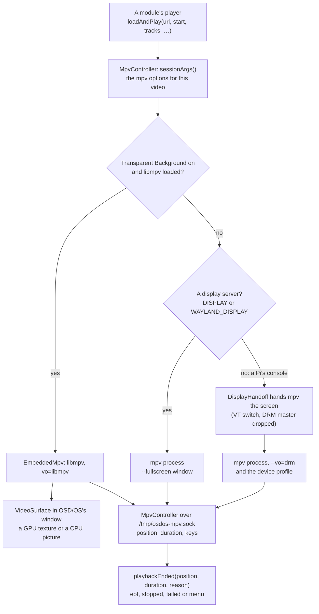

# Playback and mpv

OSD/OS never decodes a video itself: [mpv](https://mpv.io) does. Usually mpv runs as a program of its own, started for each video. With Settings → Transparent Background it runs inside OSD/OS as a library, libmpv, so the menus can lie over the picture. This page covers both ways, the exact flags OSD/OS gives mpv on each device and how to change them, what the modules and the settings add, subtitles, audio tracks and resume points, the loading screen and the channel logo, mpv's own configuration, installing a modern mpv, and what to do when playback goes wrong.

## Two ways to play

| | An mpv process (the default) | Inside the app (Transparent Background) |
|---|---|---|
| What plays | `mpv`, started for each video and ended after it | libmpv, mpv as a library, inside OSD/OS (`EmbeddedMpv`) |
| Who has the screen | mpv. On the OSD/OS image and Raspberry Pi OS Lite, OSD/OS hands it the screen; on a desktop, mpv opens a full-screen window over OSD/OS | OSD/OS, the whole time: the picture is part of its own window (`VideoSurface`) |
| Back during a video | Ends it. A Local Files, YouTube or Playlists video opens its menu instead, then starts again where it was | Returns to the menus, the video playing on behind them |
| Decoder and output flags | The device's profile, or `mpv_video_args` | A list of their own for each device; `mpv_video_args` isn't used |
| Your `~/.config/mpv/mpv.conf` | Read | Not read |
| Needs | mpv | libmpv (`libmpv2`, or Homebrew's mpv on a Mac), in a build made with its headers |


Every video goes through `MpvController` (`src/player/MpvController.cpp`). A module's player calls `mpvController.loadAndPlay(url, start, audio track, subtitle track, …)`, and gets one signal back when the video is over, `playbackEnded(position, duration, reason)`.



## The mpv process

### Starting a video

1. **The menu music stops** first, so the sound card is free when mpv opens it. It comes back once the video is over and the menus want it.
2. **The options are built** (`sessionArgs()`): the same for both ways of playing, up to how the picture is shown ([A full command line](https://github.com/mehmetraif/OSD-OS/wiki/Playback-and-mpv#a-full-command-line-on-a-pi-4)).
3. **A video still playing is told to quit** (SIGTERM), and killed a second later if it is still there. OSD/OS never waits for it on its own thread; a process stuck even past the kill (in a driver, or on a network share that went away) is given up on after five seconds, so the menus come back.
4. **The new one starts 50 ms later**, once the old one has gone and the screen is free again. The delay lets the player's loading screen be drawn first: on a Pi, starting mpv takes the screen at once, and Qt can't draw any more until it is back.
5. **mpv is found**: an `mpv` beside the `osdos` binary first (the AppImage carries its own there), then `mpv` on `PATH`. On a Mac, `/opt/homebrew/bin` and `/usr/local/bin` are added to `PATH` first, so Homebrew's mpv is found even when the app is opened from the Finder. Without one, the log says `[MpvController] mpv not found (no bundled sibling, none on PATH)` and the player goes back.
6. **Where it plays:**
   - **No display server** (Linux with neither `DISPLAY` nor `WAYLAND_DISPLAY`: the OSD/OS image, Raspberry Pi OS Lite). `DisplayHandoff` gives mpv the screen: it switches to a free virtual terminal, which suspends Qt's drawing, drops DRM master and saves the display's state. mpv draws straight to the display (`--vo=drm`). When mpv exits, OSD/OS waits 200 ms for its last frame to clear, takes the screen back and restores it. If another program holds the screen (a takeover script), playback fails with `[MpvController] Cannot start playback: <owner> has the screen`.
   - **A desktop** (X11, Wayland, macOS). mpv opens its own full-screen window (`--fullscreen --no-native-fs`). On Linux with `DISPLAY` set, `WAYLAND_DISPLAY` is removed from mpv's environment, so it runs on X11 or Xwayland: mpv's Wayland output stalls under labwc, Raspberry Pi OS's compositor. With `app.display_index` set, mpv opens on that display too (`--fs-screen` or `--fs-screen-name`).
7. **mpv's environment** gets `APP_ROOT`, and on Linux `FONTCONFIG_FILE=/tmp/osdos-fonts.conf`, so mpv's on-screen menu finds the VCR font in OSD/OS's `assets/fonts`. On a Mac, `--osd-fonts-dir` points mpv at it instead.

### The control channel

Every video's mpv listens on a Unix socket, `--input-ipc-server=/tmp/osdos-mpv.sock`. `MpvController` connects to it (trying every 100 ms until mpv is up), asks to follow four properties, and from then on talks to mpv in JSON lines:

```json
{"command":["observe_property",1,"time-pos"]}
{"command":["observe_property",2,"duration"]}
{"command":["observe_property",3,"playlist-pos"]}
{"command":["observe_property",4,"pause"]}
{"command":["keypress","RIGHT"]}
{"command":["seek",754.2,"absolute+exact"]}
{"command":["set_property","speed",1.5]}
{"command":["quit"]}
```

- **From mpv** come `property-change` events (the position, the length, the place in a playlist, pausing), which the players show and save, and `end-file`, which says why a video ended.
- **Keys reach mpv this way.** On a Pi, mpv reads no keyboard itself (`--no-input-terminal`): the player view gets every key, as it does in the menus, and forwards it as a `keypress`. A gamepad's buttons arrive as the same keys ([Controls](https://github.com/mehmetraif/OSD-OS/wiki/Controls)).
- **Settings changed during a video** go to it with `set_property`: the speed, looping, Scaling's `panscan` and `keepaspect`, the sound card.
- **mpv talks back** with client messages (`script-message`): `osdos-menu` (back, from the key bindings below), and from the deck menu `skip-segment` (SKIP), `cycle-sub` and `cycle-audio` (a stream whose tracks only the server can change).
- **A watchdog** checks every 10 seconds, and warns in the log when no position has come for 30 seconds while the video isn't paused: `[MpvController] WATCHDOG: no IPC time-pos event for 40 s — possible freeze`.

### Back, and the end of a video

OSD/OS writes the key bindings each video's mpv gets into the temporary folder as it starts, `osdos-input.conf` for a process and `osdos-input-embedded.conf` for Transparent Background, both the same three lines:

```text
ESC script-message osdos-menu
BS script-message osdos-menu
ENTER cycle pause
```

`--input-conf` points mpv at that file in place of your own `~/.config/mpv/input.conf`, which isn't read. mpv's built-in bindings stay (Space pauses, ◄ ► seek). While the deck menu is open its own bindings come first, so back closes the menu rather than the video.

Back sends `osdos-menu` to OSD/OS:

- **A process** quits. A player with a menu of its own (Local Files, YouTube, Playlists) is told the video ended for its menu: it saves where it got to, shows the menu on OSD/OS's own background, and starts the video again from there, with the settings as they are now, as the menu closes. Any other player saves where it got to and goes back.
- **Transparent Background**: the video goes on behind the menus ([below](https://github.com/mehmetraif/OSD-OS/wiki/Playback-and-mpv#back-to-the-menus-and-back-to-the-video)).

When the video is over, the player gets `playbackEnded(position, duration, reason)`, once:

| Reason | When |
|---|---|
| `eof` | The video, or the last of a playlist, played to its end. A player may go on: Plex, Jellyfin and Emby can play the next episode (Autoplay Next Episode) |
| `stopped` | It was stopped before the end: back, STOP, a crash or a kill (the safe default) |
| `failed` | mpv couldn't play it: exit code 2, or libmpv's `error`. Plex tries again with a transcode; YouTube says to check yt-dlp |
| `menu` | The process ended for its player's menu (back, above) |

On a display without a server, the signal comes once the screen is OSD/OS's again. An end that comes after another video has been asked for isn't reported: it would read as the new one's.

### Keys during a video

| Action | Keyboard | Gamepad | During a video |
|---|---|---|---|
| ▲ or ▼ | Up, Down | D-pad, left stick | Opens the deck menu |
| ◄ ► | Left, Right | D-pad, left stick, LB, RB | Seeks back or forward (mpv's own keys: 5 seconds) |
| Select | Enter | A | Pauses and plays |
| Play/pause | Space | Start | Pauses and plays |
| Back | Esc, Backspace | B, or the pad's Back/Select button | The video's menu, or back to the module (above) |
| Media keys | Volume, Mute, Play/Pause, Stop, Fast Forward, Rewind, Next, Previous | | Volume up or down by 5, with a VOLUME bar; mute; play/pause; stop; 30 seconds on; 10 seconds back; the next or the previous chapter |


**The deck menu** (`scripts/mpv-osc.lua`; Ambient:Mode has its own, `mpv-osc-ambient.lua`) is drawn by mpv in OSD/OS's letters. At the top it says what plays: `AUDIO:` (the track's name, language, codec, channels and rate), `SUBTITLE:` and `CROP:` (the Scaling in force). Below are the times and the position bar, and a row of buttons. ▲ goes to the bar and ▼ to the buttons; on the bar ◄ ► seek 10 seconds, on the buttons they move between them, and select presses one. It closes again after 5 seconds without a key.

| Button | Shown | What it does |
|---|---|---|
| SKIP | While an intro or credits can be skipped (Jellyfin and Emby, with Intro Skip or Credit Skip on Button) | Skips it |
| AUDIO | Always | The next audio track |
| SUBTITLE | When there are subtitle tracks | The next subtitle track, then none |
| CROP | Unless the Pi 3's overlay path can't crop | The next of the four Scalings, at once |
| `<` `>` | In a playlist | The previous or the next video |
| STOP | Always | Ends the video |

`scripts/mpv-media-keys.lua` handles a keyboard's or a remote's media keys in every video, and `scripts/mpv-screensaver.lua`, loaded only when Settings → Screen Saver isn't OFF, puts the bouncing logo over a video paused that long.

### A full command line on a Pi 4

What OSD/OS runs to play a film from Local Files on a Pi 4 with the OSD/OS image: Settings and Local Files as they come (Channel Logo top right, Scaling Letterbox, Video Levels Auto, Audio Output Auto, Transparent Background off, Auto Show Subtitles Forced Only, Image Duration 5 seconds), the film resumed at 12:34.2:

```sh
/usr/bin/mpv \
  --input-ipc-server=/tmp/osdos-mpv.sock \
  --log-file=/tmp/osdos-mpv.log \
  --osc=no \
  --osd-level=0 \
  --script=/opt/osdos/share/osdos/scripts/mpv-osc.lua \
  --script=/opt/osdos/share/osdos/scripts/mpv-media-keys.lua \
  --script=/opt/osdos/share/osdos/scripts/mpv-logo.lua \
  --start=754.200 \
  --subs-with-matching-audio=forced \
  --subs-fallback-forced=always \
  --script-opts=logo-corner=tr \
  --image-display-duration=5.0 \
  --ytdl=no \
  --input-conf=/tmp/osdos-input.conf \
  --video-sync=audio \
  --vo=drm \
  --hwdec=drm-copy,v4l2m2m-copy \
  --no-input-terminal \
  -- \
  '/media/OSD-OS/Sci-Fi/Terminator 2 (1991).mp4'
```

| Flags | Why |
|---|---|
| `--input-ipc-server`, `--log-file` | The control channel, and mpv's own log |
| `--osc=no`, `--osd-level=0`, `--script=…mpv-osc.lua` | mpv's own controls and messages off; OSD/OS's deck menu in their place |
| `--script=…mpv-media-keys.lua` | Media keys and the VOLUME bar, in every video |
| `--script=…mpv-logo.lua`, `--script-opts=logo-corner=tr` | Settings → Channel Logo, top right |
| `--start=754.200` | The resume point, in seconds |
| `--subs-with-matching-audio=forced`, `--subs-fallback-forced=always` | Auto Show Subtitles: Forced Only |
| `--image-display-duration=5.0` | Image Duration, for photos (mpv ignores it for a video) |
| `--ytdl=no` | mpv's yt-dlp hook off: on a server's stream it causes errors. Only a module that needs it turns it on |
| `--input-conf=/tmp/osdos-input.conf` | Back and select, as above |
| `--video-sync=audio` | The picture follows the sound (mpv's default) |
| `--vo=drm`, `--hwdec=drm-copy,v4l2m2m-copy` | The Pi 4's profile ([below](https://github.com/mehmetraif/OSD-OS/wiki/Playback-and-mpv#per-device-decode-profiles)) |
| `--no-input-terminal` | mpv reads no keys from the console; they come over the socket |
| `--` | What plays comes after it, so a name beginning with `-` is never taken for an option |

What changes it:

- **YouTube** (signed out, subtitles off, the Advanced settings as they come) has instead `--sid=no`, `--script-opts=logo-corner=tr,ytdl_hook-ytdl_path=/home/pi/.local/share/OSD-OS/bin/yt-dlp`, no `--image-display-duration` and no `--ytdl=no`, and adds `--ytdl=yes` and `--ytdl-format=bestvideo[height<=?480][vcodec^=avc1]+bestaudio/bestvideo[height<=?480]+bestaudio/best[height<=?480]/best`, with `https://www.youtube.com/watch?v=<id>` after the `--`. Signed in, it also has `--ytdl-raw-options=cookies-from-browser=%63%chromium+basictext:/home/pi/.local/share/OSD-OS/youtube/browser`.
- **Settings** add `--panscan=0.43`, `--panscan=1` or `--keepaspect=no` (Scaling), `--video-output-levels=limited` or `full` (Video Levels), `--audio-device=alsa/default:CARD=<id>` (Audio Output), `--script=…mpv-screensaver.lua` with `screensaver_timeout=<seconds>` in the script options (Screen Saver), and `logo-image`, `logo-width` and `logo-height` in the script options (Logo Image).
- **A Pi 5** has `--vo=drm --hwdec=auto-safe`, and on an output named by its display preset `--drm-device`, `--drm-connector` and `--drm-mode`.
- **A desktop** has `--fullscreen --no-native-fs` and its own `--hwdec`, and no `--vo` or `--no-input-terminal`.

mpv writes its command line into its own log at its verbose level: `grep 'Command line' /tmp/osdos-mpv.log` shows the last video's, tokens included (the file is readable by its owner only). A build made from source without `-DCMAKE_BUILD_TYPE=Release` also logs `[MpvController] launch: mpv …` with the tokens blanked out.

## Transparent Background: mpv inside the app

### What it needs

- **At build time**, libmpv's headers, found by `pkg-config mpv` (`libmpv-dev` on Debian and Raspberry Pi OS; Homebrew's `mpv` with `pkgconf` on a Mac). Without them CMake says `libmpv headers not found — Transparent Background will be unavailable`, and the setting never appears. The arm64 `.tar.gz` (which the image is made from) and the Mac's `.dmg` are built with them. The x86_64 AppImage's build installs none, and its bundled mpv is built without libmpv, so the AppImage doesn't offer the setting.
- **At run time**, libmpv itself, opened when needed rather than linked, so OSD/OS still starts where it is missing. The first of these that loads: on Linux `../lib/libmpv.so.2` beside the binary, then `libmpv.so.2`, then `libmpv.so.1`; on a Mac `../Frameworks/libmpv.2.dylib` beside the binary, `/opt/homebrew/lib/libmpv.2.dylib`, `/usr/local/lib/libmpv.2.dylib`, then `libmpv.2.dylib`. On Raspberry Pi OS it is the package `libmpv2`, which `install.sh` and the image install. The log says `[EmbeddedMpv] using <file>`, or `[EmbeddedMpv] libmpv not found: Transparent Background is unavailable`. Settings offers the row only once libmpv has loaded.

### The same command line, as libmpv options

`EmbeddedMpv::start()` takes the command line `sessionArgs()` built for the process and turns it into libmpv's options and a playlist:

- `--name=value` becomes option `name`, `--name` is `yes`, `--no-name` is `no`.
- Options that may be given several times (`--script`, `--sub-file`, `--audio-file`, `--http-header-fields`) are gathered and set as lists, so an item keeps any character, a subtitle URL's `:` and `,` among them.
- Everything after `--` is the playlist, shuffled with `--shuffle` and started at `--playlist-start`.
- On top come `vo=libmpv`, `idle=once` (it ends when the playlist has played out, as the process would exit) and `input-default-bindings=yes` (libmpv leaves mpv's built-in keys off).
- An option this libmpv doesn't know is left out with a warning, `[EmbeddedMpv] --name=value: <mpv's error>`, where the mpv program would refuse to start.

In place of the process's own flags it gets `--input-conf=/tmp/osdos-input-embedded.conf`, `--video-sync=audio` and the embedded decoder flags of the [table below](https://github.com/mehmetraif/OSD-OS/wiki/Playback-and-mpv#per-device-decode-profiles). It reads no `mpv.conf` and doesn't use `mpv_video_args`. The socket, the scripts (the deck menu, the logo, the media keys) and `playbackEnded` work as for a process. There is no screen to hand over: OSD/OS keeps it.

### How the picture is drawn

- **On the GPU**, wherever Qt Quick draws with OpenGL: `eglfs` on a Pi, and a Linux desktop. OSD/OS makes an OpenGL context that shares its textures with Qt's, on a thread of its own (`mpv-gpu`). mpv draws each picture into one of four textures, never one the screen may still be showing, and `VideoSurface` puts that texture on the screen as it is. No picture passes through the CPU, and a hardware decoder's frames reach the GPU without a copy (`drm`, `v4l2m2m`, NVDEC). mpv's passes render into 8-bit textures (`--fbo-format=rgba8`). On a Pi it enlarges with mpv's `fast` profile, shrinks with hermite widened to the scale (`--dscale=hermite --correct-downscaling=yes`), so a 1080p or 4K picture brought down to a CRT's lines doesn't shimmer, and dithers (`--dither=fruit`).
- **On the CPU** otherwise: Metal on a Mac, `QT_QUICK_BACKEND=software`, or OpenGL that itself runs on the CPU (Mesa's llvmpipe, in a virtual machine). libmpv's software renderer draws on a thread of its own (`mpv-render`), at the pixel size of the `VideoSurface`, and each picture is uploaded from memory. A Pi 3 is short of power for this.
- **Decided once**, before the first video, so that its decoder flags suit where it is drawn. Should the GPU then fail to take a video, that one and the rest are drawn on the CPU. Should it not take a hardware decoder's frames (mpv's `Mapping hardware decoded surface failed`: it then draws nothing), OSD/OS switches the video to the copy-back decoders in its list, `[EmbeddedMpv] the GPU can't take the decoder's frames: --hwdec=…`, and the videos after it start with them.
- The log says which: `[EmbeddedMpv] pictures drawn on the GPU: <the GPU's name>`, or that mpv's software renderer draws them. `OSDOS_EMBEDDED_RENDER=sw` keeps to the CPU; `OSDOS_EMBEDDED_RENDER=gpu` uses OpenGL even when it runs on the CPU, for tests.

The picture is never touched by an effect: the effects and the menu music rest while it plays, full screen or behind the menus.

### Back to the menus, and back to the video

<table>
<tr><th width="33%">The video's menu</th><th width="33%">Back to the menus</th><th width="33%">Main menu</th></tr>
<tr><td></td><td></td><td></td></tr>
<tr><td>Back during a Local Files or YouTube video opens its menu over the picture, which plays on, here at 40% solid.</td><td>Browse in that menu, or back from any other module's video, returns to the module's menus, the video playing on behind them.</td><td>The main menu leads with the video: select takes it back to full screen where it is; play/pause stops it.</td></tr>
</table>

- **Back** during a Local Files, YouTube or Playlists video opens its menu over the picture. First come its module's settings for it, which ◄ ► change: the speed, looping and Scaling at once, the others (subtitles, YouTube's format and languages) by reloading the video where it is as you go back to it. Then, in Local Files and YouTube, Add to Favorites and Play at Startup (and YouTube's Watch Later); then **Browse** (back to the module's menus) and **Close Video** (to the main menu). Back from the menu returns to the video. Back during any other module's video returns to the module's menus.
- **Behind the menus** the video plays on, sound and all. The menus' ground (Settings → OSD Background: all over, or only the window, the picture showing whole around it) lies over it as solid as the slider says; at SOLID none of the picture shows. The module has saved where it got to.
- **The main menu** leads with a row for it, `► <title>`, the cursor on it (YouTube, Local Files and Playlists note their videos; other modules' come back by choosing them again). Select brings it back full screen where it is. Choosing the same video in its module does the same, without its resume question: OSD/OS knows it by its command line, and carries on rather than starting it again.
- **It ends** when it plays out, with play/pause on the main menu (`[SPACE]:STOP`), when anything else plays, when something else takes the screen (a takeover script, Netflix or Prime Video's browser), and when Transparent Background is turned off.
- **Without Transparent Background** mpv has the screen, so the video stops for its menu, and starts again where it was as the menu closes. **Browse** leaves it stopped there, and the main menu leads with its row all the same: select starts it again where it was saved, without asking. The row stays until mpv plays anything else.

## Per-device decode profiles

OSD/OS reads the board's model once, from `/proc/device-tree/model` (`OSDOS_BOARD_MODEL` stands in for it in tests), and picks the flags for it. The log says which, at start: `[MpvController] video profile: Pi 4 — drm + drm-copy,v4l2m2m-copy`. A Pi 400 counts as a Pi 4, a Pi 500 as a Pi 5.

**An mpv process.** Without a display server the flags follow the board; on a desktop they follow the system, whatever the board:

| Where | Boot driver | Flags |
|---|---|---|
| Pi 4, no display server | Fake KMS (`vc4-fkms-v3d`) | `--vo=drm --hwdec=drm-copy,v4l2m2m-copy` |
| Pi 3, no display server | Fake KMS (`vc4-fkms-v3d`) | 1080p Playback On: `--vo=gpu --gpu-context=drm --hwdec=v4l2m2m`. Off: `--vo=drm --hwdec=v4l2m2m-copy` |
| Pi 5, no display server | Full KMS (`vc4-kms-v3d`) | `--vo=drm --hwdec=auto-safe`, and `--drm-device`, `--drm-connector` and `--drm-mode` when the launcher exports them |
| Any other Linux, no display server | | `--vo=drm --hwdec=auto-safe` |
| A Linux desktop, X11 or Wayland (a Pi running a desktop too) | | `--hwdec=vaapi,nvdec,vaapi-copy,nvdec-copy,no` |
| macOS | | `--hwdec=videotoolbox` |

**Inside the app** (Transparent Background) the flags follow the board, desktop or not, and where the picture is drawn:

| Device | Drawn on the GPU | Drawn on the CPU |
|---|---|---|
| Pi 4 | `--hwdec=drm,v4l2m2m,drm-copy,v4l2m2m-copy --fbo-format=rgba8 --profile=fast --dscale=hermite --correct-downscaling=yes --dither=fruit` | `--hwdec=drm-copy,v4l2m2m-copy` |
| Pi 3 | `--hwdec=v4l2m2m,v4l2m2m-copy` and the same five | `--hwdec=v4l2m2m-copy` |
| Pi 5 | `--hwdec=auto-copy-safe` and the same five | `--hwdec=auto-copy-safe` |
| Any other Linux | `--hwdec=nvdec,vaapi-copy,nvdec-copy,no --fbo-format=rgba8` | `--hwdec=vaapi-copy,nvdec-copy,no` |
| macOS | (Qt draws with Metal there, so the picture is drawn on the CPU) | `--hwdec=videotoolbox-copy`, and `--osd-fonts-dir` for the VCR font |

- **Pi 4.** `--vo=drm` draws on the display's primary plane, with exact page-flip timing, so the cadence is smooth. The decoders hand their frames back to memory (`-copy`), where mpv scales them: more CPU than the zero-copy overlay path (50 to 70% of the four cores), but the Pi 4 has the headroom, Scaling's cropping works, and the overlay path judders at 24 frames a second. `drm-copy` reaches the Pi 4's HEVC decoder through Raspberry Pi OS's own patched FFmpeg; the image's `config.txt` and INSTALL.md's load its overlay, `dtoverlay=rpivid-v4l2`, under `[pi4]`. `v4l2m2m-copy` decodes H.264. VP9 and AV1, which YouTube sends with Video Codec **Any**, have no decoder on a Pi 4 and decode in software.
- **Pi 3.** The copy path pegs its four cores at 1080p. With Settings → 1080p Playback **On** (the default), frames go straight to an overlay plane without a copy: about 15% of the CPU and smooth 1080p H.264, but an overlay plane can't crop, so 14:9 and Pan & Scan show the whole picture and the deck menu has no CROP. **Off** brings back the copy path, cropping and all, for videos of 720p and below. Inside the app (Transparent Background) the picture can always be cropped.
- **Pi 5.** Full KMS, so `--vo=drm` draws directly. `auto-safe` finds no working VA-API or V4L2 decoder there and takes FFmpeg's Vulkan decoder on the V3D GPU for H.264 and HEVC: a copy decoder, so the frames land on the primary plane, smooth and croppable. On a Pi 5 the launcher points Qt at the output the display preset names, and exports `OSDOS_DRM_DEVICE`, `OSDOS_DRM_CONNECTOR` and `OSDOS_DRM_MODE` for mpv to play on the same one, in the same mode, when HDMI stays on beside a CRT ([Display Output](https://github.com/mehmetraif/OSD-OS/wiki/Display-Output)).
- **A Linux desktop** (a Steam Deck, an Intel or AMD PC, a Pi with a desktop): an explicit list rather than `auto-safe`, because `auto-safe` also tries Vulkan decoding, which on a host where neither NVDEC nor VA-API works can show one frame and then hang. VA-API wins on Intel and AMD, NVDEC on NVIDIA, the `-copy` modes catch hosts whose output can't take their frames, and `no` falls back to software decoding. A Pi running a desktop gets this line too, and none of its own decoders are in it: set `mpv_video_args` there (below).
- **macOS**: VideoToolbox, which mpv leaves off by default.

## How the flags are layered

Every flag mpv gets belongs to one of five layers. On mpv's command line a later flag overrides an earlier one, and the whole command line overrides `mpv.conf`:

| Layer | Flags | Set by |
|---|---|---|
| App constants | `--input-ipc-server`, `--log-file`, `--osc`, `--osd-level`, `--script`, `--input-conf`, `--video-sync`, `--no-input-terminal`, `--fullscreen`, `--no-native-fs` | OSD/OS only: they wire up the control channel, the deck menu, the keys and the screen hand-off |
| Per video | `--start`, `--playlist-start`, `--aid`, `--sid` and the subtitle flags, `--sub-file`, `--slang`, `--script-opts`, `--loop-playlist`, `--shuffle`, `--image-display-duration`, `--no-audio`, `--ytdl`, and a module's own (`--ytdl-format`, `--http-header-fields`, `--speed` …) | The player, from its module's settings |
| Presentation | `--audio-device` (Audio Output), `--panscan` or `--keepaspect` (Scaling, the app's or the module's), `--video-output-levels` (Video Levels) | You, in Settings |
| Device decode | `--vo`, `--gpu-context`, `--hwdec`, `--drm-device`, `--drm-connector`, `--drm-mode` | OSD/OS by device; you, with `mpv_video_args` |
| Your preferences | Anything else: `deinterlace`, `cache`, `sub-scale`, `monitorpixelaspect`, profiles … | You, in `~/.config/mpv/mpv.conf` (the process only) |

- **A setting at its default adds nothing**: Scaling on Letterbox, Video Levels on Auto, Audio Output on Auto. So a `video-output-levels=`, `panscan=` or `audio-device=` line in `mpv.conf` still applies then; choosing another value in Settings puts it on the command line, where it wins.
- **The order on the command line**: the app constants, the per-video flags, Audio Output, `--ytdl=no`, the module's flags, the tokens, Scaling, Video Levels, then (the process only) `--input-conf`, `--video-sync`, the window flags, the device decode flags and `--no-input-terminal`, and last `--` with what plays. So `mpv_video_args`, near the end, wins over everything before it.

## mpv_video_args

`mpv_video_args` in `config.json` replaces the device decode layer: the `--vo`, `--gpu-context` and `--hwdec` flags OSD/OS picks for the device, and on a Pi 5 the `--drm-*` flags too.

```json
{
    "app": {
        "mpv_video_args": "--vo=drm --hwdec=v4l2m2m-copy"
    }
}
```

- **Read at every video**, so a change applies to the next one, without a restart. Edit `config.json` with OSD/OS stopped ([Configuration files](https://github.com/mehmetraif/OSD-OS/wiki/Configuration-Files#editing-by-hand)), or the next setting saved in the app may be written over a file you have half edited.
- **Split on spaces**, with no quoting: a value can't hold a space.
- **It replaces the whole line.** On a display without a server, give `--vo` as well as `--hwdec`, or mpv picks its own output. On a Pi 5 with an output named by its preset, add `--drm-device`, `--drm-connector` and `--drm-mode` yourself (the connector is the name after `cardN-` in `/sys/class/drm`, such as `HDMI-A-1`).
- **The process only**: Transparent Background ignores it.
- **Only video output and decoder flags belong here.** The other layers are the app's or Settings', and your own preferences go in `mpv.conf`. Coming last, it would override anything before it, Video Levels included.
- **To go back** to the device's own flags, delete the key, or set it to `""`.

Examples:

| Value | When |
|---|---|
| `--vo=drm --hwdec=no` | A display without a server (the image, Raspberry Pi OS Lite): decode in software, to rule out the hardware decoder when a video plays wrong |
| `--hwdec=no` | The same on a desktop |
| `--vo=drm --hwdec=v4l2m2m-copy` | A Pi 4 with H.264 decoded in hardware and HEVC in software: its line before `drm-copy` was added |
| `--hwdec=v4l2m2m-copy` | A Pi running a desktop: H.264 on the Pi's decoder, which the desktop line doesn't try |

**Cropping on a Pi 3 is a setting, not this override:** Settings → 1080p Playback → Off gives exactly `--vo=drm --hwdec=v4l2m2m-copy` and lets Scaling crop. With 1080p Playback On, OSD/OS keeps the whole picture and hides CROP even when `mpv_video_args` names the copy path, because it goes by the setting.

## What the modules add

| Module | What its player adds |
|---|---|
| [Local Files](https://github.com/mehmetraif/OSD-OS/wiki/Local-Files) | Auto Show Subtitles and Subtitle Language (`--slang`); Loop Playback `--loop-playlist=inf`; for a playlist, Shuffle `--shuffle` and the video it resumes at, `--playlist-start`; Image Duration `--image-display-duration`; for photos, `scripts/mpv-slideshow-redraw.lua`, which makes the Pi's KMS output show each new photo |
| [YouTube](https://github.com/mehmetraif/OSD-OS/wiki/YouTube) | `--ytdl=yes`; `--ytdl-format=` from Playback Resolution, Video Codec, Max Frame Rate and Audio Language; `--ytdl-raw-options=` with `write-subs=`, `sub-langs=<language>.*` and, for With Auto, `write-auto-subs=`, and `cookies-from-browser=…` once signed in; `--speed=` for a Playback Speed other than 1x; and the path of the yt-dlp OSD/OS found, `ytdl_hook-ytdl_path=` in the script options |
| [NFC Reader](https://github.com/mehmetraif/OSD-OS/wiki/NFC-Reader) | `--ytdl=yes`, and a `--ytdl-format=` capped at its YouTube Video Resolution, so a card can name a YouTube video; its subtitle settings as Local Files' |
| [Plex](https://github.com/mehmetraif/OSD-OS/wiki/Plex) | `--http-header-fields=X-Plex-Token:<token>`; the audio track chosen (`--aid`); external subtitles (`--sub-file`); `--tls-verify=no` for a server reached at `*.plex.direct`, whose certificates mpv's bundled list may not trust |
| [Jellyfin](https://github.com/mehmetraif/OSD-OS/wiki/Jellyfin), [Emby](https://github.com/mehmetraif/OSD-OS/wiki/Emby) | `--http-header-fields=Authorization:MediaBrowser Token="<token>"`; `--aid` and `--sub-file` for a file played whole. A Jellyfin transcode adds `--script-opts-append=transcode-sub=…`, `sub-cycle=…`, `transcode-audio=…` and `audio-cycle=…`, so the deck menu names the tracks baked into the stream and its AUDIO and SUBTITLE ask the server for another |
| [Ambient:Mode](https://github.com/mehmetraif/OSD-OS/wiki/Ambient-Mode) | Its own deck menu (`mpv-osc-ambient.lua`), `--loop-playlist=inf`, `--shuffle` and the other videos as more playlist entries; `--no-audio` when music of its own plays, in a second mpv (`--no-video --loop-playlist=inf`) |
| [Playlists](https://github.com/mehmetraif/OSD-OS/wiki/Playlists) | An m3u in the data folder's `playlists/`; its Subtitles and Loop Playback; a YouTube video's flags as the YouTube module makes them |

OSD/OS blanks every token out of what it logs: a URL's `ApiKey=`/`api_key=`, `X-Plex-Token`, and `Token="…"`.

## Scaling

Settings → Scaling, or a module's own Scaling when it isn't Default, says how a picture of another shape fills the screen, a 16:9 film on a 4:3 tube above all:

| Scaling | mpv flag | What you see |
|---|---|---|
| Letterbox | none: mpv's own `panscan=0`, `keepaspect=yes` | All of the picture, bars above and below |
| 14:9 | `--panscan=0.43` | A little of the sides cut, thinner bars |
| Pan & Scan | `--panscan=1` | The screen filled, the sides cut |
| Anamorphic | `--keepaspect=no` | The screen filled, the picture squeezed, for a TV switched to 16:9 |

- **During a video**, the deck menu's CROP steps through the four at once, starting from the one in force, and its `CROP:` line names it. A Local Files, YouTube or Playlists video's own menu changes its module's Scaling, and the video follows at once (`set_property` of `keepaspect` and `panscan`).
- **On a Pi 3** with 1080p Playback On, 14:9 and Pan & Scan show the whole picture, since the overlay plane can't crop. Anamorphic still applies.
- **Netflix and Prime Video** take their module's Scaling to their browser, `web-player.sh`, which applies it with a small Chromium extension: 14:9 makes the player's video 8/7 larger, Pan & Scan 4/3 larger, Anamorphic 4/3 taller.
- The older `app.auto_crop` set to `On` reads as Pan & Scan while Scaling has never been set.

## Subtitles and audio tracks

A player tells mpv which tracks to start with; the deck menu changes them during the video.

| What the player asks | Flags |
|---|---|
| A track by number | `--sid=<n>` (subtitles), `--aid=<n>` (audio): Plex, Jellyfin and Emby, from what you chose on the item's page |
| Forced subtitles only (dialogue in another language) | `--subs-with-matching-audio=forced --subs-fallback-forced=always` |
| Subtitles on | `--subs-with-matching-audio=yes --subs-fallback=yes`, and `--sid=auto` when no subtitle file is given |
| Subtitles off (or burnt in by a transcode) | `--sid=no` |
| A language first | `--slang=<code>`: Local Files' and the NFC Reader's Subtitle Language (Any adds nothing), YouTube's Subtitle Language |
| Subtitles in files beside the stream | `--sub-file=<url>` for each: a Plex, Jellyfin or Emby server's |

- **Module settings**: Local Files and the NFC Reader have Auto Show Subtitles (Forced Only, the default; On; Off) and Subtitle Language; Playlists has Subtitles (Forced Only, On, Off); YouTube has Subtitles (Off, On, With Auto), Subtitle Language and Audio Language. The forced-only flags need mpv 0.38 or later ([Installing a modern mpv](https://github.com/mehmetraif/OSD-OS/wiki/Playback-and-mpv#installing-a-modern-mpv)).
- **During the video**, the deck menu's AUDIO and SUBTITLE pick the next track (SUBTITLE goes round to none). For a server's sidecar subtitles, OSD/OS writes their real names into `/tmp/osdos-mpv-subinfo.json` for the deck menu, instead of mpv's name from the URL.
- **How subtitles look** (their size, font, position) is mpv's, so `sub-scale`, `sub-font-size` and the like in `mpv.conf` apply to the process.

## Resume points

| Module | Where it keeps them | How |
|---|---|---|
| Local Files | `local_files_history.json` in the data folder, by file | Saved when you stop after 5 seconds; cleared at 95%. A playlist saves the video it was on and the point in it, and is cleared once it has played out. Photos keep none |
| NFC Reader | `nfc_reader_history.json`, by file or URL | As Local Files |
| YouTube | `youtube_history.json`, by video | As Local Files; a video watched to 95% stays on Recently Watched at 0, so it isn't offered to resume |
| Playlists | `playlists.json`, the list's `resume` | The video a list in order stopped at and the point in it; forgotten once the list has played out |
| Plex, Jellyfin, Emby | The server | The player reports progress to the server, which keeps the point (Continue Watching) |


A module's Resume Playback says whether to ask (**Ask**), always resume (**Always**) or, in Local Files and the NFC Reader, never (**Never**). A favourite played at startup never asks: it starts where Settings → Startup From says. The point reaches mpv as `--start=<seconds>`. mpv applies that option to every file it loads, so once the video has started OSD/OS clears it (`set_property start none`): a looped video or the next in a playlist starts from the beginning.

## The loading screen


While a video starts, the player shows a tape loading, after a dubbing deck's on-screen display, until mpv reports its first position:

- **Top left:** TAPE A, PLAY, and where the video is: while it loads, the point it starts from.
- **Top middle:** TV, the deck's output.
- **Top right:** TAPE B and LOADING blinking, with how long the video is once that is known (a server's length right away; mpv's once it has opened the file), and until then the seconds the screen has been up.
- **Bottom:** SLP ▶ with the source (the module's name) on the left, SLP ◀ and DEST on the right.
- **The tape's look**: VHS noise in the color scheme's colours (white on blue with Settings → Loading Screen Colors → Default), drawn afresh about twenty times a second, and a tracking band that jitters across the top and every few seconds rolls down the picture. Settings → Loading Effect → Off leaves the display alone on the plain background.

On a Pi without Transparent Background, mpv takes the screen as soon as it starts, and what stays on the glass until its picture comes is the frame drawn last: the loading screen, still, which is why OSD/OS starts mpv 50 ms after the player asks. The noise rests while mpv has the screen, leaving the CPU to mpv. With Transparent Background the loading screen keeps moving until the picture comes. A still photo never moves mpv's position, so Local Files ends the loading screen as a photo starts.

## The channel logo

Settings → Channel Logo puts OSD/OS's logo in a corner of the picture, and Logo Image a picture of your own in its place ([Settings](https://github.com/mehmetraif/OSD-OS/wiki/Settings#video)). mpv draws it: `sessionArgs()` loads `scripts/mpv-logo.lua` with `logo-corner=tl`, `tr`, `bl`, `br` or `all` in the script options, so it is in the picture in both ways of playing, under whatever OSD/OS draws over it.

- The script redraws `assets/images/logo-bug.svg` as vector shapes through mpv's on-screen display, 7% of the output's height tall, 10% of the picture's width and height in from its corner (inside the picture, so letterbox bars stay clear of it), and again whenever the output's size changes.
- **Logo Image**: OSD/OS reads your picture at the logo's height (7% of the screen's), its shape kept, into mpv's raw overlay format (premultiplied BGRA, `/tmp/osdos-logo.bgra`), and passes `logo-image`, `logo-width` and `logo-height`. The script lays it in each corner asked for with `overlay-add`. It is made at the size it is shown because mpv before 0.38 can't scale an overlay.
- Like everything mpv is started with, a change applies from the next video.

## Audio Output and mpv

Settings → Audio Output (Linux with plain ALSA: the image and Raspberry Pi OS Lite) tells mpv the card: `--audio-device=alsa/default:CARD=<id>`, the card's own ALSA `default` device. That is the right door to each card: a USB card's `default` mixes what plays at once, and the Pi's HDMI under full KMS takes only samples framed as IEC958, which `plughw:` can't give it.

- The menu music's mpv, Ambient:Mode's and Weather's music get the same flag; a script or a web player's browser gets `ALSA_CARD=<id>`.
- With Transparent Background, a video playing behind the menus moves to a newly chosen card at once (`set_property audio-device`). An mpv process can't be playing while Settings is open; the next one starts with the card.
- A card chosen but unplugged is passed over until it is back: nothing is added, as on Auto.
- On **Auto** nothing is added, so `audio-device=` in `mpv.conf` or the default card in `/etc/asound.conf` still choose. `mpv --audio-device=help` lists the devices mpv can use.

More on the cards in [Audio Output](https://github.com/mehmetraif/OSD-OS/wiki/Audio-Output).

## mpv's own configuration

OSD/OS doesn't start mpv with `--no-config`, so an mpv process reads your `~/.config/mpv/mpv.conf` as it starts (on the OSD/OS image `/home/pi/.config/mpv/mpv.conf`, the home of the user OSD/OS runs as). Anything OSD/OS doesn't set on the command line can go there.

- **Ignored there**, because OSD/OS's command line wins: `video-sync`, `osc`, `osd-level`, `input-ipc-server`, `log-file`, `ytdl`, `hwdec` (OSD/OS always sets it) and, on a display without a server, `vo`. Scaling's options (`panscan`, `keepaspect`), Video Levels' (`video-output-levels`) and Audio Output's (`audio-device`) apply from `mpv.conf` only while those settings are at their defaults.
- **Not read**: your `~/.config/mpv/input.conf`, replaced by OSD/OS's (`--input-conf`).
- **Loaded as well**: scripts in `~/.config/mpv/scripts/`, which run beside OSD/OS's own; a script binding the same keys can get in their way.
- **Transparent Background** reads no `mpv.conf` at all (libmpv loads no configuration), and the menu music's mpv is started with `--no-config`.

A `mpv.conf` with options that work with OSD/OS:

```ini
# A CRT's pixels aren't square: correct the picture's shape (see Troubleshooting below).
monitorpixelaspect=0.888889

# Subtitles a little larger, for a TV across the room.
sub-scale=1.2

# Sound late or early against the picture (a TV or a receiver's own delay): seconds, + or -.
audio-delay=0.1

# The sound card for mpv only, while Settings → Audio Output is on Auto.
audio-device=alsa/default:CARD=Headphones
```

## Installing a modern mpv

OSD/OS needs **mpv 0.38 or later**: Forced Only subtitles use `--subs-with-matching-audio=forced`, which mpv 0.38 added, and an older mpv refuses to start with it. Check with `mpv --version`.

| System | mpv |
|---|---|
| The OSD/OS image | Comes with mpv and `libmpv2` from Raspberry Pi OS (Debian 13 "trixie") |
| Raspberry Pi OS (trixie) | `sudo apt install mpv libmpv2`; `install.sh` installs both |
| macOS | `brew install mpv`, which brings libmpv too. Add `pkgconf` to build OSD/OS with Transparent Background |
| SteamOS, Linux x86_64 | The AppImage carries its own mpv 0.40, built by `scripts/build-mpv.sh` |
| Another Linux, building from source | The distribution's mpv, if it is 0.38 or later; else build one |

`scripts/build-mpv.sh` builds mpv against the system's own FFmpeg (no FFmpeg build, no PPA) and prints the path of the binary it made:

```sh
MPV_BIN=$(scripts/build-mpv.sh)
"$MPV_BIN" --version
```

- It needs `meson`, `ninja-build`, `pkg-config` and the FFmpeg, libass, libplacebo, Lua 5.2 and VA-API development packages, as the release workflow installs them for Ubuntu 24.04.
- `MPV_TAG` picks the version (`v0.40.0` by default, the newest that builds against Ubuntu 24.04's FFmpeg 6.1), `MPV_SRC` the folder it builds in (`.mpv-build` in the repository), `MPV_LUA` another Lua (`luajit`).
- It builds the player only (`-Dlibmpv=false`), so Transparent Background still needs a `libmpv.so.2` from the system.
- OSD/OS uses an `mpv` beside its own binary before the one on `PATH`, so copying the binary next to `osdos` makes it OSD/OS's mpv without installing it anywhere else. `MPV_BIN=$(scripts/build-mpv.sh) scripts/build-appimage.sh --configure` bundles it into an AppImage ([Building from source](https://github.com/mehmetraif/OSD-OS/wiki/Building-from-Source)).

## Troubleshooting playback

### First, the logs

- **OSD/OS's log**: `journalctl -u osdos -b` under the autostart service, or the terminal you started `osdos` from. An mpv process's own messages appear there as `[mpv] …`, among them `Using hardware decoding (…)`; with Transparent Background only libmpv's warnings and errors do.
- **mpv's full log**: `/tmp/osdos-mpv.log`, the last video's, verbose. `grep -i 'hardware decoding' /tmp/osdos-mpv.log` says which decoder played it.
- **The profile**: `journalctl -u osdos -b | grep 'video profile'` says which flags OSD/OS picked. `generic` on a Pi means its model wasn't recognised.

### A video goes straight back to the menu

- `[MpvController] mpv not found …`: install mpv, or put it on `PATH` ([above](https://github.com/mehmetraif/OSD-OS/wiki/Playback-and-mpv#installing-a-modern-mpv)).
- mpv's lines in the log name an option it refused: mpv is older than 0.38.
- `[MpvController] Cannot start playback: <owner> has the screen`: another program (a takeover script) has the screen; let it end.
- `[MpvController] mpv exited with code 2`: mpv couldn't play the file or the stream. Plex tries a transcode by itself; for YouTube, see below; for a file, try it in mpv by hand.

### Judder or stutter

- **A Pi 4**: the default flags exist to avoid judder. If you set `mpv_video_args`, delete it and try again.
- **A Pi 3**: keep 1080p Playback **On** for 1080p; with it Off, keep to 720p and below.
- **YouTube**: keep Video Codec on **H.264** and Playback Resolution at **480p**, and set Max Frame Rate to **30**. Any lets YouTube send VP9 or AV1, which a Pi decodes in software.
- **Transparent Background**: see whether the log says the picture is drawn on the CPU; a Pi 3 is short of power for that.

### No hardware decoding

- Check which decoder played (`grep -i 'hardware decoding' /tmp/osdos-mpv.log`). No line means software decoding.
- **A Pi running a desktop** gets the desktop line, which has no Pi decoder: set `"mpv_video_args": "--hwdec=v4l2m2m-copy"`.
- **HEVC on a Pi 4** comes through Raspberry Pi OS's own patched FFmpeg, with `dtoverlay=rpivid-v4l2` under `[pi4]` in `config.txt`, as the image's and INSTALL.md's are. Check the line is still there; an mpv built against another FFmpeg may decode HEVC in software.
- **VP9 and AV1** have no hardware decoder on a Pi 4.
- **A profile of `generic` on a Pi**: `/proc/device-tree/model` didn't name a Pi 3, 4 or 5.

### A black screen

- **Transparent Background at SOLID** hides the picture on purpose: the video plays on behind the menus, sound and all. Move the slider towards TRANSPARENT.
- **A Pi 5 with HDMI and a CRT**: mpv plays on the output the display preset names. If you set `mpv_video_args`, it must carry `--drm-device` and `--drm-connector` too.
- **Nothing on a new output**: Display Output switches back by itself after 15 seconds without Keep.
- **Transparent Background on the GPU**: if the GPU can't take the decoder's frames, OSD/OS turns to the copy decoders by itself (the log says so). To rule the GPU out, start OSD/OS with `OSDOS_EMBEDDED_RENDER=sw`.
- **A text console or a login prompt** for a moment as a video starts, on a Pi where OSD/OS runs without the autostart service: that is a `getty` on the virtual terminal the hand-off switched to, not anything OSD/OS drew. The autostart service's install and the image mask it (`getty@tty1` and `autovt@`).

### Sound and picture out of step

- `Audio/Video desynchronisation detected!` in mpv's log means the decoding can't keep up: see Judder above, and check the hardware decoder.
- A constant offset, the same in every video (a TV's or a receiver's own delay), is mpv's `audio-delay` in `mpv.conf`, in seconds, for the process.

### The picture is squeezed or stretched

- A CRT's pixels aren't square, and mpv assumes they are: add `monitorpixelaspect=0.888889` to `mpv.conf` and adjust it with a 4:3 test pattern ([Installation](https://github.com/mehmetraif/OSD-OS/wiki/Installation)). A Pi 5's composite output sometimes reports a narrow raster (704×432 rather than 720×480), which the same setting can make up for.
- Anamorphic squeezes on purpose, for a TV set to 16:9: choose another Scaling.

### Washed-out or crushed colours

Settings → Video Levels: **Limited** if blacks crush and whites blow out, **Full** if blacks look grey.

### No sound

Choose the card in Settings → Audio Output. If the Pi's analog output is too quiet, `amixer sset PCM 100%` (and `sudo alsactl store` to keep it). [Audio Output](https://github.com/mehmetraif/OSD-OS/wiki/Audio-Output) has the rest.

### YouTube won't play

`Please check that yt-dlp is installed and up to date` means mpv's yt-dlp couldn't open the video. yt-dlp must be current, and needs Deno: OSD/OS uses `bin/yt-dlp` in the data folder first, which the image updates by itself ([YouTube](https://github.com/mehmetraif/OSD-OS/wiki/YouTube)).

## See also

- [Settings](https://github.com/mehmetraif/OSD-OS/wiki/Settings): Scaling, Transparent Background, Video Levels, Loading Effect, Channel Logo and 1080p Playback
- [Configuration files](https://github.com/mehmetraif/OSD-OS/wiki/Configuration-Files): `mpv_video_args`, the logs and the temporary files
- [Display Output](https://github.com/mehmetraif/OSD-OS/wiki/Display-Output) and [Audio Output](https://github.com/mehmetraif/OSD-OS/wiki/Audio-Output)
- [Controls](https://github.com/mehmetraif/OSD-OS/wiki/Controls): keys and buttons during a video
- [How it works](https://github.com/mehmetraif/OSD-OS/wiki/How-It-Works): the screen hand-off and the app's parts
- [The OSD/OS image](https://github.com/mehmetraif/OSD-OS/wiki/The-OSD-OS-Image)
- [Troubleshooting](https://github.com/mehmetraif/OSD-OS/wiki/Troubleshooting)
- [Building from source](https://github.com/mehmetraif/OSD-OS/wiki/Building-from-Source)
