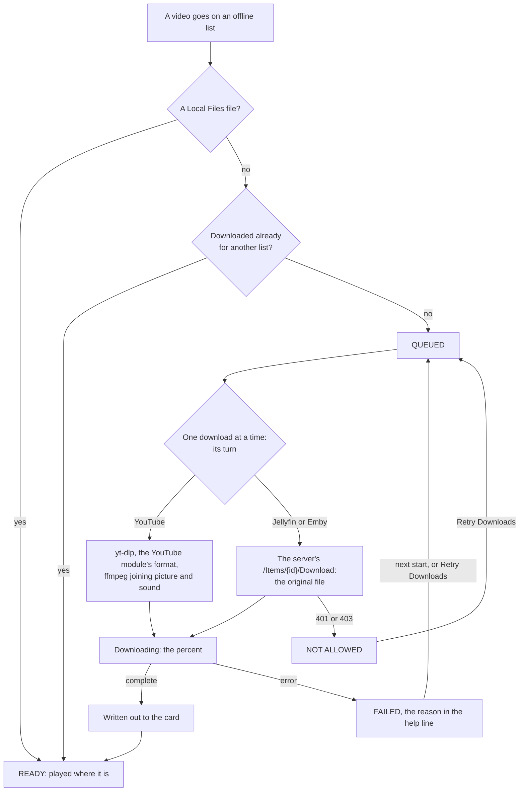

# Playlists

The Playlists module keeps your own lists of videos, like a mixtape, taken from several modules at once: files from Local Files, YouTube videos, and films and episodes from Jellyfin and Emby can sit on one list and play as one, in order or shuffled. An **online** playlist plays each video from where it lives; an **offline** one downloads every video to the device once and then plays without the network. This page covers making and filling playlists, playing them, how downloads work (where they go, how YouTube and the servers are fetched, what each status means), every setting with its config key, the files the module keeps, and what to do when something doesn't work.

The module is in [modules/playlists](https://github.com/mehmetraif/OSD-OS/tree/main/modules/playlists) (views and manifest) and [src/modules/playlists](https://github.com/mehmetraif/OSD-OS/tree/main/src/modules/playlists) (`PlaylistsBackend`, `ServerDownload`, `MediaServer`). It is on from the start: **Playlists** is on the main menu until you turn it off in **Settings → Playlists → Enabled**.

<table>
<tr><th width="50%">Playlists</th><th width="50%">An offline playlist</th></tr>
<tr><td></td><td></td></tr>
<tr><td>Online playlists play each video from where it lives; offline ones, from the device, with how many of their videos are on it.</td><td>Each video downloads once, in the background: ready, under way, or why not (a server that doesn't let you download it).</td></tr>
</table>

## Online and offline

A playlist is one or the other from the moment you make it.

| | Online playlist | Offline playlist |
|---|---|---|
| A Local Files file | Played where it is | Played where it is (it is on the device already) |
| A YouTube video | Streamed through yt-dlp, the way the YouTube module plays it | Downloaded once with yt-dlp, then played from the file |
| A Jellyfin or Emby video | Streamed from the server as the original file | Downloaded once as the original file, where the server lets your user download |
| Needs the network | For YouTube and the servers | Only while downloading |
| Its row on the first page | `6 ONLINE`: how many videos | `3/5 OFFLINE`: how many of its videos are on the device, of how many |

Jellyfin and Emby videos stream as the original file whatever those modules' **Video Quality** says: a playlist never asks a server for a transcode. A playlist doesn't report what you watch to Jellyfin or Emby, and doesn't touch any module's Recently Watched or resume points: it keeps one place of its own, where the list stopped.

## Making a playlist

Open **Playlists** from the main menu. Its first page has **New Online Playlist** and **New Offline Playlist**, then, under **Playlists**, every playlist you have. The help line says what the row under the cursor does (on New Offline Playlist, it names the folder the downloads go to).

1. Select **New Online Playlist** or **New Offline Playlist**.
2. Name it on the on-screen keyboard (**Online Playlist Name** / **Offline Playlist Name**): the arrows move, select types, **OK** finishes. Names are in capitals, up to 40 characters; a keyboard plugged in types straight in. **OK** does nothing until something is typed.
3. The new playlist's page opens. Select **Add Videos** to fill it.

A playlist can also be started from wherever a video is offered to one: **New Online Playlist** and **New Offline Playlist** sit at the foot of the **Add to playlist?** window ([below](#from-another-module)), and the video goes straight on it.

## A playlist's page

Select a playlist to open its page. The title bar names it.

| Row | What it does |
|---|---|
| **Play** | Plays the list ([Playing](#playing)). Its value: `5 VIDEOS` on an online list, `3 OF 5 READY` on an offline one |
| **Order** | **In Order** or **Shuffle**: select or ◄ ► switch it (the hint bar shows `[◄►]:CHANGE`) |
| **Add Videos** | Browse Local Files, YouTube, Jellyfin and Emby for videos to add ([below](#from-the-module-add-videos)) |
| **Rename** | A new name, on the on-screen keyboard (**Playlist Name**), which opens on the current one |
| **Retry Downloads** | Shown while a download has failed: tries the list's failed downloads again |
| **Delete Playlist** | Asks **Delete playlist?** with **Cancel** under the cursor. On an offline list its downloads go too, unless another offline playlist has them |
| **Videos** | The videos, in the list's order |

Each video's line shows its title and, against the right edge, a value:

| Value | On | Means |
|---|---|---|
| `LOCAL`, `YOUTUBE`, `JELLYFIN`, `EMBY` | Online lists | Where it plays from |
| `READY` | Offline lists | On the device (a Local Files file always is) |
| `42%` | Offline lists | Downloading now, this far |
| `QUEUED` | Offline lists | Waiting its turn |
| `FAILED` | Offline lists | The download failed; the help line gives the reason |
| `NOT ALLOWED` | Offline lists | The server doesn't let your user download it |
| `MISSING` | Both | A Local Files file that isn't there any more (moved, deleted, or on a USB drive that is out), or, on an online list, a Jellyfin or Emby video while you are signed out of that server |

The help line under the list shows the full title of the video under the cursor, and for a failed download the reason after it: `Street Fighter (1994): the server doesn't let this user download it`, `…: no yt-dlp`, `…: signed out`, `…: can't write to /media/OSD-OS/Playlists`, or yt-dlp's own error.

Select on a video opens its choices:

| Choice | What it does |
|---|---|
| **Play from Here** | Plays the list starting with this video, without asking about where it stopped |
| **Move Up** / **Move Down** | Moves it one place in the list |
| **Remove from Playlist** | Takes it off. On an offline list its download is stopped or deleted, unless another offline playlist has the video |

Back returns to the first page; back there leaves the module.

## Adding videos

A video can go on any number of playlists, but on each only once: a second time says **Already on …**. Series, seasons, collections and folders can't go on as a whole; open them and add their videos.

<table>
<tr><th width="50%">Adding videos</th><th width="50%">Add to Playlist</th></tr>
<tr><td></td><td></td></tr>
<tr><td>Local Files, YouTube, Jellyfin and Emby in one tree, down to a show's episodes. Select adds a video and stays, for the next.</td><td>From a module itself: a video's options (►), or ► on PLAY in Jellyfin and Emby.</td></tr>
</table>

### From the module: Add Videos

**Add Videos** on a playlist's page opens one tree (title bar `PLAYLISTS | ADD TO <NAME>`) with a branch for each source that is on:

| Branch | Shown when | What it holds |
|---|---|---|
| **Local Files** | The Local Files module is on | Its tree as Local Files shows it: Recently Watched, Favorites, Search, the USB drives plugged in, then the media folder's folders and files |
| **YouTube** | The YouTube module is on | Its home as the YouTube module shows it: Recently Watched, Favorites, Search and the lists after them; **More** loads the next page of a list |
| **Jellyfin** | On and signed in | **Continue Watching**, **Next Up**, then every library with videos in it (whatever the module's own Libraries setting hides), down to each show's seasons and episodes |
| **Emby** | On and signed in | The same, from the Emby server |

The tree works as Local Files' does ([The tree](https://github.com/mehmetraif/OSD-OS/wiki/Local-Files#the-tree)): the arrows move and open, back closes a folder and, at the top, returns to the page. Select on a video adds it and leaves the cursor where it is, so several go on in a row; the help line then says what became of it: `Added: <title>`, `Added, to download: <title>` (an offline list), `Already on <NAME>: <title>`, or `This one can't go on a playlist`. Search asks for words on the on-screen keyboard (**Search Local Files**, **Search YouTube**). Episodes in a season are numbered (`1. Pilot`); in Continue Watching and Next Up they carry their show's name (`The Wonder Years - Pilot`). The servers' folders are asked for afresh each time Add Videos opens, and a USB drive plugged in or pulled out shows at once.

### From another module

| Where | How |
|---|---|
| **Local Files** | ► on a file: **Add to Playlist** in its options |
| **YouTube** | ► on a video, then ► on its info screen (one ► with Settings → Info Screen off): **Add to Playlist** in its options |
| **Jellyfin**, **Emby** | ► on **PLAY** on a film's, episode's or video's page (the hint bar shows `[►]:PLAYLIST`) |


Each opens **Add to playlist?** with the video's title under it: every playlist (an offline one marked `(Offline)`), then **New Online Playlist** and **New Offline Playlist**, which ask for a name and put the video on the new list. A long list scrolls in the window. The same window then says what became of the video: **Added to <NAME>** (and **It downloads in the background, once** for an offline list), **Already on <NAME>**, or **Can't go on a playlist**; back or select closes it. These choices are offered only while the Playlists module is on.

### What a video is called

| Source | Its title on the list |
|---|---|
| Local Files | The file's name, with its extension (`Bloodsport (1988).mp4`) |
| YouTube | The video's title |
| Jellyfin, Emby | The item's name; an episode as `SHOW - EPISODE`, to tell one show's "Pilot" from another's |

## Playing

Select **Play**, or **Play from Here** on a video. While a video starts the loading screen shows, with **PLAYLISTS** as its source.

| Situation | What happens |
|---|---|
| **Play from Here** | Starts at that video. On a shuffled list that video comes first and the rest follow shuffled |
| **Play**, the list **In Order**, and it stopped part-way last time | **Resume playback?** `Resume video 3 at 12:34` / `Start from the beginning` |
| **Play**, the list **In Order**, nothing to resume | From its first video |
| **Play**, the list on **Shuffle** | In a new order each time, from the start (a shuffled list has no place to resume) |
| **Play** while this list plays behind the menus (Transparent Background) | It comes back full screen where it is, without asking |

Where the list stopped is kept by video, not by place: moving videos round doesn't lose it, and if that video has been removed (or can't play now) the list simply starts from the beginning. Once the list has played right through to its end, the place is forgotten. Stopping it anywhere else (STOP, back, a failure) keeps it.

**What plays.** Each time a list starts, OSD/OS writes the videos that can play right now into an m3u playlist ([below](#the-m3u-it-writes)) and hands it to mpv. What can't play is left out: a Local Files file that is missing, a Jellyfin or Emby video while you are signed out, and on an offline list anything not downloaded yet. So an offline list plays what is on the device, and the rest joins as its downloads finish.

**During a video.** ▲ or ▼ opens the deck's menu, which in a list of more than one video has **<** and **>** buttons for the previous and next video, beside AUDIO, SUBTITLE, CROP and STOP ([Playback and mpv](https://github.com/mehmetraif/OSD-OS/wiki/Playback-and-mpv)).

**Looping.** With **Loop Playback** on, the list starts again from its first video when it ends, until you stop it (mpv's `--loop-playlist=inf`).

**Subtitles.** The module's **Subtitles** setting applies to every video on the list:

| Subtitles | What mpv is told | What you see |
|---|---|---|
| **Forced Only** (default) | `--subs-with-matching-audio=forced --subs-fallback-forced=always` | Only subtitles for dialogue in another language, where the file marks them forced |
| **On** | `--subs-with-matching-audio=yes --subs-fallback=yes --sid=auto` | A subtitle track always; a streamed YouTube video's in the YouTube module's **Subtitle Language** |
| **Off** | `--sid=no` | None |

The subtitles are those inside the file or stream. A Jellyfin or Emby video's subtitles kept as separate files on the server aren't fetched, and a downloaded YouTube video has none (the download doesn't fetch them).

**YouTube videos on an online list** play with the YouTube module's **Advanced** settings (resolution, codec, frame rate, audio language), but at normal speed whatever its Playback Speed says, so they match the rest of the list.

**Still images** from Local Files show for Local Files' **Image Duration** (5 seconds unless changed) before the list moves on.

**Scaling.** The module's own **Scaling** decides how a 16:9 picture fills the 4:3 screen for every video on the list; **Default** follows **Settings → Scaling**.

**When it can't play:**

| Message | Means |
|---|---|
| **Nothing to play** · Add videos to it first | The list is empty |
| **Nothing to play** · None of its videos is on the device yet | An offline list with nothing downloaded |
| **Nothing to play** · None of its videos can be reached | An online list whose every video is missing or on a server you are signed out of |
| **Playback failed** · Its YouTube videos need yt-dlp, up to date, and the network | mpv stopped before showing anything, on a list with streamed YouTube videos. Select retries |
| **Playback failed** · None of its videos would play | The same, on any other list. Select retries |

## The player's menu

Back during a video (with the deck's menu closed) opens the list's own menu, titled with its name:

| Line | What it does |
|---|---|
| **Subtitles** | ◄ ► change the module setting; the video starts again where it is as you go back to it |
| **Loop Playback** | ◄ ► change it; with Transparent Background the playing list takes it at once |
| **Scaling** | ◄ ► change it; with Transparent Background the picture takes it at once |
| **Browse Playlists** | Back to the list's page |
| **Close Video** | Stops the list and leaves Playlists for the main menu |

Back in the menu returns to the video. A setting changed here is saved, as if changed in Settings → Playlists.

**With Transparent Background** the menu lies over the picture, which plays on. **Browse Playlists** returns to the list's page with the video still playing behind it; the main menu then leads with a row for the list, `► <NAME>`, and choosing that row, or **Play** on the list's page, takes it back to full screen where it is. Play/pause on the main menu stops it; playing anything else replaces it. See [Playback and mpv](https://github.com/mehmetraif/OSD-OS/wiki/Playback-and-mpv).


**Without Transparent Background** mpv has the whole screen while it plays, so the list stops for the menu: where it was is saved, and going back to the video starts it again there, in the same order, with the settings as you left them. **Close Video** returns to the main menu. **Browse Playlists** returns to the list's page, and the main menu then leads with a row for the list, `► <NAME>`: choosing that row, or **Play** on the list's page, starts it again at the video it was on, where it was, without asking. A shuffled list keeps no place, so it starts shuffled afresh. The row stays until mpv plays another video.

## Downloads

Every video on an offline list, other than a Local Files file, is downloaded once into the download folder and played from there. The file is shared: a video on three offline lists is fetched once and kept while any of them has it.



### Where they go


**Settings → Playlists → Download Folder** names the folder, picked on the same tree as Local Files' Media Directory (above): **Use This Folder** picks the folder open, **Default Folder** goes back to the default. The default is a **Playlists** folder in Local Files' media folder, so it follows Local Files' **Media Directory**:

| Local Files' media folder | Default download folder |
|---|---|
| On the OSD/OS image, unchanged: `/media/OSD-OS`, the card's OSD-OS partition ([The film partition](https://github.com/mehmetraif/OSD-OS/wiki/Local-Files#the-film-partition-on-the-osdos-image)) | `/media/OSD-OS/Playlists` |
| Elsewhere, unchanged: `<data folder>/media` | `~/.local/share/OSD-OS/media/Playlists` on Linux, `~/Library/Application Support/OSD-OS/media/Playlists` on a Mac |
| Set in **Settings → Local Files → Media Directory** (or by `OSDOS_MEDIA_DIR`, [Local Files](https://github.com/mehmetraif/OSD-OS/wiki/Local-Files#the-media-folder)) | `<that folder>/Playlists` |

Inside it each source has a folder of its own, made as needed, and each file carries the video's id in brackets, so two videos of the same name never collide:

```text
/media/OSD-OS/Playlists/
├── YouTube/
│   └── Saturday Morning Commercials 1985 [aBcD3fGh1jK].mp4
├── Jellyfin/
│   └── Kickboxer (1989) [5f1c0a8e9b2d4c6f8a1e3b5d7c9f0a2b].mkv
└── Emby/
    └── Double Impact (1991) [20731].mp4
```

Names follow exFAT's rules (Windows'): characters it forbids (`\ / : * ? " < > |`) are replaced, and the title is cut at 80 characters (YouTube: 80 bytes). The default folder is an ordinary folder inside Local Files' media folder, so Local Files lists it too and its videos also play from there. A video copied into it by hand doesn't count: only what the module downloaded is on its lists.

Changing the Download Folder affects what downloads next; files already downloaded stay where they are and go on playing from there.

### YouTube videos

YouTube videos download with yt-dlp, in the YouTube module's **Advanced** settings: **Playback Resolution**, **Video Codec**, **Max Frame Rate** and **Audio Language**. If you are signed in to YouTube (Settings → YouTube → Sign in), the download uses that sign-in too. OSD/OS finds yt-dlp where it does for the YouTube module: `<data folder>/bin/yt-dlp` first (where the OSD/OS image keeps it, updated after each boot and daily), then a copy beside the app, then the one on the `PATH`.

Above 360p YouTube sends a video's picture and sound separately, and **ffmpeg** puts them back together into one MP4. The OSD/OS image has ffmpeg; elsewhere install it (`sudo apt install ffmpeg`, `brew install ffmpeg`). Without it, OSD/OS asks yt-dlp only for files that hold both, which YouTube offers in low resolutions.

With the YouTube module's settings at their defaults (480p, H.264, any frame rate, the original audio) and ffmpeg there, the download is the same as running:

```sh
yt-dlp \
  -f 'bestvideo[height<=?480][vcodec^=avc1]+bestaudio/bestvideo[height<=?480]+bestaudio/best[height<=?480]/best' \
  --merge-output-format mp4 \
  --newline --no-playlist --no-mtime --windows-filenames \
  -o '/media/OSD-OS/Playlists/YouTube/%(title).80B [%(id)s].%(ext)s' \
  --print after_move:filepath --no-simulate --progress \
  -- 'https://www.youtube.com/watch?v=aBcD3fGh1jK'
```

How the settings change `-f`: **Playback Resolution** sets the height (`480`); **Video Codec** on **Any** drops the `[vcodec^=avc1]` (H.264) choice; **Max Frame Rate** on **30** adds `[fps<=?30]`; an **Audio Language** other than Original puts its track first (`bestaudio[language^=de]`, then `bestaudio`). Without ffmpeg `-f` is `best[height<=?480][vcodec^=avc1]/best[height<=?480]/best` and there is no `--merge-output-format`. Signed in, `--cookies-from-browser` comes first, naming the sign-in's browser profile. Running the same command by hand is a quick way to see yt-dlp's own error for a video that fails.

A YouTube download cut short (OSD/OS quit, the network gone) leaves its part file, and yt-dlp carries on from it next time.

### Jellyfin and Emby videos

A server video downloads as its original file from the server's download address, `/Items/<id>/Download`, signed in as your user. The file takes its type from the server's answer (`.mkv`, `.mp4` and so on). Two things the server decides:

- **Whether your user may download.** Jellyfin and Emby both have a per-user right to download media. Without it the server answers 401 or 403 and the video shows **NOT ALLOWED** ("the server doesn't let this user download it"). It is left alone after that until you select **Retry Downloads**, once an administrator has given your user the right.
- **That you are signed in.** A video whose server you are signed out of fails with `signed out`; sign in again in the Jellyfin or Emby module and select **Retry Downloads**.

The server's own certificate is accepted as the server module accepts it (a self-signed one on your network, say). A transfer that stops moving for 30 seconds fails rather than holding up the queue; a server download that fails or is cut short starts again from the beginning next time.

### One at a time

Downloads run one after another, in the order they were queued. Queued videos start downloading 15 seconds after OSD/OS starts (time for the network to come up at boot), and a video put on an offline list joins the queue at once. A download stays at 100% for a moment while the file is written out to the card, and only then counts as **READY**, so switching the Pi off right after doesn't leave a half-written film on the partition.

A failed download is tried again each time OSD/OS starts, and with **Retry Downloads**; one the server refused (**NOT ALLOWED**) only with Retry Downloads. A downloaded file deleted from outside OSD/OS shows **QUEUED** and downloads again the next time OSD/OS starts.

Turning the module off in Settings hides it and its Add to Playlist choices; it doesn't stop the downloads its offline lists still need.

### When a download is deleted

A download is deleted as soon as no offline playlist has the video any more: removed from its last offline list, or that list deleted. A download under way for it is stopped (yt-dlp and the ffmpeg under it end with it), and what it had fetched is deleted too. An online list never keeps a copy, so a video that is only on online lists has no download.

### A card flashed with an earlier image

Earlier OSD/OS images mounted the film partition read-only, so every download fails at once with `can't write to /media/…`. Flash the current image, or edit the film partition's line in `/etc/fstab` (`/media/240-MP`, as those images named it): change `ro` to `rw,noexec,nosuid,nodev`, and the last `0` to `2`. Then restart and select **Retry Downloads**. Any other folder that can't be written fails the same way, naming the folder.

## What can't go on a playlist

| Not on a playlist | Why |
|---|---|
| Netflix and Prime Video | They play in the service's own player, in Chromium, not in mpv |
| Plex | The Playlists module takes Local Files, YouTube, Jellyfin and Emby only; a Plex video has no Add to Playlist |
| Series, seasons, collections, folders | Only videos go on; add their episodes or files one by one (Add Videos makes that quick) |

## Settings

Settings → Playlists.

| Setting | Values | Default | What it does | Config key |
|---|---|---|---|---|
| Enabled | ON, OFF | ON | Shows Playlists on the main menu, and the Add to Playlist choices in Local Files, YouTube, Jellyfin and Emby | `modules.com.osdos.playlists.enabled` |
| Download Folder | Default, or a folder | Default | Where offline playlists' videos are downloaded, each video once whatever lists it is on. Default: a Playlists folder in Local Files' folder | `modules.com.osdos.playlists.download_folder` |
| Subtitles | Forced Only, On, Off | Forced Only | Whether a video's subtitles show as it starts ([Playing](#playing)) | `modules.com.osdos.playlists.subtitles` |
| Loop Playback | ON, OFF | OFF | When a playlist ends, start it again from its first video | `modules.com.osdos.playlists.loop_playback` |
| Scaling | Default, Letterbox, 14:9, Pan & Scan, Anamorphic | Default | How a 16:9 picture fills the 4:3 screen in Playlists; Default follows Settings → Scaling | `modules.com.osdos.playlists.video_scaling` |

### How the values are saved

| Key | Saved as |
|---|---|
| `enabled`, `loop_playback` | `true` or `false` |
| `download_folder` | `""` for the default, else the folder's full path |
| `subtitles` | `"Forced Only"`, `"On"` or `"Off"` |
| `video_scaling` | `"Default"`, `"Letterbox"`, `"14:9"`, `"Pan & Scan"` or `"Anamorphic"` |

The module's entry in `config.json` (in the data folder), downloading to a folder of its own on the OSD/OS image's film partition instead of the default:

```json
{
    "modules": {
        "com.osdos.playlists": {
            "enabled": true,
            "download_folder": "/media/OSD-OS/Offline Videos",
            "subtitles": "On",
            "loop_playback": true,
            "video_scaling": "14:9"
        }
    }
}
```

The folder has to be one OSD/OS can write to: on the OSD/OS image USB drives are mounted read-only, so they can't take downloads. See [Configuration Files](https://github.com/mehmetraif/OSD-OS/wiki/Configuration-Files) for the whole file.

## Files it keeps

| File | What it holds |
|---|---|
| `playlists.json` in the data folder | The playlists and the downloads ([below](#playlistsjson)) |
| `playlists/<playlist id>-<n>.m3u` in the data folder | What a list played last ([below](#the-m3u-it-writes)) |
| The download folder | The downloaded videos |

The data folder is `~/.local/share/OSD-OS/` on Linux and the OSD/OS image, and `~/Library/Application Support/OSD-OS/` on a Mac (or wherever `DATA_ROOT` points). Don't confuse its `playlists` folder (m3u files) with the download folder's `Playlists` (videos).

### playlists.json

Written whole each time anything changes (a playlist made, renamed, reordered or deleted, a video added, moved or removed, a download finished, where a list stopped). It holds:

| Field | What it is |
|---|---|
| `playlists` | The playlists, in the order they were made |
| `playlists[].id` | The playlist's id (a UUID) |
| `playlists[].name` | Its name |
| `playlists[].kind` | `"online"` or `"offline"` |
| `playlists[].order` | `"inorder"` or `"shuffle"` |
| `playlists[].items` | Its videos, in order: each an `id` (a UUID of its own), the `module` it comes from, its `key`, its `title` and its `source` (`path` for Local Files, `videoId` and `channel` for YouTube, `itemId` for Jellyfin and Emby) |
| `playlists[].resume` | Where it stopped: the item's `id` (`itemId`) and `positionMs`. Absent once it has played out |
| `downloads` | By key: `{ "path", "state": "done", "bytes" }` for a finished download, `{ "state": "failed", "reason" }` for a failed one. A video not downloaded yet has no entry |

A video's **key** names it whatever list it is on, and so names its download: `local:<path>`, `youtube:<videoId>`, `jellyfin:<itemId>` or `emby:<itemId>`.

A file with one offline and one online playlist, in the form OSD/OS writes it (four-space indents, keys in alphabetical order):

```json
{
    "downloads": {
        "emby:20733": {
            "reason": "not allowed",
            "state": "failed"
        },
        "jellyfin:5f1c0a8e9b2d4c6f8a1e3b5d7c9f0a2b": {
            "bytes": 734003200,
            "path": "/media/OSD-OS/Playlists/Jellyfin/Kickboxer (1989) [5f1c0a8e9b2d4c6f8a1e3b5d7c9f0a2b].mkv",
            "state": "done"
        },
        "youtube:aBcD3fGh1jK": {
            "bytes": 48230112,
            "path": "/media/OSD-OS/Playlists/YouTube/Saturday Morning Commercials 1985 [aBcD3fGh1jK].mp4",
            "state": "done"
        }
    },
    "playlists": [
        {
            "id": "3f2c9a1e-7b4d-4e8f-9a6b-1c2d3e4f5a6b",
            "items": [
                {
                    "id": "0b6e2c7a-4d1f-4a8e-b3c5-9e7f1a2d4c6b",
                    "key": "youtube:aBcD3fGh1jK",
                    "module": "com.osdos.youtube",
                    "source": {
                        "channel": "Retro Ad Archive",
                        "videoId": "aBcD3fGh1jK"
                    },
                    "title": "Saturday Morning Commercials 1985"
                },
                {
                    "id": "9d4a1f3e-2b7c-4e6a-8f5d-0c1b2a3e4d5f",
                    "key": "jellyfin:5f1c0a8e9b2d4c6f8a1e3b5d7c9f0a2b",
                    "module": "com.osdos.jellyfin",
                    "source": {
                        "itemId": "5f1c0a8e9b2d4c6f8a1e3b5d7c9f0a2b"
                    },
                    "title": "Kickboxer (1989)"
                },
                {
                    "id": "c7e5b3a1-8f6d-4b2e-9a0c-5d4e3f2a1b0c",
                    "key": "local:/media/OSD-OS/Martial Arts/Bloodsport (1988).mp4",
                    "module": "com.osdos.local_files",
                    "source": {
                        "path": "/media/OSD-OS/Martial Arts/Bloodsport (1988).mp4"
                    },
                    "title": "Bloodsport (1988).mp4"
                },
                {
                    "id": "5a3c1e9b-7d2f-4c8a-b6e4-2f1d0c9b8a7e",
                    "key": "emby:20733",
                    "module": "com.osdos.emby",
                    "source": {
                        "itemId": "20733"
                    },
                    "title": "Street Fighter (1994)"
                }
            ],
            "kind": "offline",
            "name": "MOVIE NIGHT",
            "order": "inorder",
            "resume": {
                "itemId": "9d4a1f3e-2b7c-4e6a-8f5d-0c1b2a3e4d5f",
                "positionMs": 754000
            }
        },
        {
            "id": "e1d2c3b4-a5f6-4e7d-8c9b-0a1f2e3d4c5b",
            "items": [
                {
                    "id": "2c4e6a8b-1d3f-4b5a-9c7e-8f0a2b4c6d8e",
                    "key": "local:/media/OSD-OS/Martial Arts/Bloodsport (1988).mp4",
                    "module": "com.osdos.local_files",
                    "source": {
                        "path": "/media/OSD-OS/Martial Arts/Bloodsport (1988).mp4"
                    },
                    "title": "Bloodsport (1988).mp4"
                },
                {
                    "id": "7f9b1d3c-5e2a-4f6b-8d0c-3a5e7c9b1d2f",
                    "key": "emby:20733",
                    "module": "com.osdos.emby",
                    "source": {
                        "itemId": "20733"
                    },
                    "title": "Street Fighter (1994)"
                }
            ],
            "kind": "online",
            "name": "SUNDAY MATINEE",
            "order": "shuffle"
        }
    ]
}
```

Here the offline list stopped 12 minutes 34 seconds into Kickboxer, its YouTube and Jellyfin videos are on the card, its Local Files film plays from where it is, and the Emby film can't be downloaded by this user. The online list streams the same Emby film from the server.

Edit it only with OSD/OS stopped (`sudo systemctl stop osdos` on the image), and keep it valid JSON: a file that can't be read is taken as no playlists at all, and the next change writes it afresh.

### The m3u it writes

Each time a list starts, it is written into `playlists/<playlist id>-<n>.m3u` in the data folder, a new number each time, replacing the list's previous one. The file is readable by your user only, because a Jellyfin or Emby address in it carries the server's token. A shuffled list is shuffled here, so the file is in the order it plays. Played, the online list above writes (in the order that shuffle gave):

```text
#EXTM3U
#EXTINF:-1,Bloodsport (1988).mp4
/media/OSD-OS/Martial Arts/Bloodsport (1988).mp4
#EXTINF:-1,Street Fighter (1994)
http://192.168.1.30:8096/Videos/20733/stream?static=true&api_key=<token>
```

A YouTube video is written as `https://www.youtube.com/watch?v=<id>` (mpv's yt-dlp hook plays it), and a Jellyfin video as `<server>/Videos/<id>/stream?static=true&ApiKey=<token>&api_key=<token>`; the token goes in the address rather than a header so that, in a list mixing sources, it goes to that server and nowhere else. On an offline list every line is a file on the device. The `#EXTINF` titles are what mpv's display shows.

## Troubleshooting

| Problem | What to do |
|---|---|
| A YouTube video **FAILED**, `no yt-dlp` | Install yt-dlp ([Installation](https://github.com/mehmetraif/OSD-OS/wiki/Installation)): the OSD/OS image has it in `~/.local/share/OSD-OS/bin/yt-dlp`; elsewhere put a copy there or on the `PATH`. Then **Retry Downloads** |
| A YouTube video **FAILED** with yt-dlp's error | Usually an out-of-date yt-dlp, or YouTube's bot check: update yt-dlp (`~/.local/share/OSD-OS/bin/yt-dlp -U` for the copy in the data folder; the image's updates itself daily), or sign in with Settings → YouTube → Sign in. Run the [command above](#youtube-videos) by hand to see the whole error |
| YouTube downloads are low resolution | ffmpeg is missing: install it (`sudo apt install ffmpeg`, `brew install ffmpeg`); videos downloaded from then on are joined at the YouTube module's resolution |
| Everything **FAILED**, `can't write to …` | The download folder can't be written: pick another **Download Folder**, or on a card from an earlier image [make the partition writable](#a-card-flashed-with-an-earlier-image) |
| **NOT ALLOWED** | Your Jellyfin or Emby user may not download media; an administrator can allow it on the server, then **Retry Downloads** |
| **FAILED**, `signed out` | Sign in again in the Jellyfin or Emby module, then **Retry Downloads** |
| **MISSING** | The Local Files file was moved, renamed or deleted, or is on a USB drive that is out (plug it back in); on an online list, a server video while you are signed out of it. A moved file has to be added again |
| A video stays **QUEUED** | Downloads run one at a time, and start 15 seconds after OSD/OS does; a server that stops sending fails after 30 seconds and the queue moves on |
| The card fills up | Every offline video is a full file. Take videos off offline lists, or delete lists you don't need: their downloads go at once. `bytes` in `playlists.json` gives each file's size |
| **Nothing to play** | The list is empty, nothing is downloaded yet, or nothing can be reached: see [Playing](#playing) |
| **Playback failed** on a list with YouTube videos | yt-dlp must be there and up to date, and the network up |
| A Jellyfin or Emby video doesn't play on an online list | The server must be reachable from the device; the list streams the original file, so a file mpv can't decode won't play here even though the server module would transcode it |

The app's log has the module's warnings: `journalctl -u osdos -b | grep Playlists` with the service, such as `[Playlists] download of youtube:aBcD3fGh1jK failed: <reason>` or `[Playlists] can't write playlists.json`. mpv's own log is `/tmp/osdos-mpv.log` (in the system's temp folder on a Mac). See [Troubleshooting](https://github.com/mehmetraif/OSD-OS/wiki/Troubleshooting).

## See also

- [Local Files](https://github.com/mehmetraif/OSD-OS/wiki/Local-Files): the media folder, its own m3u playlists, and the film partition
- [YouTube](https://github.com/mehmetraif/OSD-OS/wiki/YouTube): the Advanced settings downloads follow, yt-dlp and signing in
- [Jellyfin](https://github.com/mehmetraif/OSD-OS/wiki/Jellyfin) and [Emby](https://github.com/mehmetraif/OSD-OS/wiki/Emby): ► on PLAY, and downloading rights
- [Netflix and Prime Video](https://github.com/mehmetraif/OSD-OS/wiki/Netflix-and-Prime-Video): why they can't go on a playlist
- [Playback and mpv](https://github.com/mehmetraif/OSD-OS/wiki/Playback-and-mpv): the deck menu, Scaling and Transparent Background
- [The OSD/OS Image](https://github.com/mehmetraif/OSD-OS/wiki/The-OSD-OS-Image): the card's OSD-OS partition, yt-dlp and ffmpeg on the image
- [Settings](https://github.com/mehmetraif/OSD-OS/wiki/Settings) and [Configuration Files](https://github.com/mehmetraif/OSD-OS/wiki/Configuration-Files)
- [Troubleshooting](https://github.com/mehmetraif/OSD-OS/wiki/Troubleshooting)
