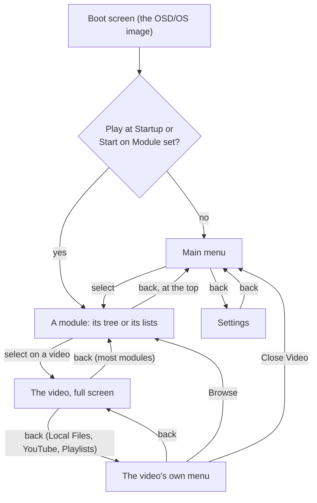

# Using OSD/OS

A tour of OSD/OS, screen by screen, as you meet them: the boot screen, the main menu, the tree every module is browsed with, searching, info screens and options, playing a video and the menus over it, the logo in the corner, and quitting. Every screen is drawn like a VCR's on-screen display, in the color scheme's two colors, and works with the arrows, select and back. [Controls](https://github.com/mehmetraif/OSD-OS/wiki/Controls) lists which key, button or remote button does each; the pictures are the app itself at 640×480.

## The basics

Everything is done with a handful of actions:

| Action | Keyboard | Gamepad | What it does |
|---|---|---|---|
| The arrows | ▲ ▼ ◄ ► | D-pad, left stick | ▲ ▼ move through a list. ◄ ► change a setting's value, and in a tree go up a level or open one |
| Select | Enter | A | Opens, plays, chooses |
| Back | Esc, Backspace or Right Shift | B or Back | One step back. On the main menu it opens Settings |
| ► on an entry | ► | D-pad right | A video's options, or its info screen |
| Play/pause | Space | Start | Pauses a video; stops one playing behind the menus |

The bar at the foot of every screen (the hint bar) says which keys do what there, as `[ESC]:BACK [▲▼]:NAVIGATE [ENTER]:SELECT`, and switches to the gamepad's buttons once you press one. A ▲ above a list or a ▼ below it means there are more lines that way. A line too long for the screen scrolls through while the cursor is on it.

How you move between the screens:

With [Transparent Background](https://github.com/mehmetraif/OSD-OS/wiki/Using-OSD-OS#transparent-background) on, the video goes on playing behind wherever back leads, and the main menu's first row takes it back to full screen. Without it, Browse leaves the video stopped, and the main menu's first row starts it again where it was.

## The boot screen

On the [OSD/OS image](https://github.com/mehmetraif/OSD-OS/wiki/The-OSD-OS-Image), OSD/OS is on screen before the rest of the system has started, and the boot screen shows the rest coming up. It is a VCR playing a tape: **PLAY ▶** in the corner, and the OSD/OS cassette, whose reels turn and whose tape winds from the left reel onto the right one as the bar under it fills. Under the bar, **LOADING** and how far it has got, then a line per service, in the order they start:

| Line | Means |
|---|---|
| `[ OK ] WI-FI` | Started (NetworkManager, which runs Ethernet too) |
| `[ .. ] BLUETOOTH` | Starting now; the line is inverted, like a selected menu line |
| `[    ] LOCAL NETWORK` | Waiting its turn (avahi, which makes the Pi `osdos.local` on the network) |
| `[FAIL] …` | It failed to start |
| `[ -- ] …` | Skipped, as its conditions weren't met |

`SSH` has a line when the image was built with SSH on, and the last line, `ONLINE`, waits until the network is really up, or 20 seconds without one. The screen closes by itself once every line has settled, or after a minute, whatever keys are pressed: no key does anything while it is up but Ctrl+Q, which powers the Pi off. Then the main menu opens, or the module Settings → Start on Module names, or the favourite set to [play at startup](https://github.com/mehmetraif/OSD-OS/wiki/Using-OSD-OS#play-at-startup).

On an app install (Raspberry Pi OS, macOS, SteamOS) there is no boot screen: OSD/OS opens on the main menu.

**After Settings → Display Output** switched to another output, the first thing on the new one, over the boot screen, is **Keep this display output?**, with the time left. **Keep** keeps it; **Switch Back**, or 15 seconds without an answer, goes back to the old output, restarting again. Back does nothing there: on a screen that shows nothing, a key pressed at random must not keep it. [Display Output](https://github.com/mehmetraif/OSD-OS/wiki/Display-Output) has the rest.

## The main menu

The main menu lists the modules, like the inputs on a deck: Local Files, Plex, YouTube and the rest. Select opens one; back opens Settings.

- **Which modules.** Only the modules that are turned on, in the order of their folders' names (`modules/ambient_mode`, `emby`, `jellyfin`, …). Out of the box, **Local Files** and **Playlists** are on. Turn others on in Settings: each module has a line under **Modules**, and its **Enabled** row turns it on. The picture above has them all on. With none on, the menu says **No modules enabled** and **Please enable one in settings**.
- **Rows a module adds.** A module can put rows of its own on the menu, after the modules: a script you marked in [Scripts](https://github.com/mehmetraif/OSD-OS/wiki/Scripts) has one, which runs it.
- **The video playing behind.** With [Transparent Background](https://github.com/mehmetraif/OSD-OS/wiki/Using-OSD-OS#transparent-background), a video left playing behind the menus leads the list as `► <its title>`, with the cursor on it.
- ▲ ▼ go round from the last row to the first. The menu remembers the row you left it on.

[Modules](https://github.com/mehmetraif/OSD-OS/wiki/Modules) describes each module, and its own page how to set it up.

## The tree

Local Files, YouTube, Netflix and Prime Video are all browsed the same way, as a horizontal tree, and so are the playlists' Add Videos and the pickers for folders and files in Settings. (Plex, Jellyfin and Emby have list screens of their own, and Weather, Ambient:Mode, NFC Reader and Scripts screens of their own: see their pages.)

<table>
<tr><th width="50%">Recently Watched</th><th width="50%">Folders</th></tr>
<tr><td></td><td></td></tr>
<tr><td>The tree opens on what you played last, then Favorites, Search and your folders. The entry under the cursor branches out to its contents in full; the other folders' branches are faint.</td><td>The open folders run along the line through the middle. The folder under the cursor branches out once more: Action › Rambo Movies › its films.</td></tr>
</table>

**How it is drawn.** The folders you have opened run from left to right along a line through the middle of the screen, the spine. Each folder's entries are stacked above and below the one the spine runs through, which is the one that leads on. In the folder you are in, every folder branches off to the right, on a dotted line, to its first few entries, and the folder under the cursor shows more of its own and branches once more from each folder in it: you see two levels ahead before opening anything. Only the branches of the folder under the cursor are drawn in full, the rest faint, so the folders side by side don't run together. Local Files and the folder picker show a folder's every entry in its branch, not just its first few. Folders opened further back slide off to the left, the spine running on from the edge of the screen. The title bar names the folder you are in. A folder still being read shows `loading…`; the folder under the cursor, if it is empty, `(empty)`, and any other empty folder no branch at all. The branches grow once the cursor stops moving.

**Moving.**

| Key | What it does |
|---|---|
| ▲ ▼ | Move through the folder you are in, round from the last entry to the first |
| ► or select on a folder | Open it |
| ◄ | Back up to the folder before (at the top, nothing) |
| Back | Back up to the folder before; at the top, leave the module for the main menu |
| Select on a video | Play it |
| ► on a video | Its options, or in Netflix, Prime Video and YouTube its [info screen](https://github.com/mehmetraif/OSD-OS/wiki/Using-OSD-OS#info-screens) |

The hint bar follows the entry under the cursor: on a folder `[ESC]:BACK [▲▼◄►]:NAVIGATE [ENTER]:OPEN`, on a file `[ESC]:BACK [▲▼◄]:NAVIGATE [►]:OPTIONS [ENTER]:PLAY` (► is taken by the options there). Each folder remembers the entry you left it on, and coming back from a video reopens the tree exactly where it was.

**What is at the top.** Every module's tree starts with the same three entries, then the module's own:

- **Recently Watched**: what you played last, newest first.
- **Favorites**: what you marked from its [options](https://github.com/mehmetraif/OSD-OS/wiki/Using-OSD-OS#options).
- **Search**: select opens the [on-screen keyboard](https://github.com/mehmetraif/OSD-OS/wiki/Using-OSD-OS#searching).

In Local Files, the drives plugged in follow, each as `USB: <its label>` (the OSD/OS image mounts USB drives by itself; on a desktop or a Mac, those the system mounts), coming and going as you plug them in and pull them out, then the media folder's own folders and files. With nothing in the media folder and no drive, Local Files says **No items found** instead. In YouTube, Subscriptions, Channels, Playlists and Watch Later follow; in Netflix and Prime Video, Movies and Series by genre, and the service's own home page. Each module's page has its tree.

<table>
<tr><th width="50%">Favorites</th><th width="50%">Search results</th></tr>
<tr><td></td><td></td></tr>
<tr><td>What you marked from its options, in the module's own Favorites.</td><td>Names that match anywhere under the media folder.</td></tr>
</table>

## Searching

Select on **Search** brings up an on-screen keyboard, for typing with a remote the way a deck's menu spells a title: the letters A to Z, the digits, `-`, `'`, `.` and `&` in a grid, and **SPACE**, **DEL** and **OK** on the last row. What you have typed is in the box above, with a blinking block where the next letter goes.

| Key | What it does |
|---|---|
| The arrows | Move the box, round from one edge to the other |
| Select | Types what is in the box, or presses SPACE, DEL or OK |
| Backspace | Deletes the last letter (here it isn't back) |
| Back (Esc, or a gamepad's back) | Cancels |
| A real keyboard's keys | Type straight in; the box jumps to OK, so Enter then searches |

A search takes up to 40 characters, and OK with nothing typed does nothing. The results open as a folder of their own in the tree, `Search: <what you typed>`. In Local Files a search finds names anywhere under the media folder and on the drives plugged in; each module's page says what its search covers. The same keyboard names a new playlist.

## Info screens

<table>
<tr><th width="50%">A film's info screen</th><th width="50%">A video's info screen</th></tr>
<tr><td></td><td></td></tr>
<tr><td>Story, genre, director, cast and rating, from TMDB. Select plays the title; ► offers its options.</td><td>Channel, date, length, views and description.</td></tr>
</table>

In Netflix, Prime Video and YouTube, a title has an info screen, the way a deck's INFO key puts up what is on the tape: a **PLAY ►** box, the title, a line of facts, the story (which scrolls through when it is longer than its room) and the details as menu lines. It is the tree's last layer.

| Key | What it does |
|---|---|
| Select | Plays the title |
| ▲ ▼ | Close it and move to the entry before or after in the tree |
| ► | The title's [options](https://github.com/mehmetraif/OSD-OS/wiki/Using-OSD-OS#options) |
| ◄, back, play/pause, I, or a remote's Info key | Close it |

When it comes up is Settings → **Info Screen**:

| Setting | Values | Default | What it does | Config key |
|---|---|---|---|---|
| Info Screen | Off, Key, 1 sec, 2 sec, 3 sec, 5 sec | 3 sec | **Key**: with ► on a title (or play/pause, I, or a remote's Info key). **1–5 sec**: also by itself, once the cursor has rested on a title that long (once per resting place, not again after you closed it there). **Off**: no info screens; ► on a title gives its options straight away | `app.info_screen` (`off`, `key`, `1`, `2`, `3`, `5`) |

## Options

<table>
<tr><th width="50%">Options</th><th width="50%">Add to Playlist</th></tr>
<tr><td></td><td></td></tr>
<tr><td>► on any video: Add to Favorites (or Remove), Play at Startup, and Add to Playlist.</td><td>From a module itself: a video's options (►), or ► on PLAY in Jellyfin and Emby.</td></tr>
</table>

► on a video in a tree (or on its info screen) opens **Options**, with the video's name under the title. ▲ ▼ choose, select does it, back closes.

| Option | What it does |
|---|---|
| **Add to Favorites** / **Remove from Favorites** | Puts it in the module's Favorites, or takes it out |
| **Play at Startup** / **Don't Play at Startup** | Makes it the favourite OSD/OS plays as it starts, or stops that ([below](https://github.com/mehmetraif/OSD-OS/wiki/Using-OSD-OS#play-at-startup)) |
| **Add to Playlist** | Puts it on one of the [Playlists](https://github.com/mehmetraif/OSD-OS/wiki/Playlists) module's playlists. Offered while that module is on, for videos from Local Files, YouTube, Jellyfin and Emby |
| **Save to Watch Later** / **Remove from Watch Later** | YouTube only: its Watch Later list |

Folders have no options (► opens them), and neither has Search (select opens it).

**Add to Playlist** lists every playlist (an offline one marked `(Offline)`), then **New Online Playlist** and **New Offline Playlist**, which you name on the on-screen keyboard. Then it says what became of the video: **Added to** the playlist (on an offline one, "It downloads in the background, once"), **Already on** it, or **Can't go on a playlist**. Select or back closes it.

Favorites and Recently Watched are each module's own lists, kept in `lists.json` in the data folder ([Configuration files](https://github.com/mehmetraif/OSD-OS/wiki/Configuration-Files)).

### Play at startup

One favourite can play by itself as OSD/OS starts: straight after the boot screen on the image, at once elsewhere, without a resume question. Choosing **Play at Startup** on a video also adds it to Favorites, and taking it out of Favorites stops it playing at startup. Back from it goes to its module's tree (in Favorites), and from there to the main menu. Settings has the rest:

| Setting | Values | Default | What it does | Config key |
|---|---|---|---|---|
| Play at Startup | None, or the favourite's name | None | The favourite played at startup. It is chosen in its module (► on it, Play at Startup); here it can only be turned off | `app.startup_favorite` (`{ "module", "path", "name" }`, or `""`) |
| Startup From | Resume, Beginning | Resume | Where it begins: where it was stopped, or from the start. Shown while there is a favourite to play | `app.startup_from` |
| Start on Module | None, or a module that is on | None | Opens that module, instead of the main menu, as OSD/OS starts. The favourite to play at startup goes first | `app.startup_module` (a module id, such as `com.osdos.youtube`) |

## Playing a video

### Resume

A video you stopped partway asks **Resume playback?**: **Resume from 1:12:34** (where you stopped) or **Start from the beginning**. ▲ ▼ choose, select plays, back goes back to the tree. In Local Files:

- a playlist file (`.m3u`) resumes at the video it was on: **Resume video 3 at 12:40**;
- with Shuffle Playback on Ask, a playlist asks **Start playback?**: **Play in order** or **Shuffle**;
- the place is saved when you stop after the first 5 seconds, and forgotten once you have watched 95% of it (or, for a playlist, played it to the end).

Local Files, YouTube, Plex, Jellyfin, Emby and NFC Reader each have a **Resume Playback** setting (in Local Files: Ask, Always, Never), which their pages describe. A video played at startup, or taken back from behind the menus, never asks.

### The tape loading

While a video starts, a tape loads: live VHS noise in the color scheme's colors, the tracking band jittering across the top and now and then rolling down over everything, and a dubbing deck's display in the corners. **TAPE A PLAY** counts where the video starts from; **TAPE B LOADING** blinks over the video's length once it is known (until then, the seconds it has taken); **SLP▶** names the source (the module). It goes the moment the picture comes.

| Setting | Values | Default | What it does | Config key |
|---|---|---|---|---|
| Loading Effect | On, Off | On | **Off**: the deck's display alone, on the plain background, without the noise and the bands | `app.loading_effect` |
| Loading Screen Colors | Theme, Default | Theme | **Default**: white on blue, whatever the theme | `app.loading_colors` |

The theme's effects and the menu music never touch a video: they rest while one plays, loads, or has its menu open.

### The deck's menu

During a video, ▲ or ▼ opens the deck's menu, drawn by mpv over the picture: the audio track, the subtitle track and the Scaling in force at the top left (`AUDIO:`, `SUBTITLE:`, `CROP:`), and at the bottom the time played and the length over the position bar, and a row of buttons:

| Button | What it does |
|---|---|
| **SKIP** | Skips an intro or the credits, when Jellyfin or Emby marks one (it comes first, and the cursor lands on it) |
| **AUDIO** | The next audio track |
| **SUBTITLE** | The next subtitle track (only when there are subtitles) |
| **CROP** | The next Scaling: Letterbox, 14:9, Pan & Scan, Anamorphic (not on a Pi 3 with 1080p Playback on, where it can't crop) |
| **<** and **>** | The previous and next video of a playlist |
| **STOP** | Ends the video |

In the menu, ▲ goes to the position bar and ▼ to the buttons (where it opens). On the bar, ◄ ► jump 10 seconds back and forward; on the buttons, they move between them, and select presses one. Back closes the menu, and it closes by itself after 5 seconds without a key.

With the menu closed, ◄ ► jump 5 seconds (mpv's own keys), select and play/pause pause, and back does what the next section says. A keyboard's or remote's media keys work too: [Controls](https://github.com/mehmetraif/OSD-OS/wiki/Controls#during-playback) has them all.

### Back during a video

What back does depends on the module, and on [Transparent Background](https://github.com/mehmetraif/OSD-OS/wiki/Using-OSD-OS#transparent-background):

| | Transparent Background off (the default) | Transparent Background on |
|---|---|---|
| **Local Files, YouTube, Playlists** | The video stops, where it is, and [its menu](https://github.com/mehmetraif/OSD-OS/wiki/Using-OSD-OS#the-videos-own-menu) opens on OSD/OS's own background. Back from the menu starts it again from there | [Its menu](https://github.com/mehmetraif/OSD-OS/wiki/Using-OSD-OS#the-videos-own-menu) opens over the picture, which plays on |
| **The other modules** | The video stops, its place saved, and you are back where you chose it | You are back where you chose it, the video playing on behind the menus |

### The video's own menu

Local Files, YouTube and Playlists give a video a menu of its own: first the module's settings that matter while it plays, then what you can do with it, then **Close Video**.

| Module | Its lines |
|---|---|
| Local Files | Auto Show Subtitles, Subtitle Language, Loop Playback, Scaling; Add to Favorites, Play at Startup, Browse Local Files, Close Video |
| YouTube | Playback Resolution, Video Codec, Max Frame Rate, Scaling, Audio Language, Subtitles, Subtitle Language, Playback Speed; Add to Favorites, Play at Startup, Save to Watch Later, Browse YouTube, Close Video |
| Playlists | Subtitles, Loop Playback, Scaling; Browse Playlists, Close Video |

- **◄ ►** change a setting. It is saved at once, as the module's own setting (it stays for the next video too), and applied to this one: some at once (Loop Playback, Scaling, Playback Speed), the rest as you go back to the video, which reloads where it is.
- **Select** on an action does it. **Browse** returns to the module's menus. **Close Video** ends the video and goes to the main menu.
- **Back** returns to the video, full screen. Play/pause still pauses the video under the menu. The hint bar reads `[ESC]:VIDEO`.

With Transparent Background, the video plays on under the menu, as much of it showing as the setting says (40% solid in the picture). Without it, nothing plays under the menu: the video stopped for it, and starts again where it was, with the settings as they are now, as the menu closes. **Close Video** then leaves without a video anywhere. **Browse** leaves it stopped where it was, and the main menu leads with a row for it, `► <title>`, as for a video behind the menus: select starts it again there, without asking. The row stays until mpv plays another video.

### A service's own player

Netflix and Prime Video play in the service's own web player, in Chromium, which has the screen until it closes. To come back, **hold back for two seconds**, or close the browser with Ctrl+W. The first time in a run, this screen stays up a moment before the browser opens, long enough to read it. [Netflix and Prime Video](https://github.com/mehmetraif/OSD-OS/wiki/Netflix-and-Prime-Video) has the rest.

## Transparent Background

<table>
<tr><th width="33%">The video's menu</th><th width="33%">Back to the menus</th><th width="33%">Main menu</th></tr>
<tr><td></td><td></td><td></td></tr>
<tr><td>With Transparent Background, back during a Local Files or YouTube video opens its menu over the picture, which plays on, here at 40% solid. ◄ ► change its module's settings for it, at once or as you go back to it. Close Video goes to the main menu; back, to the video.</td><td>Browse in that menu, or back from any other module's video, returns to the module's menus, the video playing on behind them. Choose it again to watch it full screen from where it is.</td><td>The main menu leads with the video, the cursor on it: select takes it back to full screen where it is. Play/pause stops it (<code>[SPACE]:STOP</code>), and playing anything else replaces it.</td></tr>
</table>

Normally, back from a video stops it. With Settings → **Transparent Background**, OSD/OS plays videos inside its own window, so back returns to the menus while the video goes on playing behind them, the way a deck's menu lies over the tape.

- **The slider.** The setting is a slider, drawn as the deck's tape bar, from **TRANSPARENT** to **SOLID**: how solid the menus' background is over the video, in steps of 10%. ◄ ► move it, and save at once, so over a video playing behind you see each step. At SOLID none of the picture shows, but the video plays on, sound and all. Select turns the setting off and back on at the bar's place; ◄ ► turn it on too. Off, back stops the video, as it always did.
- **Taking it back.** The main menu's first row is the video behind, `► <its title>`, with the cursor on it: select brings it back full screen, from where it is. Choosing the same video again in its module does the same. YouTube, Local Files and Playlists videos come back this way; another module's video only comes back by choosing it again.
- **Stopping it.** Play/pause on the main menu stops it (`[SPACE]:STOP` in the hint bar). It also ends when its playlist has played out, when you play anything else, when something else takes the screen (a script that takes over the screen, Netflix or Prime Video's browser) and when you turn the setting off.
- **With OSD Background on Window,** only the window lies over the video, which shows whole around it.
- The theme's effects and menu music rest while a video plays behind the menus, as they do while it plays full screen, and the screen saver doesn't come.

| Setting | Values | Default | What it does | Config key |
|---|---|---|---|---|
| Transparent Background | Off, or TRANSPARENT (0) to SOLID (100) in steps of 10 | Off (turned on, the bar starts at 40) | Back from a video returns to the menus with the video playing behind them, this solid | `app.transparent_background` (`"Off"` or `0`–`100`) |

It needs libmpv, which OSD/OS opens as it runs: `libmpv2` on Raspberry Pi OS (on the image, and installed by `install.sh`), part of Homebrew's mpv on a Mac. Where it is missing, as in the AppImage, the row isn't in Settings. On a Pi 4 or 5 and on desktop Linux the GPU draws the picture; on a Mac, mpv's software renderer does. [Playback and mpv](https://github.com/mehmetraif/OSD-OS/wiki/Playback-and-mpv) explains how it works.

## The channel logo

<table>
<tr><th width="50%">Channel Logo</th><th width="50%">Under the menus</th></tr>
<tr><td></td><td></td></tr>
<tr><td>OSD/OS's logo in a corner of the picture while a video plays, the way a channel's sits in a broadcast. Settings → Channel Logo picks the corner, all four, or none.</td><td>It is in the picture itself, so with Transparent Background the menus lie over it.</td></tr>
</table>

<table>
<tr><th width="50%">Logo Image</th><th width="50%">Picking the picture</th></tr>
<tr><td></td><td></td></tr>
<tr><td>Settings → Logo Image puts a picture of your own there instead, as tall as OSD/OS's logo.</td><td>Picked on the same file browser: select on a picture, or OSD/OS Logo at the top to go back to it.</td></tr>
</table>

mpv draws the logo into the picture, 7% of its height tall and 10% of the picture in from its corner (a letterboxed picture's bars stay clear of it). Both settings apply from the next video.

| Setting | Values | Default | What it does | Config key |
|---|---|---|---|---|
| Channel Logo | Off, Top Left, Top Right, Bottom Left, Bottom Right, All Corners | Top Right | Where the logo sits while a video plays | `app.video_logo` (`off`, `tl`, `tr`, `bl`, `br`, `all`) |
| Logo Image | OSD/OS (OSD/OS Logo on the picker), or a picture (PNG, JPEG, SVG, GIF, BMP, WebP) | OSD/OS | The logo's picture, picked on the file picker; a PNG with a clear background works best. Shown while Channel Logo isn't Off | `app.video_logo_image` (a path; unset for OSD/OS's) |

## The screen saver

To spare a CRT's phosphor, a screen saver puts OSD/OS's logo bouncing across a black screen, the way a DVD player's did: in the menus after that many seconds without a key, and during a video after it has been paused that long. The first key only wakes it; the next one acts. Moving the mouse wakes it too, unless Mouse Pointer is Off. It never comes while a video plays (behind the menus too), while a script runs, or over the boot screen.

| Setting | Values | Default | What it does | Config key |
|---|---|---|---|---|
| Screen Saver | OFF, 30, 60, 120 | OFF | Seconds without a key in the menus, or paused in a video, before it comes | `app.screensaver_timeout` |

## The hint bar and the help line

- **The hint bar**, the solid bar at the foot of every screen, says which keys do what there, as a deck's menu ends with "SELECT WITH (▲▼) AND (OK)". It shows the keyboard's keys (`[ESC]`, `[ENTER]`, `[SPACE]`) until you press a gamepad button, then that gamepad's (`[B]`, `[A]`, `[START]`, or a PlayStation pad's `[O]`, `[X]`), and back again with the next key ([Controls](https://github.com/mehmetraif/OSD-OS/wiki/Controls#the-hints-at-the-foot-of-the-screen)).
- **The help line** is the box under a menu (Settings, a module's settings, Controls, Bluetooth, a video's menu, About) with a line about the selected row. A line too long for the box scrolls through it like a ticker, pausing each time its start comes round.

Both can go once the keys are second nature; the keys work as they always do.

| Setting | Values | Default | What it does | Config key |
|---|---|---|---|---|
| Hint Bar | On, Off | On | **Off**: no key hints at the foot of any screen; the menus, the file browser and the dialogs take their room, and a help line moves down into it | `app.hint_bar` |
| Help Line | On, Off | On | **Off**: no box with a line about the selected row, and a row more in the menu above it (About keeps its own, as those lines are the page) | `app.help_line` |

## The mouse pointer

A mouse, or a keyboard's touchpad, shows OSD/OS's own pointer, drawn in its pixels and colors, while it moves, and hides it again after a few seconds still. The menus still go by keys: the pointer shows where the mouse is, and a click does nothing unless you have made a mouse button one of the actions in Settings → Controls ([Controls](https://github.com/mehmetraif/OSD-OS/wiki/Controls#the-mouse)).

| Setting | Values | Default | What it does | Config key |
|---|---|---|---|---|
| Mouse Pointer | Off, 2 sec, 5 sec, 10 sec, 30 sec, Always | 5 sec | How long the pointer stays after the mouse stops. **Off**: never shown. **Always**: it stays | `app.mouse_pointer` (`off`, `2`, `5`, `10`, `30`, `always`) |

## Settings

Back on the main menu opens Settings, laid out like a camcorder's menu: a line per setting, its value at the end (`COLOR SCHEME······VIDEO 1`). The version is in the title bar, and the IP address at its right.

- ▲ ▼ move, skipping the headings, round from the bottom to the top. ◄ ► change the value, saved at once. Select opens a line that leads somewhere (a module's settings, Bluetooth, Update, a file or folder picker) and turns a slider on or off.
- The look comes first: Theme, then its parts (Color Scheme, Skin, the effects, Transition, Menu Music), then OSD Background and Window Frame. Then what plays (Start on Module, Play at Startup, Scaling, Transparent Background, Video Levels, Loading Effect, Loading Screen Colors, Boot Screen Colors, Channel Logo) and the screen (Hint Bar, Help Line, Screen Saver, Mouse Pointer, Info Screen).
- **Modules**: a line per module, for its settings, its **Enabled** row among them.
- **Application**: Display Output (on the image), Audio Output (where plain ALSA plays), Controls, Bluetooth (on Linux), Update, About and Quit.

<table>
<tr><th width="50%">A module's settings</th><th width="50%">Picking a folder</th></tr>
<tr><td></td><td></td></tr>
<tr><td>Local Files: its folder, looping, shuffle, resume, subtitles, and its own Scaling.</td><td>Folders are picked on the same tree Local Files is browsed with, from home, the drives and the root down: USE THIS FOLDER picks the one open, Default Folder the module's own.</td></tr>
</table>

[Settings](https://github.com/mehmetraif/OSD-OS/wiki/Settings) describes every row; [Controls](https://github.com/mehmetraif/OSD-OS/wiki/Controls), [Display Output](https://github.com/mehmetraif/OSD-OS/wiki/Display-Output), [Audio Output](https://github.com/mehmetraif/OSD-OS/wiki/Audio-Output) and [Installation](https://github.com/mehmetraif/OSD-OS/wiki/Installation#updating) the screens behind Application.

## Quit, Restart, Power Off, Exit to Terminal

**Quit** is the last line of Settings. It asks **Really quit?**, and what it offers depends on how OSD/OS was started:

| Started | Choices |
|---|---|
| By hand (`osdos`), on a Mac, as an AppImage | **Yes** quits OSD/OS; **No** stays |
| With the system: the OSD/OS image, or `install.sh`'s autostart service | **Power Off**, **Restart**, **Exit to Terminal**, **Cancel** |

With the system:

- **Power Off** quits OSD/OS and switches the Pi off. To switch it on again, unplug its power and plug it back in (a Pi 5 also has a power button).
- **Restart** reboots the Pi. It is offered only where the service's stop helper knows how; an install from before it was added needs `install.sh` run once more ([Installation](https://github.com/mehmetraif/OSD-OS/wiki/Installation#updating-with-installsh)).
- **Exit to Terminal** drops to a text login on the Pi's screen, and leaves the service in place for the next boot. On an image built without a password, it logs the user `pi` in by itself. From there, as a user who can use `sudo`, `sudo systemctl start osdos` brings OSD/OS back and `sudo reboot` starts the Pi afresh; as any user, `osdos` runs OSD/OS by hand (where Quit then asks Yes or No, and returns to the shell).
- **Cancel**, or back, stays.

Ctrl+Q (⌘Q on a Mac) quits at once from most screens, without asking: with the system, that switches the Pi off, as Power Off does.

## About and the license

<table>
<tr><th width="50%">About</th><th width="50%">The license</th></tr>
<tr><td></td><td></td></tr>
<tr><td>What OSD/OS is, who makes it, what it is made of and under which license, each line's detail in the help line.</td><td>Behind the LICENSE line: the notice, then the GNU GPL's text, a page at a time.</td></tr>
</table>

Settings → **About** opens on the OSD/OS wordmark and **SMART TV FOR CRT**, then a line each for what OSD/OS is made of, who makes it and under which license; the help line under them gives each line's detail, and stays even with Help Line off.

| Line | Says |
|---|---|
| Build | The commit this build was made from, and the day (the version is in the title bar) |
| Developer | mehmet raif tasdemir (darkBLACK), who develops OSD/OS |
| Based On | 240-MP, by Anthony Caccese and its contributors, which OSD/OS is a modified version of |
| License | GNU GPL v3. Select opens the license |
| Source | Where the source, the releases and the issues are |
| Written With | Claude Code, which OSD/OS's changes were written with |
| Artwork | ChatGPT, which the logos and the boot screen's cassette were made with |
| Fonts | VCR OSD Mono and GNU Unifont |
| Built With | Qt, SDL2 and mpv, with their licenses, and what else the image carries |
| Image OS | Raspberry Pi OS Lite on Debian 13, and the trademark notices |
| Data | TMDB, Open-Meteo and Wikidata, with the notices their terms ask for |

Select on **License** shows the notice the GNU GPL asks an interactive program to show (whose copyright it is, that it comes with no warranty, that you may pass it on under the license), then the license's full text, from the `LICENSE` file every build carries. ▲ ▼ turn a page at a time; back returns to the lines. [Credits](https://github.com/mehmetraif/OSD-OS/wiki/Credits) has the same on the web.

## See also

- [Controls](https://github.com/mehmetraif/OSD-OS/wiki/Controls): every key, button and remote button, remapping, Bluetooth
- [Settings](https://github.com/mehmetraif/OSD-OS/wiki/Settings): every row of Settings
- [Modules](https://github.com/mehmetraif/OSD-OS/wiki/Modules): what each module shows, and its own page
- [Playback and mpv](https://github.com/mehmetraif/OSD-OS/wiki/Playback-and-mpv): how videos play, Scaling, subtitles and resume
- [Themes](https://github.com/mehmetraif/OSD-OS/wiki/Themes), [Skins](https://github.com/mehmetraif/OSD-OS/wiki/Skins) and [Effects](https://github.com/mehmetraif/OSD-OS/wiki/Effects): changing the look
- [Features](https://github.com/mehmetraif/OSD-OS/wiki/Features): everything at a glance
- [The screen tour](https://github.com/mehmetraif/OSD-OS/blob/main/docs/TOUR.md): every screen, module by module
