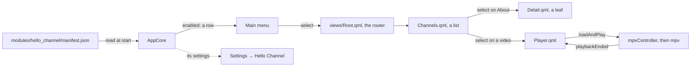
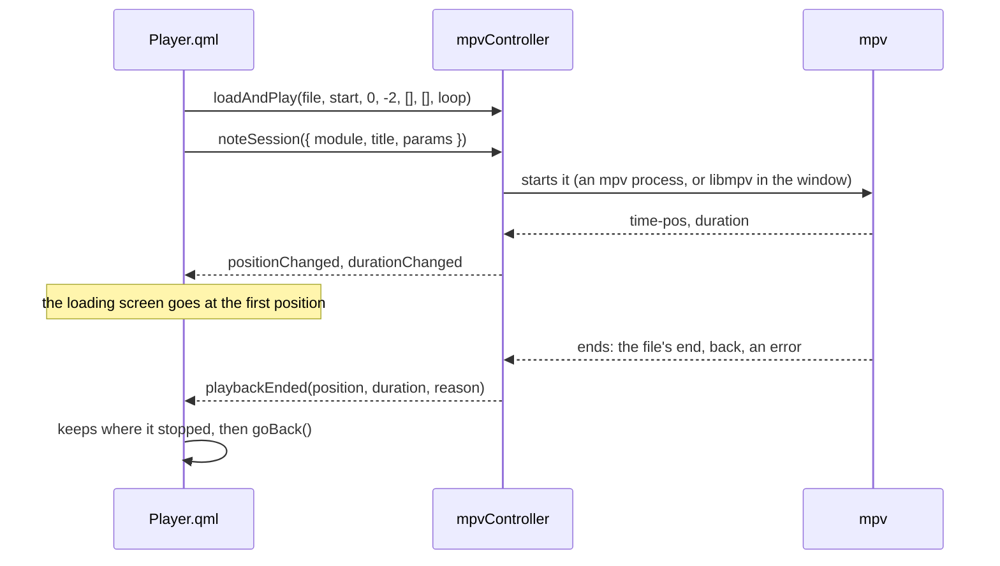

# Writing a module

A module is how a new source of videos joins OSD/OS: one more input on the deck. This page builds one from nothing, step by step, with every file whole: **Hello Channel**, which lists the videos in a folder, plays them through OSD/OS's player, has settings of its own, then grows a C++ backend and tests. Every piece of code here was run against OSD/OS's current source, built and driven under Xvfb, and its test passed.

The reference for all of it is [ARCHITECTURE.md](https://github.com/mehmetraif/OSD-OS/blob/main/ARCHITECTURE.md) ([Anatomy of a Module](https://github.com/mehmetraif/OSD-OS/blob/main/ARCHITECTURE.md#anatomy-of-a-module), [manifest.json](https://github.com/mehmetraif/OSD-OS/blob/main/ARCHITECTURE.md#manifestjson-reference), [AppCore](https://github.com/mehmetraif/OSD-OS/blob/main/ARCHITECTURE.md#appcore--the-app-shell), [QML View Patterns](https://github.com/mehmetraif/OSD-OS/blob/main/ARCHITECTURE.md#qml-view-patterns), [Components](https://github.com/mehmetraif/OSD-OS/blob/main/ARCHITECTURE.md#components-wip)), and the house rules are in [CONTRIBUTING.md](https://github.com/mehmetraif/OSD-OS/blob/main/CONTRIBUTING.md).

## What a module is

OSD/OS is a browsing shell that hands off to purpose-built tools. The shell (`AppCore`) finds the modules, shows their settings and routes what they ask for; a module browses its own content and, to play, hands the video to mpv through `mpvController`. A module has up to three parts:

| Part | Where | Needed |
|---|---|---|
| `manifest.json` | `modules/<name>/manifest.json` | Yes: the module's identity and its settings |
| QML views | `modules/<name>/views/`, the entry point `Root.qml` | Yes |
| A C++ backend | `src/modules/<name>/<Name>Backend.h` and `.cpp` | Only when QML can't do it alone: files, a network API, a process |

At start, `AppCore` reads every `modules/*/manifest.json`, in the order of the folders' names. A module with no backend needs no change anywhere else: drop its folder in and it is there. One with a backend adds one `registerModule(...)` call to `src/main.cpp`.



Five principles from CONTRIBUTING.md shape every module:

1. **A remote is enough.** Every screen works with the arrows, select and back (Enter, Escape or Backspace on a keyboard). A gamepad arrives as the same keys, so a view that handles the keys handles gamepads too: never add gamepad code to a view.
2. **Laid out for a CRT.** Everything is sized from the screen (`root.sw`, `root.sh`), never in pixels, inside the safe area every view uses, away from a tube's edges.
3. **Self-contained.** The module's files stay in `modules/<name>` and `src/modules/<name>`.
4. **No tracking.** A module talks only to the service it shows, and writes only to OSD/OS's data folder.
5. **Browse, then hand off.** Playing is handed to a program made for it: mpv, or another one through `DisplayHandoff`. The module never plays anything itself.

## The manifest

`manifest.json` is the module's identity and the shape of its settings. Settings → *the module's name* is built from it, with no QML of the module's own.

| Key | Needed | What it is |
|---|---|---|
| `id` | Yes | The module's id, `com.osdos.<name>` by convention. Its settings are saved under `modules.<id>` in `config.json`, its lists under it in `lists.json` |
| `name` | | Shown on the main menu (in capitals), as the Settings row, and in the module's title bar |
| `icon` | | Its logo, relative to the module's folder |
| `entry_point_qml` | Yes | Its router, relative to the module's folder: `views/Root.qml` |
| `settings` | | Its settings, in the order Settings shows them. A module with none isn't listed in Settings |

A manifest that isn't JSON is left out, with `[AppCore] Bad manifest.json in <folder>: <error>` in the log; one without `id` or `entry_point_qml`, with `[AppCore] Skipping <folder>: manifest missing 'id' or 'entry_point_qml'`.

Each setting is an object:

| Key | For | What it does |
|---|---|---|
| `key` | Every type | Its key under `modules.<id>`. A dot reaches one level down (`libraries.abc` is `"libraries": { "abc": … }`) |
| `label` | Every type | The row's text, shown in capitals |
| `type` | Every type | One of the types below |
| `default` | `toggle`, `list_single` | What the row shows while nothing is saved: `"ON"` or `"OFF"`, or one of the options (a dynamic list shows its first choice instead, and a `directory_browser` shows `Default`). OSD/OS doesn't write it: your own code must read an unset key as this default too |
| `description` | Every type | The help line under the menu while the row is selected. Lines written with `\n` read as one, joined with `•`; by convention `[WORD]` explains one of the choices |
| `options` | `list_single` | The choices, saved as they are written |
| `options_source`, `options_slot` | `list_single`, `multiselect_submenu` | `"dynamic"`, and the backend slot that sends the choices ([part 3](#part-3-a-c-backend)) |
| `apply_slot` | `list_single` with dynamic choices | A backend slot called after each change |
| `action_slot` | `action` | The backend slot select calls |
| `params` | `module_view` | The `navParams` the module's `Root.qml` opens with |
| `settings` | `submenu` | Its own rows, in this same format |
| `requires_auth` | Every type | Shown only while the backend's `get_auth_state()` is neither `""` nor `"none"`: Plex hides its server, user and library rows until it is signed in |
| `requires_capability` | Every type | Shown only while the backend's choices for `_capabilities` name it: Jellyfin's skip rows need its server's media segments |

The types, as Settings shows and saves them:

| `type` | In Settings | Saved as |
|---|---|---|
| `toggle` | `ON` or `OFF`; ◄ ►, and select, flip it. `default` is `"ON"` or `"OFF"` | `true` or `false` |
| `list_single` with `options` | ◄ ► step through the choices, round the ends | The choice's text |
| `list_single` with `"options_source": "dynamic"` | The backend's labels. While nothing is saved the row shows the first choice, so put the default first | The choice's `id` |
| `multiselect_submenu` | Select opens a page of the backend's choices, each switched on and off | `{ "<id>": true, … }` under the key; every choice is on until it is switched off |
| `submenu` | Select opens its rows on a page of their own, titled `MODULE / LABEL` (YouTube's Advanced) | Its rows' keys, flat under `modules.<id>` |
| `module_view` | Select opens the module itself, its `Root.qml` with `params` (Netflix's Sign in) | Nothing |
| `directory_browser` | Select opens the folder picker, the tree Local Files is browsed with; the row shows the path, or `Default` | The folder's path; `""` for **Default Folder**, which the module gives a meaning |
| `action` | Select calls `action_slot` | Nothing |

There is no free-text type: Weather reads its places from a file in the data folder instead, and a view of your own can open the `OnScreenKeyboard`.

**`enabled`** is a setting like the others, with one meaning more: `AppCore` lists a module on the main menu while `modules.<id>.enabled` is true, or, unset, while its manifest's `enabled` default isn't `"OFF"`. A module without an `enabled` setting is always on. Most of OSD/OS's own ship `"OFF"`; Local Files and Playlists `"ON"`.

## Part 1: a pure-QML module

Hello Channel's first version is QML only: four files and a logo, no build.

```text
modules/hello_channel/
├── manifest.json
├── assets/
│   └── images/
│       └── logo.svg
└── views/
    ├── Root.qml
    ├── Channels.qml
    ├── Detail.qml
    └── Player.qml        (part 2)
```

### manifest.json

An `enabled` toggle, a folder, a list with fixed choices, another toggle, and the module's own Scaling:

```json
{
  "id": "com.osdos.hello_channel",
  "name": "Hello Channel",
  "icon": "assets/images/logo.svg",
  "entry_point_qml": "views/Root.qml",
  "settings": [
    {
      "key": "enabled",
      "label": "Enabled",
      "type": "toggle",
      "default": "ON"
    },
    {
      "key": "video_folder",
      "label": "Video Folder",
      "type": "directory_browser",
      "default": "",
      "description": "The folder whose videos the channel lists\n[DEFAULT] None: pick one here first"
    },
    {
      "key": "sort_order",
      "label": "Sort Order",
      "type": "list_single",
      "options": ["A to Z", "Z to A"],
      "default": "A to Z",
      "description": "The order the videos are listed in"
    },
    {
      "key": "loop_playback",
      "label": "Loop Playback",
      "type": "toggle",
      "default": "OFF",
      "description": "Play a video over and over until you stop it"
    },
    {
      "key": "video_scaling",
      "label": "Scaling",
      "type": "list_single",
      "options": ["Default", "Letterbox", "14:9", "Pan & Scan", "Anamorphic"],
      "default": "Default",
      "description": "How a 16:9 picture fills the 4:3 screen in this module\n[DEFAULT] As Settings' Scaling says"
    }
  ]
}
```

`video_scaling` needs no code: while a module's views are open, the player takes that module's own `video_scaling` (unless it is `Default`) over Settings' Scaling. Every video module has this row, written as here.

### The logo

`assets/images/logo.svg`, a pixel-art TV on a 20 × 20 grid, in one colour:

```xml
<?xml version="1.0" encoding="utf-8"?>
<svg xmlns="http://www.w3.org/2000/svg" viewBox="0 0 20 20">
  <path fill-rule="evenodd" style="fill: rgb(255, 255, 255);"
        d="M5 0H7V2H5Z M13 0H15V2H13Z M7 2H9V4H7Z M11 2H13V4H11Z
           M0 4H20V18H0Z M2 6V16H15V6Z M17 7V9H19V7Z M17 11V13H19V11Z
           M2 18H5V20H2Z M15 18H18V20H15Z"/>
</svg>
```

The title bar draws a logo through `OsdIconProvider`: trimmed to its shape, a fifth taller than the bar, in the colour scheme's text colour, from its alpha. So draw it white on clear, as OSD/OS's own are. A skin can draw it differently by its folder's name, with `"icons": { "hello_channel": "tv.png" }` in its `skin.json` ([Skins](https://github.com/mehmetraif/OSD-OS/wiki/Skins)).

### Root.qml: the router

The shell loads `Root.qml` and listens for its `goBack()`, which leaves the module. Everything else is the router's own: a stack of views in one `Loader`. Its code is the Playlists module's router, but for the id and the first view; every module of OSD/OS has one built the same way, some deciding more as they start (YouTube's and Netflix's sign-in, Plex's NFC cards):

```qml
import QtQuick

// Hello Channel's router: the module's own stack of views. The shell loads
// this file (the manifest's entry_point_qml) and listens for goBack(), which
// leaves the module.
FocusScope {
    id: moduleRoot

    // Leaves the module, back to the main menu.
    signal goBack()

    property var navParams: ({})

    // The manifest's id: the one place it appears in this module's QML.
    // The views read it as moduleRoot.moduleId.
    property string moduleId: "com.osdos.hello_channel"
    property var _moduleInfo: appCore ? appCore.get_module_info(moduleId) : ({})
    property string moduleName: _moduleInfo.name || ""
    property string moduleIcon: _moduleInfo.icon || ""

    property var navStack: []
    property var currentParams: ({})

    function navigateTo(viewPath, params, fromState) {
        var resolved = Qt.resolvedUrl(viewPath)
        navStack.push({ source: internalLoader.source, params: currentParams, listState: fromState || {} })
        currentParams = params || {}
        root.changeWindow(internalLoader, resolved, { "navParams": params || {} })
    }

    // Shows a view in place of this one, without pushing it on the stack.
    function replaceWith(viewPath, params) {
        var resolved = Qt.resolvedUrl(viewPath)
        currentParams = params || {}
        root.changeWindow(internalLoader, resolved, { "navParams": params || {} })
    }

    function navigateBack() {
        if (navStack.length === 0) {
            moduleRoot.goBack()
            return
        }
        var prev = navStack.pop()
        if (!prev.source || prev.source.toString() === "") {
            moduleRoot.goBack()
            return
        }
        // The list state the view left with comes back in its navParams.
        var restored = Object.assign({}, prev.params)
        restored.navListState = prev.listState || {}
        currentParams = restored
        root.changeWindow(internalLoader, prev.source, { "navParams": restored })
    }

    Loader {
        id: internalLoader
        anchors.fill: parent
        focus: true
        onLoaded: { if (item) item.forceActiveFocus() }

        Connections {
            target: internalLoader.item
            ignoreUnknownSignals: true
            function onNavigateTo(path, params, listState) { moduleRoot.navigateTo(path, params, listState) }
            function onReplaceWith(path, params) { moduleRoot.replaceWith(path, params) }
            function onGoBack() { moduleRoot.navigateBack() }
        }
    }

    // The first view. resumePlayer is set when the main menu's first row
    // takes a video playing behind the menus back (Transparent Background).
    Component.onCompleted: navigateTo("Channels.qml", { resumePlayer: navParams.resumePlayer })
}
```

How it works:

- **`id: moduleRoot`, always.** The views are made inside the router's `Loader`, so they reach it by that id: `moduleRoot.moduleId`, `moduleRoot.moduleName`, `moduleRoot.moduleIcon`.
- **The id once.** `moduleId` is the only place the manifest's id is written in the module's QML. `moduleName` and `moduleIcon` come from `appCore.get_module_info()`, never typed in.
- **`root.changeWindow(loader, source, properties)`**, never `loader.source` or `setSource()`. `root` is the app's window (`Main.qml`): `changeWindow()` plays Settings' transition between the two views, and notes a video's view so that effects and menu music rest while it shows.
- **The stack's first entry is empty.** The first `navigateTo()` pushes the loader's empty source; back from the first view pops it, and `navigateBack()` then calls `goBack()`: the module is left.
- **Position comes back.** A view leaves with a list state (`{ currentIndex: … }`), and gets it back as `navParams.navListState` when back returns to it.
- **`replaceWith()`** shows a view without pushing it: Plex's `CardPlay.qml` hands over to its player this way, so back from the video returns to the NFC Reader.
- **Starting params.** What the shell opens the module with is in the router's own `navParams`: `resumePlayer` (which this router passes on, below); `fromAppStartup` when OSD/OS opened the module by itself as it started (Settings → Start on Module, or Play at Startup); and `startupPlay`, the favourite to play at once, with Play at Startup. Local Files' router passes `startupPlay` on to its tree; Scripts' runs its Auto-Run On Startup script at `fromAppStartup`.

### Channels.qml: a list view

The channel's first page: the videos of the Video Folder, a heading, and **About This Channel**. A view is a `FocusScope` that declares `navParams` and talks to the router only through its signals:

```qml
import QtQuick
import Components

// The channel's first page: the videos in the Video Folder, then ABOUT THIS
// CHANNEL. Select plays a video, or opens About.
FocusScope {
    id: channelsRoot

    property var navParams: ({})
    property var navListState: navParams.navListState || ({})

    signal navigateTo(string path, var params, var listState)
    signal goBack()

    readonly property var videoTypes: ["mp4", "mkv", "avi", "mov", "m4v", "webm"]
    property var rows: []

    // The folder the setting names: "" until one is picked.
    function folder() {
        return appCore.get_setting(moduleRoot.moduleId, "video_folder") || ""
    }

    // One row per video: { type, label, value, path }.
    function videoRows() {
        var dir = folder()
        if (dir === "")
            return [{ type: "empty", label: "No Folder Chosen", value: "" }]
        var out = []
        var entries = appCore.folderEntries(dir, videoTypes)
        for (var i = 0; i < entries.length; i++) {
            if (entries[i].isFolder)
                continue
            var name = entries[i].name
            out.push({ type: "video", label: name.replace(/\.[^.]+$/, ""),
                       value: name.replace(/^.*\./, "").toUpperCase(), path: entries[i].path })
        }
        if ((appCore.get_setting(moduleRoot.moduleId, "sort_order") || "A to Z") === "Z to A")
            out.reverse()
        return out.length > 0 ? out : [{ type: "empty", label: "No Videos", value: "" }]
    }

    function reload() {
        rows = videoRows().concat([{ type: "section", label: "Channel" },
                                   { type: "about", label: "About This Channel" }])
    }

    Component.onCompleted: {
        reload()
        // Back from a view: the cursor on the row it was on.
        if (navListState.currentIndex !== undefined)
            list.currentIndex = Math.min(navListState.currentIndex, rows.length - 1)
        // From the main menu's row for a video playing behind the menus: its
        // player, which takes it back. Deferred: the router listens to this
        // view only once it has been made.
        var behind = navParams.resumePlayer
        if (!navParams.navListState && behind && behind.filePath)
            Qt.callLater(function() {
                channelsRoot.navigateTo("Player.qml", behind, { currentIndex: list.currentIndex })
            })
    }

    AppBar {
        iconSource: moduleRoot.moduleIcon
        title: moduleRoot.moduleName
        anchors.top: parent.top
        anchors.left: parent.left
        anchors.topMargin: root.sh * 0.125 //60
        anchors.leftMargin: root.sw * 0.125 //80
    }

    MenuList {
        id: list
        model: channelsRoot.rows
        focus: true

        Keys.onReturnPressed: {
            var row = channelsRoot.rows[currentIndex]
            if (!row)
                return
            if (row.type === "video")
                channelsRoot.navigateTo("Player.qml", { filePath: row.path, title: row.label },
                                        { currentIndex: currentIndex })
            else if (row.type === "about")
                channelsRoot.navigateTo("Detail.qml", { videoCount: channelsRoot.rows.filter(
                                            function(r) { return r.type === "video" }).length },
                                        { currentIndex: currentIndex })
        }
        Keys.onPressed: function(event) {
            if (event.key === Qt.Key_Escape || event.key === Qt.Key_Backspace || event.key === Qt.Key_Back) {
                channelsRoot.goBack()
                event.accepted = true
            }
        }

        delegate: MenuRow {
            width: list.width
            height: root.sh * 0.0583333 //28
            heading: modelData.type === "section"
            keepValue: modelData.type === "video"
            label: modelData.label || ""
            value: modelData.value || ""
            selected: list.currentIndex === index
        }
    }

    HelpLine {
        readonly property var row: channelsRoot.rows[list.currentIndex]
        text: !row ? ""
            : row.type === "video" ? row.path
            : row.type === "empty" ? "Pick a folder in Settings, Hello Channel, Video Folder"
            : "The channel's settings, and how many videos it has"
        anchors.bottom: parent.bottom
        anchors.left: parent.left
        anchors.bottomMargin: root.helpLineMargin
        anchors.leftMargin: root.sw * 0.125 //80
    }

    HintBar {
        readonly property var row: channelsRoot.rows[list.currentIndex]
        text: root.hints.back + ":BACK " + root.hints.navigate + ":NAVIGATE "
              + (row && row.type === "video" ? root.hints.select + ":PLAY"
                 : row && row.type === "about" ? root.hints.select + ":OPEN" : "")
        anchors.bottom: parent.bottom
        anchors.left: parent.left
        anchors.bottomMargin: root.sh * 0.1041667 //50
        anchors.leftMargin: root.sw * 0.125 //80
    }
}
```

What each part does, and why it is written so:

- **`navParams` and `navListState`.** The router hands each view its `navParams`; a list view reads `navListState` from them and puts the cursor back where it was.
- **`navigateTo(path, params, listState)`** always takes three arguments: the view, its params, and the state this view wants back (`{ currentIndex }`). The router resolves the path against its own folder, `views/`.
- **`Qt.callLater`** for a `navigateTo` from `Component.onCompleted`: the router connects to a view only once it has been made, so a signal sent while it is being made reaches no one.
- **`goBack()`** goes one view back; only the router's own `goBack()` leaves the module.
- **Reading settings.** `appCore.get_setting(moduleId, key)` reads `config.json` as it is now. Fall back to the manifest's `default` yourself: an unset key is `undefined`.
- **Files.** `appCore.folderEntries(path, types)` gives a folder's entries, `[{ name, path, isFolder }]`: its folders, then its files of those types, hidden ones left out. A pure-QML module can list a folder with it.
- **`MenuList`** is the menu in the place every view has it, under the title bar, with ▲ ▼ when rows are hidden; its cursor steps over rows of `type: "section"` and goes round the ends. The view gives it the rows and a delegate, and handles select and back.
- **`MenuRow`** draws a line the way a camcorder's menu does, `TEST CARD······MP4`; `heading` makes a group's heading (`CHANNEL ────`); `keepValue` cuts the label short rather than the value.
- **`HelpLine`** is the box under the menu, scrolling a line too long for it; Settings → Help Line hides every one. `root.helpLineMargin` puts it over the hint bar, or in its place while Settings → Hint Bar is off.
- **`HintBar`**, always at the foot, in the same place on every screen. Its text is built from **`root.hints`**: `[ESC]`, `[ENTER]` and `[▲▼]` on a keyboard, the button's own label once a gamepad was touched. Never type `[ESC]`, and never bind to `inputManager.hints`: as the router swaps views, the old view's context properties go null, while `root` stays.
- **Sizes** are fractions of the screen, `root.sw` and `root.sh`, with the 640 × 480 pixels in a comment. The title bar starts at `root.sh * 0.125` and `root.sw * 0.125`; the hint bar ends `root.sh * 0.1041667` above the bottom. These keep the view inside a CRT's safe area at any resolution. A list of your own grows by `root.hintRoom` (and, over a help line, `root.helpRoom`): a row for each bar that Settings turns off, `MenuList` doing it by itself.
- **Colours and font.** The shared components already draw in `root.primaryColor` on `root.surfaceColor`, in `root.globalFont`, capitals: a view of its own uses the same, so the colour schemes and themes reach it.

### Detail.qml: a leaf view

**About This Channel** is a page to read: a leaf, which only goes back, so it declares `goBack()` and no `navigateTo`:

```qml
import QtQuick
import Components

// About This Channel: a page to read, not to choose from. A leaf view: it
// only goes back.
FocusScope {
    id: detailRoot

    property var navParams: ({})

    signal goBack()

    focus: true
    Keys.onPressed: function(event) {
        if (event.key === Qt.Key_Escape || event.key === Qt.Key_Backspace || event.key === Qt.Key_Back) {
            goBack()
            event.accepted = true
        }
    }

    // Each line as Settings would show it: a toggle unset is its default.
    readonly property var lines: [
        { label: "Folder", value: appCore.get_setting(moduleRoot.moduleId, "video_folder") || "None" },
        { label: "Videos", value: String(navParams.videoCount || 0) },
        { label: "Sort Order", value: appCore.get_setting(moduleRoot.moduleId, "sort_order") || "A to Z" },
        { label: "Loop Playback", value: appCore.get_setting(moduleRoot.moduleId, "loop_playback") ? "On" : "Off" },
        { label: "OSD/OS", value: root.appVersion }
    ]

    AppBar {
        iconSource: moduleRoot.moduleIcon
        title: moduleRoot.moduleName
        subtitle: "About"
        anchors.top: parent.top
        anchors.left: parent.left
        anchors.topMargin: root.sh * 0.125 //60
        anchors.leftMargin: root.sw * 0.125 //80
    }

    Column {
        anchors.top: parent.top
        anchors.left: parent.left
        anchors.topMargin: root.sh * 0.25 //120
        anchors.leftMargin: root.sw * 0.115625 //74
        width: root.sw * 0.76875 //492

        Repeater {
            model: detailRoot.lines
            delegate: MenuRow {
                width: parent.width
                height: root.sh * 0.0583333 //28
                label: modelData.label
                value: modelData.value
                // Read, not chosen: a long value scrolls all the time.
                alwaysScroll: true
            }
        }
    }

    HintBar {
        text: root.hints.back + ":BACK"
        anchors.bottom: parent.bottom
        anchors.left: parent.left
        anchors.bottomMargin: root.sh * 0.1041667 //50
        anchors.leftMargin: root.sw * 0.125 //80
    }
}
```

`AppBar`'s `subtitle` names where you are in the module. A question or a notice that hides the whole view is a `PromptScreen`, a question in the title bar behind a **?** (a notice behind a **!**) with its answers, never a line of text in the middle of a view; see the [Components](#the-shared-components) below.

### Trying it

Copy the folder into `modules/` and start OSD/OS (no build needed for QML):

```sh
APP_ROOT=$(pwd) ./build/osdos
```

**HELLO CHANNEL** is on the main menu, among the modules in the order of their folders' names: first, with OSD/OS's defaults. Its list says **No Folder Chosen** until Settings → Hello Channel → Video Folder names one; the page is built from the manifest:

<table>
<tr><th width="50%">Settings → Modules</th><th width="50%">A module's settings</th></tr>
<tr><td></td><td></td></tr>
<tr><td>Further down Settings, a row per module that has settings, under the MODULES heading, in the order of their folders: Hello Channel's comes after Emby's.</td><td>A settings page made from a manifest, Local Files' here: a toggle, a folder, lists. Hello Channel's has its five rows the same way.</td></tr>
</table>

Changing a row saves it at once. With Sort Order on Z to A and Loop Playback on, `config.json` has, among the rest:

```json
{
    "modules": {
        "com.osdos.hello_channel": {
            "loop_playback": true,
            "sort_order": "Z to A",
            "video_folder": "/home/pi/Videos"
        }
    }
}
```

Back in the channel, the list reads in the new order: a view reads its settings each time it is made.

## Part 2: playing a video

Select on a video opens `Player.qml`, which hands the file to mpv the way Local Files' player does:

```qml
import QtQuick
import Components

// Plays one file through mpv the way Local Files' player does: a tape
// loading until the first position comes, the remote's keys handed to mpv's
// on-screen controls, and one playbackEnded handler that every end goes
// through. Where the video stopped goes on the module's "recent" list, so it
// starts there next time. Named …Player.qml, so the effects and the menu
// music rest while it is shown.
FocusScope {
    id: playerRoot

    property var navParams: ({})

    signal goBack()

    property string filePath: navParams.filePath || ""
    property string itemTitle: navParams.title || ""

    // The first position has come: the loading screen goes.
    property bool playbackStarted: false
    property int startMs: 0
    property int lastKnownPositionMs: 0
    property int lastKnownDurationMs: 0

    focus: true

    // Where this file stopped last time: its entry on the module's own
    // "recent" list (AppCore keeps it in lists.json).
    function savedPosition() {
        var recent = appCore.get_list(moduleRoot.moduleId, "recent")
        for (var i = 0; i < recent.length; i++) {
            if (recent[i].path === filePath)
                return recent[i].pos || 0
        }
        return 0
    }

    function play(fromMs) {
        playbackStarted = false
        startMs = fromMs
        var loop = !!appCore.get_setting(moduleRoot.moduleId, "loop_playback")
        // url, start (s), audio track (0: mpv's choice), subtitles (-2: off),
        // subtitle files, subtitle languages, loop.
        mpvController.loadAndPlay(filePath, fromMs / 1000.0, 0, -2, [], [], loop)
        // With Transparent Background, how the main menu's first row takes
        // the video back once it plays behind the menus.
        mpvController.noteSession({ module: moduleRoot.moduleId, title: itemTitle,
                                    params: { filePath: filePath, title: itemTitle } })
    }

    Component.onCompleted: play(savedPosition())

    // mpv has the picture: the keys go to its on-screen controls.
    Keys.onPressed: function(event) {
        var key = ""
        switch (event.key) {
        case Qt.Key_Escape:
        case Qt.Key_Back:      key = "ESC"; break
        case Qt.Key_Backspace: key = "BS"; break
        case Qt.Key_Up:        key = "UP"; break
        case Qt.Key_Down:      key = "DOWN"; break
        case Qt.Key_Left:      key = "LEFT"; break
        case Qt.Key_Right:     key = "RIGHT"; break
        case Qt.Key_Space:     key = "SPACE"; break
        case Qt.Key_Return:
        case Qt.Key_Enter:     key = "ENTER"; break
        }
        if (key !== "") {
            mpvController.sendKey(key)
            event.accepted = true
        }
    }

    Connections {
        target: mpvController
        function onPositionChanged(ms) {
            if (ms > 0) {
                playerRoot.lastKnownPositionMs = ms
                playerRoot.playbackStarted = true
            }
        }
        function onDurationChanged(ms) {
            if (ms > 0)
                playerRoot.lastKnownDurationMs = ms
        }
        // Every end comes here once: "eof", "stopped" or "failed". By then
        // mpv has gone, so every branch goes back (or starts another video):
        // a player that stays shown over a dead mpv freezes the app.
        function onPlaybackEnded(finalPositionMs, finalDurationMs, reason) {
            var pos = playerRoot.lastKnownPositionMs || finalPositionMs
            var dur = playerRoot.lastKnownDurationMs || finalDurationMs
            var done = reason === "eof" || (dur > 0 && pos >= dur * 0.95)
            if (reason === "failed")
                console.warn("[HelloChannel] mpv could not play " + playerRoot.filePath)
            appCore.add_to_list(moduleRoot.moduleId, "recent",
                                { name: playerRoot.itemTitle, path: playerRoot.filePath,
                                  pos: done ? 0 : pos }, 30)
            playerRoot.goBack()
        }
    }

    Rectangle {
        anchors.fill: parent
        color: "black"

        // A tape loading, until the picture comes.
        LoadingScreen {
            anchors.fill: parent
            source: moduleRoot.moduleName
            startMs: playerRoot.startMs
            durationMs: playerRoot.lastKnownDurationMs
            visible: !playerRoot.playbackStarted
        }
    }
}
```



### loadAndPlay

`mpvController.loadAndPlay()` takes the video and how to play it; everything after the first four arguments has a default. The ones a module uses most:

| # | Argument | Hello Channel passes | What it is |
|---|---|---|---|
| 1 | `url` | the file's path | A file, a playlist (`.m3u`) or a stream's URL |
| 2 | `startSeconds` | the saved position | Where to start; under half a second, from the beginning |
| 3 | `audioTrack` | `0` | `0` for mpv's choice, else a track's number |
| 4 | `subTrack` | `-2` | `-2` subtitles off, `0` on, `-1` forced only (needs mpv 0.38 or newer), above 0 a track's number |
| 5, 6 | `subFiles`, `subLangs` | `[]`, `[]` | Subtitle files to load; preferred subtitle languages |
| 7 | `loop` | Loop Playback | Over and over (`--loop-playlist=inf`) |
| 8 | `playlistStart` | | Where in a playlist to start, `-1` for its start |
| 12 | `oscMode` | | `"ambient"` for Ambient:Mode's own on-screen controls |
| 13 | `shuffle` | | A playlist in random order |
| 15, 16 | `imageDurationSec`, `imageContent` | | For pictures: how long each shows |
| 17 | `extraArgs` | | mpv options of the module's own: YouTube passes `--ytdl=yes`, with its yt-dlp options |
| 19 | `extraUrls` | | More files after the first, one playlist |

The app adds the rest itself: the board's decoder and output, Settings' Scaling (or the module's own `video_scaling`), Video Levels, Audio Output, the channel logo, the IPC socket mpv is driven through ([Playback and mpv](https://github.com/mehmetraif/OSD-OS/wiki/Playback-and-mpv)).

### The rules a player keeps

- **One handler for every end.** `playbackEnded(finalPositionMs, finalDurationMs, reason)` comes once, after mpv has gone, with `reason` `"eof"` (the end of the file), `"stopped"` (back, a stop, or a crash), `"failed"` (mpv couldn't play it, its exit code 2) or `"menu"` (only for a player whose note says `menu: true`, which opens a menu of its own, as Local Files' does). Every branch must go back, or start the next video: a player left on screen over a dead mpv freezes the app. A module can do more on one reason: Plex plays the next episode at `eof`, and retries with a transcode at `failed`.
- **The keys go to mpv.** While mpv has the picture, its on-screen controls take the remote's keys through `mpvController.sendKey()`, by mpv's names (`ESC`, `ENTER`, `UP`, …). Back reaches mpv as `ESC`, which ends the video; while mpv's deck menu is open (▲ or ▼ opens it), back closes that first.
- **A loading screen until the picture.** `LoadingScreen` is the tape loading every player shows (TAPE A at `startMs`, TAPE B with `durationMs` once known), until the first position arrives. On a Pi, mpv takes the screen as it starts, and what stays on it until the picture comes is the frame drawn last: this one.
- **The name.** A view whose file name ends in `Player.qml`, `Play.qml`, `Launch.qml`, `Takeover.qml`, `SignIn.qml` or `Console.qml` is a video's view to `Main.qml`: while it shows, no effect, transition or menu music plays. A layer of a video's elsewhere says so with `root.restFor(item, true)`, as `LoadingScreen` and `PlayerMenu` do.
- **Where it stopped.** Hello Channel keeps it on its own `recent` list, in `lists.json` beside `config.json`, through `appCore.add_to_list(moduleId, name, entry, limit)`: an entry is put first in place of one with its `path`, and the newest `limit` are kept. `get_list()`, `remove_from_list()` and `list_contains()` read and change them; Local Files' Recently Watched and Favorites are lists like this.


`LoadingScreen` as YouTube's player shows it: the module's name under SLP ▶ (`source`), TAPE A at where the video starts (`startMs`), TAPE B with its length once known (`durationMs`). Hello Channel's says HELLO CHANNEL there.

### Transparent Background, and the main menu's first row

With Settings → Transparent Background on, the video plays inside OSD/OS's window, and back returns to the menus with the picture going on behind them. For the player nothing changes: back still ends in `playbackEnded(…, "stopped")`, and it goes back as always. Two lines make the video easy to take back:

1. **`noteSession({ module, title, params })`**, right after `loadAndPlay()`. While the video plays behind the menus, the main menu leads with a row for it, `► TEST CARD`, the cursor on it.
2. **Routing `resumePlayer`.** Select on that row opens the module with `navParams.resumePlayer`, the `params` noted. `Root.qml` passes it to `Channels.qml`, which opens the player with it. The player starts the same file from the point back saved, and `mpvController` sees the same command line apart from the start: rather than starting the video again, it brings the one playing back to full screen, carrying on where the picture is.

Without a note, a video behind the menus comes back only by choosing it again.

A player with a menu of its own (`menu: true` in its note) gets the row without Transparent Background too. Its menu's Browse, with nothing playing under it (`mpvController.videoActive` false), calls `mpvController.leaveSession()` before going back, and the main menu offers the stopped video until mpv plays anything else. Opened with the noted `params`, the player finds its video in `root.takeBackNote` and starts it where it saved it, without asking.

## Part 3: a C++ backend

A backend is a `QObject` the views call. It is worth one when QML alone can't, or shouldn't: walking folders, talking to a service's API (`QNetworkAccessManager`, asynchronous, on the main thread), running a process, keeping state in JSON files. Hello Channel's backend gives the module a folder of its own, lists it, and offers the **Video Type** setting choices that depend on what is in the folder.

```text
src/modules/hello_channel/
├── HelloChannelBackend.h
└── HelloChannelBackend.cpp
```

### HelloChannelBackend.h

```cpp
#pragma once
#include <QObject>
#include <QString>
#include <QVariant>
#include <QVariantList>

// Hello Channel's backend: the folder its videos are in (the Video Folder
// setting, or <data folder>/hello_channel), what is in it, and the choices
// of the Video Type setting, which depend on what is in it.
class HelloChannelBackend : public QObject {
    Q_OBJECT
public:
    explicit HelloChannelBackend(const QString &dataRoot, QObject *parent = nullptr);

    // The folder in force: the setting's, else the module's own.
    Q_INVOKABLE QString videoFolder() const { return m_folder; }
    // Its videos of one type ("all", or an extension such as "mkv"), by
    // name, as [{ name, path, type }].
    Q_INVOKABLE QVariantList videos(const QString &type = QStringLiteral("all")) const;

    // manifest: video_type (list_single, "options_source": "dynamic")
    Q_INVOKABLE void getVideoTypes();
    // manifest: rescan (action)
    Q_INVOKABLE void rescan();

public slots:
    // Connected to AppCore::moduleSettingChanged by registerModule, because
    // it is declared with exactly this signature.
    void onSettingChanged(const QString &moduleId, const QString &key, const QVariant &value);

signals:
    // Re-emitted by AppCore as dynamicOptionsReady(moduleId, key, options).
    void dynamicOptionsReady(const QString &key, const QVariant &options);
    // The folder, or what is in it, changed: the list reads it again.
    void videosChanged();

private:
    void setFolder(const QString &path);

    QString m_dataRoot;
    QString m_folder;
};
```

### HelloChannelBackend.cpp

```cpp
#include "HelloChannelBackend.h"
#include <QDir>
#include <QFile>
#include <QFileInfo>
#include <QJsonDocument>
#include <QJsonObject>

static const char *kModuleId = "com.osdos.hello_channel";
static const QStringList kVideoTypes = { "mp4", "mkv", "avi", "mov", "m4v", "webm" };

HelloChannelBackend::HelloChannelBackend(const QString &dataRoot, QObject *parent)
    : QObject(parent), m_dataRoot(dataRoot)
{
    // The saved folder, read straight from config.json, as the Scripts and
    // Ambient Mode backends read theirs as they are made.
    QString configured;
    QFile f(m_dataRoot + QStringLiteral("/config.json"));
    if (f.open(QIODevice::ReadOnly)) {
        const QJsonObject cfg = QJsonDocument::fromJson(f.readAll()).object();
        configured = cfg.value("modules").toObject().value(QLatin1String(kModuleId)).toObject()
                         .value("video_folder").toString();
    }
    setFolder(configured);
}

void HelloChannelBackend::setFolder(const QString &path) {
    // "" (the picker's Default Folder) is the module's own folder.
    m_folder = path.isEmpty() ? m_dataRoot + QStringLiteral("/hello_channel") : path;
    QDir().mkpath(m_folder);
    qInfo("[HelloChannel] video folder: %s", qPrintable(m_folder));
}

QVariantList HelloChannelBackend::videos(const QString &type) const {
    QVariantList list;
    const QFileInfoList files = QDir(m_folder).entryInfoList(QDir::Files, QDir::Name | QDir::IgnoreCase);
    for (const QFileInfo &file : files) {
        const QString suffix = file.suffix().toLower();
        if (!kVideoTypes.contains(suffix) || (type != QLatin1String("all") && suffix != type))
            continue;
        list.append(QVariantMap{ { "name", file.completeBaseName() },
                                 { "path", file.absoluteFilePath() },
                                 { "type", suffix } });
    }
    return list;
}

void HelloChannelBackend::getVideoTypes() {
    // "All" first: Settings shows the first choice while none is saved.
    QVariantList options{ QVariantMap{ { "id", "all" }, { "label", "All" } } };
    const QVariantList found = videos();
    for (const QString &type : kVideoTypes) {
        for (const QVariant &video : found) {
            if (video.toMap().value("type").toString() == type) {
                options.append(QVariantMap{ { "id", type }, { "label", type.toUpper() } });
                break;
            }
        }
    }
    emit dynamicOptionsReady(QStringLiteral("video_type"), options);
}

void HelloChannelBackend::rescan() {
    // Settings' Video Type row takes the new choices at once.
    getVideoTypes();
    emit videosChanged();
}

void HelloChannelBackend::onSettingChanged(const QString &moduleId, const QString &key,
                                           const QVariant &value) {
    // Every module's changes come here: only this module's matter.
    if (moduleId != QLatin1String(kModuleId))
        return;
    if (key == QLatin1String("video_folder")) {
        setFolder(value.toString());
        emit videosChanged();
    }
}
```

The patterns are OSD/OS's own:

- **The folder resolved in the constructor**, from `config.json`, as `ScriptsBackend` and `AmbientModeBackend` do, with a folder of its own in the data folder as the default (Local Files' is `media`, Ambient:Mode's `ambient`). `main.cpp` never touches a module's paths.
- **`Q_INVOKABLE`** for what QML calls, **signals** for what it hears back.
- **Logging** with a prefix of the module's own, `qInfo("[HelloChannel] …")` for what a user should see in a Release build, `qWarning` for what went wrong, `qDebug` for what only a build from source should print ([Troubleshooting → Reading the log](https://github.com/mehmetraif/OSD-OS/wiki/Troubleshooting#reading-the-log)).
- **State on disk** goes through `writeFileAtomically()` (`src/util/AtomicFile.h`), owner-only for a token or a key, never a `QFile` opened for writing: a power cut mid-write would leave it cut short. Hello Channel keeps nothing of its own: its settings are `AppCore`'s.

### Wiring it in

Three lines in `src/main.cpp`, beside the other backends:

```cpp
#include "modules/hello_channel/HelloChannelBackend.h"
```

```cpp
    AmbientModeBackend  ambientMode(dataRoot);
    HelloChannelBackend helloChannel(dataRoot);
```

```cpp
    appCore.registerModule("com.osdos.playlists",    "playlistsBackend",   &playlistsBackend, ctx);
    appCore.registerModule("com.osdos.hello_channel", "helloChannelBackend", &helloChannel, ctx);
```

and its source in `CMakeLists.txt`'s `add_executable(osdos …)`:

```cmake
    src/modules/playlists/ServerDownload.cpp
    src/modules/hello_channel/HelloChannelBackend.cpp
```

Then configure and build again (`cmake -B build && cmake --build build`). `registerModule(moduleId, contextProperty, backend, ctx)` stores the backend for the module's slots, makes it the QML context property `helloChannelBackend`, and connects what the backend declares, looked up by name and signature, so `main.cpp` needs nothing more:

| Declared on the backend | Becomes |
|---|---|
| signal `dynamicOptionsReady(QString, QVariant)` | `appCore.dynamicOptionsReady(moduleId, key, options)`, which Settings fills a dynamic row from |
| signal `authStateChanged()` | `appCore.moduleAuthStateChanged(moduleId)`: Settings shows or hides the `requires_auth` rows again |
| slot `onSettingChanged(QString, QString, QVariant)` | Called by `appCore.moduleSettingChanged` at every module's setting saved. An app setting (Settings' own rows) doesn't come here |
| `Q_INVOKABLE QString get_auth_state()` | Asked by `appCore.get_module_auth_state()` for the `requires_auth` rows |
| `Q_INVOKABLE QVariantList get_menu_entries()` | Asked as the main menu is built: rows `{ name, params }` of the module's own, after the modules' rows (Scripts puts its favourite scripts there) |

Settings calls `options_slot`, `action_slot` and `apply_slot` through `appCore.invoke_module_action(moduleId, slot)`, queued and with no arguments: they must be `Q_INVOKABLE` (or slots) that take none. A slot that isn't there is logged: `[AppCore] invoke_module_action: slot '<name>' not found on backend '<id>'`.

### The settings that need it

In `manifest.json`, the folder's default gets a meaning, and two rows join, a dynamic list and an action:

```json
    {
      "key": "video_folder",
      "label": "Video Folder",
      "type": "directory_browser",
      "default": "",
      "description": "The folder whose videos the channel lists\n[DEFAULT] hello_channel in the data folder"
    },
    {
      "key": "video_type",
      "label": "Video Type",
      "type": "list_single",
      "options_source": "dynamic",
      "options_slot": "getVideoTypes",
      "default": "all",
      "description": "Which of the folder's videos the channel lists\n[ALL] Every one"
    },
```

and, after `video_scaling`:

```json
    {
      "key": "rescan",
      "label": "Rescan Folder",
      "type": "action",
      "action_slot": "rescan",
      "description": "Read the folder again, for videos copied in since"
    }
```

As the module's settings page opens, Settings calls `getVideoTypes()`; its answer fills the Video Type row with **All**, then one choice per type in the folder (`MP4`, `MKV`, …), and ◄ ► save the chosen one's `id`: `"video_type": "mp4"`. Rescan Folder sends the choices again, so a type copied in since shows at once. And when Video Folder changes, `onSettingChanged()` takes the new folder.

### The views, with the backend

`Channels.qml` asks the backend for the videos, and listens to it. Take out `videoTypes` and `folder()`, and put in this `videoRows()`:

```qml
    // One row per video: { type, label, value, path }, from the backend.
    function videoRows() {
        var type = appCore.get_setting(moduleRoot.moduleId, "video_type") || "all"
        var videos = helloChannelBackend.videos(type)
        var out = []
        for (var i = 0; i < videos.length; i++)
            out.push({ type: "video", label: videos[i].name, value: videos[i].type.toUpperCase(),
                       path: videos[i].path })
        if ((appCore.get_setting(moduleRoot.moduleId, "sort_order") || "A to Z") === "Z to A")
            out.reverse()
        return out.length > 0 ? out : [{ type: "empty", label: "No Videos", value: "" }]
    }
```

then, after `Component.onCompleted`, the backend's signal:

```qml
    // The backend says when the folder, or what is in it, changed.
    Connections {
        target: helloChannelBackend
        function onVideosChanged() { channelsRoot.reload() }
    }
```

and, in the `HelpLine`, the empty list's line:

```qml
            : row.type === "empty" ? "Copy videos into " + helloChannelBackend.videoFolder()
```

In `Detail.qml`, the folder line asks the backend too:

```qml
        { label: "Folder", value: helloChannelBackend.videoFolder() },
```

<details>
<summary>The whole <code>Channels.qml</code>, with the backend</summary>

```qml
import QtQuick
import Components

// The channel's first page: the videos in the Video Folder, then ABOUT THIS
// CHANNEL. Select plays a video, or opens About.
FocusScope {
    id: channelsRoot

    property var navParams: ({})
    property var navListState: navParams.navListState || ({})

    signal navigateTo(string path, var params, var listState)
    signal goBack()

    property var rows: []

    // One row per video: { type, label, value, path }, from the backend.
    function videoRows() {
        var type = appCore.get_setting(moduleRoot.moduleId, "video_type") || "all"
        var videos = helloChannelBackend.videos(type)
        var out = []
        for (var i = 0; i < videos.length; i++)
            out.push({ type: "video", label: videos[i].name, value: videos[i].type.toUpperCase(),
                       path: videos[i].path })
        if ((appCore.get_setting(moduleRoot.moduleId, "sort_order") || "A to Z") === "Z to A")
            out.reverse()
        return out.length > 0 ? out : [{ type: "empty", label: "No Videos", value: "" }]
    }

    function reload() {
        rows = videoRows().concat([{ type: "section", label: "Channel" },
                                   { type: "about", label: "About This Channel" }])
    }

    Component.onCompleted: {
        reload()
        // Back from a view: the cursor on the row it was on.
        if (navListState.currentIndex !== undefined)
            list.currentIndex = Math.min(navListState.currentIndex, rows.length - 1)
        // From the main menu's row for a video playing behind the menus: its
        // player, which takes it back. Deferred: the router listens to this
        // view only once it has been made.
        var behind = navParams.resumePlayer
        if (!navParams.navListState && behind && behind.filePath)
            Qt.callLater(function() {
                channelsRoot.navigateTo("Player.qml", behind, { currentIndex: list.currentIndex })
            })
    }

    // The backend says when the folder, or what is in it, changed.
    Connections {
        target: helloChannelBackend
        function onVideosChanged() { channelsRoot.reload() }
    }

    AppBar {
        iconSource: moduleRoot.moduleIcon
        title: moduleRoot.moduleName
        anchors.top: parent.top
        anchors.left: parent.left
        anchors.topMargin: root.sh * 0.125 //60
        anchors.leftMargin: root.sw * 0.125 //80
    }

    MenuList {
        id: list
        model: channelsRoot.rows
        focus: true

        Keys.onReturnPressed: {
            var row = channelsRoot.rows[currentIndex]
            if (!row)
                return
            if (row.type === "video")
                channelsRoot.navigateTo("Player.qml", { filePath: row.path, title: row.label },
                                        { currentIndex: currentIndex })
            else if (row.type === "about")
                channelsRoot.navigateTo("Detail.qml", { videoCount: channelsRoot.rows.filter(
                                            function(r) { return r.type === "video" }).length },
                                        { currentIndex: currentIndex })
        }
        Keys.onPressed: function(event) {
            if (event.key === Qt.Key_Escape || event.key === Qt.Key_Backspace || event.key === Qt.Key_Back) {
                channelsRoot.goBack()
                event.accepted = true
            }
        }

        delegate: MenuRow {
            width: list.width
            height: root.sh * 0.0583333 //28
            heading: modelData.type === "section"
            keepValue: modelData.type === "video"
            label: modelData.label || ""
            value: modelData.value || ""
            selected: list.currentIndex === index
        }
    }

    HelpLine {
        readonly property var row: channelsRoot.rows[list.currentIndex]
        text: !row ? ""
            : row.type === "video" ? row.path
            : row.type === "empty" ? "Copy videos into " + helloChannelBackend.videoFolder()
            : "The channel's settings, and how many videos it has"
        anchors.bottom: parent.bottom
        anchors.left: parent.left
        anchors.bottomMargin: root.helpLineMargin
        anchors.leftMargin: root.sw * 0.125 //80
    }

    HintBar {
        readonly property var row: channelsRoot.rows[list.currentIndex]
        text: root.hints.back + ":BACK " + root.hints.navigate + ":NAVIGATE "
              + (row && row.type === "video" ? root.hints.select + ":PLAY"
                 : row && row.type === "about" ? root.hints.select + ":OPEN" : "")
        anchors.bottom: parent.bottom
        anchors.left: parent.left
        anchors.bottomMargin: root.sh * 0.1041667 //50
        anchors.leftMargin: root.sw * 0.125 //80
    }
}
```

</details>

A view that names `helloChannelBackend` needs the backend: from here on the module runs only in a build with it.

### More a backend can do

| To | Do as | See |
|---|---|---|
| Sign in to a service, its rows hidden until then | `get_auth_state()`, `authStateChanged()`, `requires_auth` | `PlexBackend`, the most complete backend and the one to study |
| Put rows on the main menu | `get_menu_entries()`, its `params` reaching `Root.qml` as `navParams` | `ScriptsBackend` |
| Hand the whole screen to another program | `DisplayHandoff`, never your own VT or DRM calls: getting them wrong ends in a black screen with no way back | `ScriptLauncher`, and [Adding a different hand-off target](https://github.com/mehmetraif/OSD-OS/blob/main/ARCHITECTURE.md#adding-a-different-hand-off-target) |
| Play sound of its own in the menus | `MenuMusic::hold(who)` first, `release(who)` after, so the menu music stops | `WeatherBackend`'s and `AmbientModeBackend`'s music |
| Play from an NFC card | A `CardPlay.qml`, a `cardRef` branch in `Root.qml` ahead of any sign-in screen, a row in the NFC Reader's `kHandoffModules` | [Card Hand-off](https://github.com/mehmetraif/OSD-OS/blob/main/ARCHITECTURE.md#card-hand-off-nfc--a-module), Plex's `CardPlay.qml` |
| Put its videos on playlists | A key prefix, an entry and a URL to play in `PlaylistsBackend`, or `MediaServer` for a media server | [Playlists](https://github.com/mehmetraif/OSD-OS/blob/main/ARCHITECTURE.md#playlists-videos-from-several-modules) |

## Part 4: testing

### Under Xvfb

Xvfb is an X server with a screen in memory: OSD/OS runs on it as on a desktop, xdotool presses its keys, and ImageMagick's `import` photographs the screen. On Debian or Ubuntu, `sudo apt install xvfb xdotool imagemagick ffmpeg`. From the repository's folder, after `cmake --build build`:

```sh
#!/bin/sh
# Hello Channel on a screen of its own, driven like a remote. From the
# repository's folder, after cmake --build build.
set -e
D=/tmp/hello-data
rm -rf "$D" && mkdir -p "$D/hello_channel"

# A minute of test card, with a tone, as the channel's video.
ffmpeg -loglevel error -f lavfi -i testsrc=duration=60:size=640x480:rate=25 \
       -f lavfi -i sine=frequency=440:duration=60 -shortest \
       -pix_fmt yuv420p "$D/hello_channel/Test Card.mp4"

# The Video Folder, set before the app starts (the pure-QML version needs it).
printf '{ "modules": { "com.osdos.hello_channel": { "video_folder": "%s/hello_channel" } } }\n' "$D" \
    > "$D/config.json"

Xvfb :99 -screen 0 640x480x24 > /dev/null 2>&1 & XVFB=$!
sleep 1
export DISPLAY=:99
DATA_ROOT="$D" APP_ROOT="$(pwd)" ./build/osdos > /tmp/hello.log 2>&1 & APP=$!
sleep 4

W=$(xdotool search --name '^OSD/OS$' | head -1)
key() { xdotool windowfocus --sync "$W" key "$@"; sleep 1.5; }

key Return                              # HELLO CHANNEL, first on the main menu
import -window root /tmp/hello-1-list.png
key Return                              # TEST CARD: it plays
sleep 3
import -window root /tmp/hello-2-playing.png
key Escape                              # back: mpv stops, the list comes back
import -window root /tmp/hello-3-back.png

kill "$APP" "$XVFB"
cat "$D/lists.json"; echo               # the recent list, with where it stopped
```

The three pictures show the list, the test card playing with the channel logo in its corner, and the list again; `lists.json` holds the video with its `pos`, about four seconds in. What to know:

- **640 × 480** is the size the views' fractions are written against (the `//60` in the comments); try 1920 × 1080 too, the layout must hold.
- **`DATA_ROOT`** keeps the test's settings apart from yours. It must name a folder that exists.
- **The window to type into.** Xvfb has no window manager: when mpv's window closes, nothing gives the focus back. `xdotool windowfocus` on OSD/OS's window, found by its title `OSD/OS`, before every key.
- **No sound card**, as in a container: mpv says `Could not open/initialize audio device -> no sound.` and plays on, but a video it plays to its end may then end as `failed` rather than `eof`. Check the end of a video on a machine with sound.
- **The log** is in `/tmp/hello.log`, mpv's own in `/tmp/osdos-mpv.log`. A QML mistake names its file and line there.
- **The keys**: `Up`, `Down`, `Left`, `Right`, `Return` (select), `Escape` (back), `space` (play/pause), as a keyboard sends them.

### A test in tests/

The regression tests in [`tests/`](https://github.com/mehmetraif/OSD-OS/tree/main/tests) are Qt Test programs built apart from the app, from the sources they test. One for the backend, `tests/hello_channel_test.cpp`, checks what it lists, and that `registerModule` connects it as `main.cpp` does:

```cpp
#include "AppCore.h"
#include "modules/hello_channel/HelloChannelBackend.h"
#include <QDir>
#include <QFile>
#include <QSignalSpy>
#include <QTemporaryDir>
#include <QtTest>

// Hello Channel's backend, alone and wired into AppCore as main.cpp wires it.
class HelloChannelTest : public QObject {
    Q_OBJECT

    static bool touch(const QString &path) {
        QFile f(path);
        return f.open(QIODevice::WriteOnly);
    }

private slots:
    // With no folder set, its own in the data folder, made at once.
    void defaultFolder() {
        QTemporaryDir data;
        QVERIFY(data.isValid());
        HelloChannelBackend backend(data.path());
        QCOMPARE(backend.videoFolder(), data.path() + "/hello_channel");
        QVERIFY(QDir(backend.videoFolder()).exists());
    }

    // Only videos, by name; one type when asked.
    void listsVideos() {
        QTemporaryDir data;
        QVERIFY(data.isValid());
        HelloChannelBackend backend(data.path());
        const QString dir = backend.videoFolder();
        QVERIFY(touch(dir + "/b.mkv"));
        QVERIFY(touch(dir + "/A.mp4"));
        QVERIFY(touch(dir + "/notes.txt"));
        const QVariantList all = backend.videos();
        QCOMPARE(all.size(), 2);
        QCOMPARE(all[0].toMap().value("name").toString(), QString("A"));
        QCOMPARE(all[1].toMap().value("type").toString(), QString("mkv"));
        QCOMPARE(backend.videos("mkv").size(), 1);
    }

    // registerModule connects what the backend declares: its options come
    // back from AppCore with the module id, and its settings reach it.
    void wiredByRegisterModule() {
        QTemporaryDir data;
        QVERIFY(data.isValid());
        AppCore core(data.path(), data.path());
        HelloChannelBackend backend(data.path());
        core.registerModule("com.osdos.hello_channel", "helloChannelBackend", &backend, nullptr);
        QVERIFY(touch(backend.videoFolder() + "/clip.mp4"));

        QSignalSpy options(&core, &AppCore::dynamicOptionsReady);
        core.invoke_module_action("com.osdos.hello_channel", "getVideoTypes");   // queued
        QTRY_COMPARE(options.count(), 1);
        QCOMPARE(options.first().at(0).toString(), QString("com.osdos.hello_channel"));
        QCOMPARE(options.first().at(1).toString(), QString("video_type"));
        QCOMPARE(options.first().at(2).toList().size(), 2);   // All, MP4

        QSignalSpy changed(&backend, &HelloChannelBackend::videosChanged);
        const QString other = data.path() + "/other";
        core.save_setting("com.osdos.hello_channel", "video_folder", other);
        QCOMPARE(changed.count(), 1);
        QCOMPARE(backend.videoFolder(), other);
    }
};

QTEST_GUILESS_MAIN(HelloChannelTest)
#include "hello_channel_test.moc"
```

Add it to `tests/CMakeLists.txt`, after the `looks` test, with `AppCore` and what it needs:

```cmake
# Hello Channel's backend, and registerModule's wiring of it (AppCore).
add_executable(hello_channel_test
    hello_channel_test.cpp
    ../src/AppCore.cpp
    ../src/util/LegacyNames.cpp
    ../src/modules/hello_channel/HelloChannelBackend.cpp)
target_include_directories(hello_channel_test PRIVATE ../src)
target_link_libraries(hello_channel_test PRIVATE Qt6::Core Qt6::Network Qt6::Qml Qt6::Test)
add_test(NAME hello_channel COMMAND hello_channel_test)
```

and run it:

```sh
cmake -S tests -B build-tests
cmake --build build-tests --parallel
ctest --test-dir build-tests -R hello_channel --output-on-failure
```

```text
1/1 Test #3: hello_channel ....................   Passed    0.02 sec

100% tests passed, 0 tests failed out of 1
```

`registerModule()` takes a null context, so a test needs no QML engine. `invoke_module_action()` is queued, hence `QTRY_COMPARE`, which lets the event loop run until the signal comes; `save_setting()` reaches `onSettingChanged()` at once. A test that needs mpv, FluidSynth or another program puts a shell script of that name first on the `PATH`, as `playback_retire` and `menu_music` do. CI runs every test on each pull request that touches `src/` or `tests/`, on Ubuntu and on Raspberry Pi OS ([Building from source → The regression tests](https://github.com/mehmetraif/OSD-OS/wiki/Building-from-Source#the-regression-tests)).

### On the device

What a machine can't tell, CONTRIBUTING.md asks to check by hand:

- **With a remote or a keyboard only**: every screen of the module can be reached, and left, with the arrows, select and back.
- **On a CRT**, if you have one: nothing in the module runs off a tube's edges, and its lines read at 480i. On HDMI too, ideally.
- **Settings survive a restart**, and settings saved by an older version still load: a key once used stays the same key.
- **The video's end**: Hello Channel goes back to its list at the end of a video, and starts again from the beginning next time.

## The finished module

```text
modules/hello_channel/
├── manifest.json                  identity, and seven settings
├── assets/
│   └── images/
│       └── logo.svg               the title bar's logo
└── views/
    ├── Root.qml                   the router
    ├── Channels.qml               the list
    ├── Detail.qml                 About This Channel, a leaf
    └── Player.qml                 hands a video to mpv
src/modules/hello_channel/
├── HelloChannelBackend.h          the backend
└── HelloChannelBackend.cpp
tests/hello_channel_test.cpp       its regression test
```

with three lines in `src/main.cpp`, one in `CMakeLists.txt` and a block in `tests/CMakeLists.txt`. Without the backend, `modules/hello_channel/` alone is a module.

## The shared components

Every screen is drawn from the components in [`views/Components`](https://github.com/mehmetraif/OSD-OS/tree/main/views/Components) (`import Components`), so a module looks like the rest and a skin dresses it with the rest:

| Component | Use it for |
|---|---|
| `AppBar` | The title bar: `iconSource`, `title`, `subtitle` |
| `HintBar` | The key hints at the foot, from `root.hints` |
| `MenuRow`, `MenuList`, `ScrollMarks` | Lines laid out like a camcorder's menu, a menu of them, ▲ ▼ when lines are hidden |
| `HelpLine` | The line about the selected row, under the menu |
| `PromptScreen`, `ChoiceOverlay` | A question or a notice, full screen, and a short list of answers to one |
| `OnScreenKeyboard` | Typing with a remote: `open(text)`, then `accepted(text)` or `canceled()` |
| `TreeBrowser`, `InfoPanel`, `EntryOptions`, `PlaylistAdder` | Browsing as Local Files and YouTube do, a title's info screen, an entry's options, Add to Playlist |
| `LoadingScreen`, `PlayerMenu` | The tape loading while a video starts, a video's own menu |
| `OsdGround`, `SelectionBox`, `SkinImage`, `Dither` | The ground under a full-screen layer, the selected line's box, a skin's picture, the two-colour way to dim |
| `PixelIcon`, `OsdTicks`, `OsdTapeBar`, `VhsCassette` | The deck's pixel-drawn pieces: symbols, a segment bar, the tape position bar, the boot screen's cassette |
| `NfcCardWriter` | Writing an NFC card for what a detail view shows |
| `WebPlayerBrowse`, `WebPlayerLaunch` | A streaming service's catalogue and its web player |

`BackgroundFx` and `MousePointer` are in the folder too, but they are the shell's: `OsdGround` lays the background effect under every window, and `Main.qml` draws the mouse's pointer. Each one's properties are in [ARCHITECTURE.md → Components](https://github.com/mehmetraif/OSD-OS/blob/main/ARCHITECTURE.md#components-wip). From `Main.qml`, as `root.*`, every view also has: `sw`, `sh` and `px` (one pixel of a 240-line picture), `contentBox` (the area views lay out in), `primaryColor` and `surfaceColor`, `globalFont`, `hints`, `appVersion`, `formatTime(ms)`, `changeWindow()`, `restFor()`, and `behindNote` and `videoBehind` for a video behind the menus.

## Before a pull request

CONTRIBUTING.md's checklist, for a module:

- [ ] It works with the remote's keys only: the arrows, select and back.
- [ ] Sizes and places come from `root.sh` and `root.sw`, nothing in pixels, with a CRT's overscan in mind.
- [ ] No tracking: its only network calls go to the service it shows.
- [ ] It writes only to the data folder, its state files whole (`writeFileAtomically()`).
- [ ] Playing is handed to mpv (or another purpose-built program), not done by the module.
- [ ] Its views change through `root.changeWindow()`, its hints come from `root.hints`, its screens are the shared components.
- [ ] A setting's key, once released, never changes: users' choices are saved under it.
- [ ] It is described for users in [`docs/wiki/Modules.md`](https://github.com/mehmetraif/OSD-OS/blob/main/docs/wiki/Modules.md), with a line in the README's list if it is a big one. The wiki's pages are kept in `docs/wiki`, reviewed with the code, and published here once they reach `main`.
- [ ] The pull request says which platforms it was tried on, and how AI was used in it, as its template asks.

## See also

- [Modules](https://github.com/mehmetraif/OSD-OS/wiki/Modules): the modules OSD/OS comes with
- [How it works](https://github.com/mehmetraif/OSD-OS/wiki/How-It-Works): the shell, playback and the screen's hand-off
- [Playback and mpv](https://github.com/mehmetraif/OSD-OS/wiki/Playback-and-mpv): what the player adds to every video
- [Building from source](https://github.com/mehmetraif/OSD-OS/wiki/Building-from-Source): building, running and the tests
- [Configuration files](https://github.com/mehmetraif/OSD-OS/wiki/Configuration-Files): `config.json` and `lists.json`
- [Skins](https://github.com/mehmetraif/OSD-OS/wiki/Skins) and [Themes](https://github.com/mehmetraif/OSD-OS/wiki/Themes): what dresses a module's screens
- [Troubleshooting](https://github.com/mehmetraif/OSD-OS/wiki/Troubleshooting): reading the log
