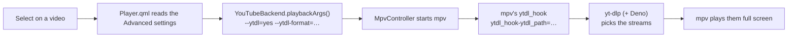

# YouTube

YouTube without the YouTube app. Your subscriptions come from each channel's RSS feed, your playlists and YouTube's search through yt-dlp, and every video plays full screen in mpv, which asks yt-dlp for the streams. No account is needed; you can sign in with one if YouTube starts asking for proof that you are not a bot. This page covers what the module needs, how to add channels and playlists, browsing and playing, every Advanced setting and the format string it gives yt-dlp, signing in, and what to do when YouTube gets in the way.

<table>
<tr><th width="50%">YouTube</th><th width="50%">Subscriptions</th></tr>
<tr><td></td><td></td></tr>
<tr><td>Recently Watched, Favorites, Search, Subscriptions, Channels, Playlists and Watch Later. The entry under the cursor branches out to its first few videos.</td><td>The latest videos from your channels, newest first. ► on a video opens its info screen.</td></tr>
</table>

<table>
<tr><th width="50%">A video's info screen</th><th width="50%">The video's menu</th></tr>
<tr><td></td><td></td></tr>
<tr><td>Channel, date, length, views and the description. Select plays the video; ► offers its options.</td><td>Back during a video opens its menu (Local Files' is shown here; YouTube's lists its Advanced settings, then Favorites, Play at Startup, Watch Later, Browse YouTube and Close Video).</td></tr>
</table>

## What it needs

| Piece | What it does | Where it comes from |
|---|---|---|
| **mpv** | Plays the video. Its `ytdl_hook` script hands the watch URL to yt-dlp and plays the streams yt-dlp picks. | Installed with OSD/OS (the image, `install.sh`, the AppImage); `brew install mpv` on a Mac. |
| **yt-dlp** | Finds a video's streams when it plays, searches YouTube, lists your playlists and fills in the info screens. It has to be recent: YouTube changes often, and a yt-dlp a few weeks old soon stops finding videos. | The image has it and keeps it up to date. Elsewhere you install it (below). |
| **Deno** | The JavaScript runtime yt-dlp uses to answer YouTube's challenges ([yt-dlp's EJS notes](https://github.com/yt-dlp/yt-dlp/wiki/EJS)). Without one, yt-dlp warns `No supported JavaScript runtime could be found` and a video plays in few formats or none. | The image has it. Elsewhere you install it. |
| A network connection | Feeds, search and streams. | |
| Chromium (Google Chrome on a Mac) | Only for **Sign in**. Without a desktop, also `cage` and `wtype`. | The image has them. See [Signing in](https://github.com/mehmetraif/OSD-OS/wiki/YouTube#signing-in). |
| ffmpeg | Only for the [Playlists](https://github.com/mehmetraif/OSD-OS/wiki/Playlists) module's offline lists: it puts a downloaded video's picture and sound back together above 360p. | The image has it. |

The Subscriptions feed and the Channels folders need neither yt-dlp nor Deno to list videos (they are RSS), but playing any video does.

### On the OSD/OS image

Nothing to install. The image comes with:

- **yt-dlp's nightly build** in the data folder, at `/home/pi/.local/share/OSD-OS/bin/yt-dlp`, where OSD/OS looks first. The nightly channel is the one yt-dlp's own README recommends for regular use.
- **`osdos-yt-dlp-update.timer`**, which runs `yt-dlp --update` two minutes after each boot and then once a day. It waits up to five minutes for a connection (`nm-online`) and skips the run without one, and runs at the lowest priority, out of the way of a film. A check is one small request to GitHub.
- **Deno** in `/usr/local/bin/deno` (its licence in `/usr/local/share/doc/deno/LICENSE.md`).
- `python3-pycryptodome`, `python3-requests` and `python3-brotli`, which make yt-dlp faster on a Pi (pycryptodome decrypts the sign-in's cookies far faster than yt-dlp's own code), and `ffmpeg`.

To see when it last updated, or to update now, over SSH:

```sh
systemctl list-timers osdos-yt-dlp-update.timer
journalctl -u osdos-yt-dlp-update.service
sudo systemctl start osdos-yt-dlp-update.service
```

An image built with `OSDOS_YOUTUBE=0` ([The OSD/OS image](https://github.com/mehmetraif/OSD-OS/wiki/The-OSD-OS-Image)) leaves yt-dlp, Deno and ffmpeg out, and the module then says yt-dlp is missing.

### On Raspberry Pi OS, SteamOS and macOS

The version of yt-dlp Raspberry Pi OS packages is too old, so take the latest from yt-dlp's GitHub. Either put it on the `PATH` for everyone:

```sh
sudo wget https://github.com/yt-dlp/yt-dlp/releases/latest/download/yt-dlp -O /usr/local/bin/yt-dlp
sudo chmod a+rx /usr/local/bin/yt-dlp
```

or in OSD/OS's own data folder, where only OSD/OS uses it and where it can update itself with `yt-dlp -U` without `sudo`. This is the way on SteamOS, whose system folders are read-only:

```sh
mkdir -p ~/.local/share/OSD-OS/bin
curl -fL https://github.com/yt-dlp/yt-dlp/releases/latest/download/yt-dlp -o ~/.local/share/OSD-OS/bin/yt-dlp
chmod +x ~/.local/share/OSD-OS/bin/yt-dlp
```

Deno has to be on the `PATH` of the user (or the systemd service) that runs OSD/OS. On a 64-bit Raspberry Pi, the same build the image installs:

```sh
curl -fL -o /tmp/deno.zip https://github.com/denoland/deno/releases/latest/download/deno-aarch64-unknown-linux-gnu.zip
sudo python3 -m zipfile -e /tmp/deno.zip /usr/local/bin/
sudo chmod 755 /usr/local/bin/deno
```

On a Mac, `brew install yt-dlp deno`. Other systems: see [yt-dlp's EJS guide](https://github.com/yt-dlp/yt-dlp/wiki/EJS) for the runtimes it supports.

### How OSD/OS finds yt-dlp

yt-dlp is deliberately not bundled with OSD/OS: it has to be updated far more often than OSD/OS is released. `YtDlpLocator` ([src/util/YtDlpLocator.cpp](https://github.com/mehmetraif/OSD-OS/blob/main/src/util/YtDlpLocator.cpp)) picks one copy, the first of:

1. `bin/yt-dlp` in the data folder, if it is executable (`~/.local/share/OSD-OS/bin/yt-dlp` on Linux and the image, `~/Library/Application Support/OSD-OS/bin/yt-dlp` on a Mac, or `$DATA_ROOT/bin/yt-dlp` when the `DATA_ROOT` environment variable sets the data folder);
2. `yt-dlp` beside the `osdos` program itself (none is shipped there today);
3. `yt-dlp` on the `PATH`. On a Mac, OSD/OS adds `/opt/homebrew/bin` and `/usr/local/bin` to its `PATH` first, so Homebrew's copy is found even when the app is opened from Finder.

That one copy serves everything: the module's own runs (search, playlists, info screens) and mpv's `ytdl_hook`, which is pointed at it with `--script-opts=ytdl_hook-ytdl_path=<path>` on every YouTube playback. So updating that one file updates YouTube everywhere in OSD/OS.



## Turning it on

Settings → **YouTube** (in the Modules section) → **Enabled**: On. YouTube then appears on the main menu. With nothing else set up, its tree holds Recently Watched, Favorites and Search; Subscriptions, Channels and Playlists appear once you list channels and playlists in the two files below, and Watch Later once something is saved to it.

## Channels and subscriptions

There is no account behind your subscriptions. You list the channels you follow, one per line, in a text file in the data folder:

| System | File |
|---|---|
| OSD/OS image, Raspberry Pi OS, SteamOS | `~/.local/share/OSD-OS/youtube_subscriptions.txt` |
| macOS | `~/Library/Application Support/OSD-OS/youtube_subscriptions.txt` |

The rules:

- One channel per line: its **channel ID** (24 characters, starting `UC`), or a URL with `/channel/<ID>` in it, from which the ID is taken.
- `#` starts a comment, but only at the start of a line: a comment after an ID on the same line becomes part of the ID and breaks it.
- Blank lines are ignored, and a channel listed twice counts once.
- Handle URLs (`https://www.youtube.com/@name`) are **not** understood. Use the ID.

To find a channel's ID, on YouTube's website open the channel, its **more** link under the name, then **Share channel** → **Copy channel ID**. Or ask yt-dlp, with the channel's handle URL (on the image, use the full path `~/.local/share/OSD-OS/bin/yt-dlp`):

```sh
yt-dlp --flat-playlist -I 1 --print playlist_channel_id "https://www.youtube.com/@TechnologyConnections"
```

which prints `UCy0tKL1T7wFoYcxCe0xjN6Q`.

An example, written over SSH:

```sh
cat > ~/.local/share/OSD-OS/youtube_subscriptions.txt <<'EOF'
# Technology Connections
UCy0tKL1T7wFoYcxCe0xjN6Q
# The 8-Bit Guy, pasted as a URL
https://www.youtube.com/channel/UC8uT9cgJorJPWu7ITLGo9Ww
# NASA
UCLA_DiR1FfKNvjuUpBHmylQ
EOF
```

How OSD/OS uses it:

- The file is read again each time the tree asks for it, so an edit shows the next time you open YouTube. No restart is needed.
- Each channel's official feed (`https://www.youtube.com/feeds/videos.xml?channel_id=<ID>`) gives its 15 or so newest videos, with their titles, dates and descriptions. No yt-dlp is involved.
- **Subscriptions** is every channel's videos merged, newest first, at most 100.
- **Channels** has a folder per channel, named after the channel and sorted by name; each holds that channel's newest videos. A channel whose feed failed still shows, under its ID.
- What was fetched is kept for 15 minutes, so moving between Subscriptions and Channels doesn't fetch again. A feed that fails keeps whatever it had before.

## Playlists

Playlists are listed the same way, in `youtube_playlists.txt` in the data folder:

- One playlist per line: a URL with `list=<ID>` in it (a playlist link, or a watch link from inside a playlist), or the bare playlist ID. A URL without `list=` is ignored.
- Optionally a name first, then `|`: `My Name | <URL or ID>`. Without one, the folder is named as yt-dlp reports the playlist's title, or by its ID until then.
- `#` comments at the start of a line only, as above. A playlist listed twice counts once.
- The folders keep the file's order.

```text
# Named here
Television, by Technology Connections | https://www.youtube.com/playlist?list=PLv0jwu7G_DFUGEfwEl0uWduXGcRbT7Ran
# A watch link from inside a playlist: its list= is used
https://www.youtube.com/watch?v=Eg8tK1LpLS8&list=PLv0jwu7G_DFUoByWSHHoSTlUIxY7VkJLi
# A bare ID: named as YouTube names it (James Webb Space Telescope, from NASA)
PL2aBZuCeDwlQTMjNAeDU5wVqqm4KPECIT
```

A playlist's feed stops at 15 videos, so its contents come from yt-dlp instead: `yt-dlp --flat-playlist -I 1:500 --print …` on `https://www.youtube.com/playlist?list=<ID>`. Up to 500 videos are listed (endless Mix and Radio lists are cut there), private and deleted videos are left out, and a fetch that takes more than a minute is given up. The videos are fetched when you open a playlist (every listed playlist then, two at a time), not for the branch that previews one, because yt-dlp is slow on a Pi. They are kept for 15 minutes, like the feeds.

## Browsing

### The tree

YouTube is browsed in the same tree as Local Files ([Using OSD/OS](https://github.com/mehmetraif/OSD-OS/wiki/Using-OSD-OS)): the open folders along a line through the middle, the entry under the cursor branching out to its first few items.

| Entry | What it holds | Shown when | Kept in |
|---|---|---|---|
| **Recently Watched** | Videos you played, newest first, at most 100. Finished ones stay listed. | Always | `youtube_history.json` |
| **Favorites** | Videos you added from their options, newest first, at most 100. | Always | `lists.json` (`com.osdos.youtube` → `favorites`) |
| **Search** | YouTube's search, on the on-screen keyboard. | Always | Not kept |
| **Subscriptions** | Your channels' newest videos, merged. | `youtube_subscriptions.txt` lists a channel | Fetched |
| **Channels** | A folder per channel. | As above | Fetched |
| **Playlists** | A folder per playlist. | `youtube_playlists.txt` lists a playlist | Fetched |
| **Watch Later** | Videos you saved from their options, newest saved first. | It holds something | `youtube_watch_later.json` |

| Action | Keyboard | Gamepad | In the tree |
|---|---|---|---|
| Move | ▲ ▼ | D-pad, left stick | Up and down the folder |
| Open | ► or Enter | D-pad right, A | Opens a folder |
| Up a level | ◄ | D-pad left | Back to the parent folder |
| Info / options | ► on a video | D-pad right | Opens its info screen, or its options with Settings → Info Screen off |
| Play | Enter on a video | A | Plays it |
| Back | Esc (or Backspace) | B | Up a level; at the top, back to the main menu |

### Search

Select **Search**, type on the on-screen keyboard and choose OK. The results are a folder, `Search: <words>`, holding YouTube's first 20 matches, with **More…** at the end for the next 20, until YouTube has no more. Each page is one yt-dlp run:

```sh
yt-dlp --flat-playlist --no-warnings -I 1:20 --print "%(.{id,title,channel,uploader,url,live_status})j" -- "ytsearch20:technology connections"
```

(`-I 21:40` and `ytsearch40:` for the second page, and so on.) Announced live streams that haven't started are left out: there is nothing to play yet. A search stays in the tree while you browse, so coming back from a video returns to it.

### Info screens

A video's info screen shows the PLAY box, its title, the channel and date, the description, then CHANNEL, DATE, LENGTH and VIEWS as menu lines. It opens with ► on a video, or by itself once the cursor has rested on one, as **Settings → Info Screen** says: after 1, 2, 3 (the default) or 5 seconds, **Key** for ► only, or **Off**, where ► offers the video's options instead.

What the list already knows (from the feed: title, channel, date and description) shows at once. yt-dlp then adds the length, the view count and the whole description, which takes a few seconds on a Pi (`yt-dlp --skip-download --no-playlist --print …`). One video is looked up at a time; while one runs, only the last video you rested on is queued. Each video is looked up once per run.

On the info screen, select plays, ▲ ▼ close it and move on through the list, ◄ or back close it, and ► offers the options.

### Options

► on a video's info screen (or on the video, with the info screen off) offers:

- **Add to Favorites** / **Remove from Favorites**
- **Play at Startup** / **Don't Play at Startup**: OSD/OS plays this video straight after the boot screen, instead of opening a module. It goes on Favorites too. Settings → Play at Startup turns it off, and Settings → Startup From says whether it resumes or starts from the beginning.
- **Add to Playlist**, when the [Playlists](https://github.com/mehmetraif/OSD-OS/wiki/Playlists) module is on.
- **Save to Watch Later** / **Remove from Watch Later**

### Shorts

**Display Shorts** (Advanced, on by default) off leaves Shorts out of every folder. A Short is known in a channel feed by its `/shorts/` link and in search results by its URL. Playlist entries can't be told apart, so they always show, and so do Recently Watched and Watch Later, which keep no such mark. A favourite keeps the mark it had when you added it. The same setting applies when you add YouTube videos in the Playlists module.

## Playing

Select on a video, and OSD/OS shows the loading screen (a tape loading) while mpv starts and yt-dlp finds the streams, then mpv plays full screen. During playback the deck's controls apply ([Playback and mpv](https://github.com/mehmetraif/OSD-OS/wiki/Playback-and-mpv)): ▲ or ▼ opens the deck's menu (the position bar, audio and subtitle tracks, crop and stop), and back opens the video's menu.

### Resume

When you stop a video more than 5 seconds in, OSD/OS keeps where you were. One you watched to 95% or more counts as finished: it stays in Recently Watched but starts from the beginning next time.

- **Resume Playback: Ask** (the default): a video you stopped part way asks **Resume from 12:34** or **Start from the beginning**.
- **Resume Playback: Always**: it carries on without asking.
- A video still playing behind the menus (Transparent Background) carries on where it is, without asking.

Where you stopped is kept in `youtube_history.json`, so **Delete Recently Watched** forgets it too.

### The video's menu

Back during a video opens its menu:

1. The Advanced settings that matter while it plays: Playback Resolution, Video Codec, Max Frame Rate, Scaling, Audio Language, Subtitles, Subtitle Language and Playback Speed. ◄ ► change one, and save it as in Settings.
2. **Add to Favorites** / **Remove from Favorites**, **Play at Startup** / **Don't Play at Startup**, **Save to Watch Later** / **Remove from Watch Later**.
3. **Browse YouTube**: back to the tree.
4. **Close Video**: to the main menu.

Back in the menu returns to the video.

- **With Transparent Background** (Settings), the menu lies over the picture, which plays on. Playback Speed and Scaling change at once; the others (resolution, codec, frame rate, audio and subtitles) reload the video where it is when you go back to it. **Browse YouTube** leaves it playing behind the menus, and the main menu's first row takes it back to full screen.
- **Without it**, mpv has the screen, so the video stops for the menu, and starts again where it was, with the settings as you left them, when you go back to it. **Browse YouTube** leaves it stopped there, and the main menu's first row, or the same video in the tree, starts it again where it was, without asking.

If mpv fails before the video starts (yt-dlp missing, out of date, or YouTube refusing), OSD/OS shows **Playback failed: Please check that yt-dlp is installed and up to date**. Select retries; back returns to the tree.

## The Advanced settings, and what yt-dlp is asked for

Settings → YouTube → **Advanced** holds everything about how a video plays. They are saved like any setting (under `modules.com.osdos.youtube`, not in a sub-object) and read each time a video starts.

| Setting | Values | Default | What it does | Config key |
|---|---|---|---|---|
| Playback Resolution | 240p, 360p, 480p, 720p, 1080p, 1440p, 2160p | 480p | The most a video plays at: `[height<=?N]` in the format. A video without that much plays at what it has. 480p suits a CRT and a Pi. 1440p and 2160p need Video Codec **Any**: YouTube has H.264 only up to 1080p. | `modules.com.osdos.youtube.playback_resolution` |
| Video Codec | H.264, Any | H.264 | **H.264** tries `[vcodec^=avc1]` first, which a Pi decodes in hardware, and falls back to any codec. **Any** takes what yt-dlp ranks best, often VP9 or AV1, decoded in software. | `modules.com.osdos.youtube.video_codec` |
| Max Frame Rate | Any, 30 | Any | **30** adds `[fps<=?30]`: 30 fps where a video also has 60, lighter on a Pi. | `modules.com.osdos.youtube.max_frame_rate` |
| Scaling | Default, Letterbox, 14:9, Pan & Scan, Anamorphic | Default | How a 16:9 picture fills a 4:3 screen in this module. **Default** follows Settings → Scaling. | `modules.com.osdos.youtube.video_scaling` |
| Audio Language | Original, English, Spanish, French, German, Italian, Portuguese, Dutch, Polish, Russian, Turkish, Arabic, Hindi, Indonesian, Japanese, Korean, Chinese | Original | The audio track of a video dubbed in several: `bestaudio[language^=xx]` first, then the original. **Original** is the one it was made in. | `modules.com.osdos.youtube.audio_language` (`original`, `en`, `es`, `fr`, `de`, `it`, `pt`, `nl`, `pl`, `ru`, `tr`, `ar`, `hi`, `id`, `ja`, `ko`, `zh`) |
| Subtitles | Off, On, With Auto | Off | **On**: the video's subtitles in Subtitle Language, where it has them. **With Auto**: YouTube's automatic captions too. | `modules.com.osdos.youtube.subtitles` |
| Subtitle Language | English … Chinese (the same 16) | English | The language Subtitles fetches and shows. | `modules.com.osdos.youtube.subtitle_language` (`en` …) |
| Playback Speed | 0.75x, 1x, 1.25x, 1.5x, 1.75x, 2x | 1x | `--speed`. | `modules.com.osdos.youtube.playback_speed` |
| Resume Playback | Ask, Always | Ask | See [Resume](https://github.com/mehmetraif/OSD-OS/wiki/YouTube#resume). | `modules.com.osdos.youtube.resume_playback` |
| Display Shorts | On, Off | On | See [Shorts](https://github.com/mehmetraif/OSD-OS/wiki/YouTube#shorts). | `modules.com.osdos.youtube.display_shorts` (`true`/`false`) |

A language code also takes its regional variants: `pt` matches `pt-BR`, both in `language^=pt` and in `sub-langs=pt.*`.

### The format string

`YouTubeBackend::ytdlFormat()` ([src/modules/youtube/YouTubeBackend.cpp](https://github.com/mehmetraif/OSD-OS/blob/main/src/modules/youtube/YouTubeBackend.cpp)) builds a list of choices, separated by `/`, which yt-dlp tries in order until one exists:

1. The cap: `[height<=?N]`, plus `[fps<=?30]` with Max Frame Rate 30. The `?` lets a format that doesn't state its height or rate through.
2. The video choices: with H.264, `bestvideo<cap>[vcodec^=avc1]`, then `bestvideo<cap>`; with Any, only `bestvideo<cap>`.
3. The audio choices: with a language, `bestaudio[language^=xx]`, then `bestaudio`; with Original, only `bestaudio` (yt-dlp ranks the original track first).
4. Every audio choice with every video choice, the audio outer: a dub in VP9 comes before the original in H.264.
5. Last, `best<cap>` (a single file with both) and plain `best`.

The default (480p, H.264, Any, Original):

```text
bestvideo[height<=?480][vcodec^=avc1]+bestaudio/bestvideo[height<=?480]+bestaudio/best[height<=?480]/best
```

720p, Any, 30, Spanish:

```text
bestvideo[height<=?720][fps<=?30]+bestaudio[language^=es]/bestvideo[height<=?720][fps<=?30]+bestaudio/best[height<=?720][fps<=?30]/best
```

1080p, H.264, 30, German:

```text
bestvideo[height<=?1080][fps<=?30][vcodec^=avc1]+bestaudio[language^=de]/bestvideo[height<=?1080][fps<=?30]+bestaudio[language^=de]/bestvideo[height<=?1080][fps<=?30][vcodec^=avc1]+bestaudio/bestvideo[height<=?1080][fps<=?30]+bestaudio/best[height<=?1080][fps<=?30]/best
```

### What mpv is given

Besides OSD/OS's usual options, a YouTube video adds (`playbackArgs()` and `Player.qml`):

| Option | When |
|---|---|
| `--ytdl=yes` | Always. OSD/OS turns the hook off (`--ytdl=no`) for any playback that doesn't ask for it, since it gets in the way of media servers' streams. |
| `--ytdl-format=<format>` | Always: the string above. |
| `--script-opts=…,ytdl_hook-ytdl_path=<path>` | Always, with the yt-dlp [found above](https://github.com/mehmetraif/OSD-OS/wiki/YouTube#how-osdos-finds-yt-dlp) (unless its path holds a comma). |
| `--ytdl-raw-options=write-subs=,sub-langs=<code>.*` | Subtitles On or With Auto. |
| `…,write-auto-subs=` | Subtitles With Auto. |
| `…,cookies-from-browser=%<bytes>%<browser>:<profile>` | Once you have signed in. |
| `--subs-with-matching-audio=yes --subs-fallback=yes --sid=auto --slang=<code>` | Subtitles On or With Auto. |
| `--sid=no` | Subtitles Off. |
| `--speed=<n>` | Playback Speed other than 1x. |

yt-dlp's own options all go in one `--ytdl-raw-options` list, because a second one would replace the first. The profile path goes in mpv's length-prefixed quoting (`%63%…`), since a path may hold a comma. For example, 720p, Any, 30, Spanish, Subtitles On in English, 1.25x and signed in, on the image:

```text
--subs-with-matching-audio=yes --subs-fallback=yes --sid=auto
--slang=en
--script-opts=…,ytdl_hook-ytdl_path=/home/pi/.local/share/OSD-OS/bin/yt-dlp
--ytdl=yes
--ytdl-format=bestvideo[height<=?720][fps<=?30]+bestaudio[language^=es]/bestvideo[height<=?720][fps<=?30]+bestaudio/best[height<=?720][fps<=?30]/best
--ytdl-raw-options=write-subs=,sub-langs=en.*,cookies-from-browser=%63%chromium+basictext:/home/pi/.local/share/OSD-OS/youtube/browser
--speed=1.25
```

The Playlists module downloads a YouTube video for an offline list with the same format and the same account (`-f <format> --merge-output-format mp4`). Without ffmpeg it takes the best single file instead: `best[height<=?N][vcodec^=avc1]/best[height<=?N]/best`.

## Signing in

An account is optional. Signed in, yt-dlp searches and plays as that account, which YouTube asks for fewer bot checks, and age-restricted videos play.

> [!WARNING]
> YouTube can block an account used through yt-dlp, as [yt-dlp's wiki](https://github.com/yt-dlp/yt-dlp/wiki/Extractors#youtube) warns. Sign in with a spare account, not the one you care about.

1. Settings → YouTube → **Sign in**. A screen says **Sign in to YouTube**, how to come back, and to use a spare account.
2. Have a keyboard ready, and press select. Google's sign-in page opens full screen in Chromium.
3. Sign in with the keyboard.
4. Come back by holding back (Esc, or B on a gamepad) for two seconds, or with `Ctrl+W`.

What happens underneath:

- The page opens in the same web player the [Netflix and Prime Video](https://github.com/mehmetraif/OSD-OS/wiki/Netflix-and-Prime-Video) modules use (`scripts/web-player.sh`), in a browser profile of YouTube's own: `youtube/browser` in the data folder. Your sign-in lives there, as in any browser.
- From then on, every yt-dlp run in the module and in mpv gets `--cookies-from-browser chromium+basictext:<data folder>/youtube/browser` (`chrome:<profile>` on a Mac). `basictext` because the web player runs Chromium with `--password-store=basic`. yt-dlp reads the profile afresh each time, so there is no exported cookie file to go stale when YouTube rotates the cookies. This starts as soon as the profile has a cookie store.
- Chromium writes new cookies to disk only every half minute or so, and a browser stopped outright loses what it hasn't written. Holding back therefore closes it the way `Ctrl+W` does (by typing `Ctrl+W` into it with `wtype`), so it saves first. Without `wtype`, close it with `Ctrl+W` on the keyboard, or wait half a minute after signing in before holding back.
- It needs Chromium (`chromium`, `chromium-browser`, `google-chrome-stable` or `google-chrome`), with `cage` and `wtype` when there is no desktop: `sudo apt install chromium cage wtype` on Raspberry Pi OS (Widevine isn't needed for this). On a Mac it needs **Google Chrome** in `/Applications`: the web player's Safari fallback keeps its sign-in where yt-dlp can't read it, so without Chrome the screen says **Google Chrome is not installed**.

**Sign out** (Settings → YouTube) deletes the profile, and with it the sign-in. It does nothing while the browser is open.

## Settings

Settings → **YouTube**:

| Setting | Values | Default | What it does | Config key |
|---|---|---|---|---|
| Enabled | On, Off | Off | Shows YouTube on the main menu. | `modules.com.osdos.youtube.enabled` |
| Advanced | Opens a submenu | | [The Advanced settings](https://github.com/mehmetraif/OSD-OS/wiki/YouTube#the-advanced-settings-and-what-yt-dlp-is-asked-for). | |
| Delete Watch Later | Select | | Deletes `youtube_watch_later.json` at once. | |
| Delete Recently Watched | Select | | Deletes `youtube_history.json` at once: Recently Watched, and every resume point. | |
| Sign in | Select | | Opens Google's sign-in page full screen. See [Signing in](https://github.com/mehmetraif/OSD-OS/wiki/YouTube#signing-in). | (the profile `youtube/browser`) |
| Sign out | Select | | Deletes the sign-in's browser profile. | |

App settings that act on YouTube: **Info Screen** (`app.info_screen`: `off`, `key`, `1`, `2`, `3`, `5`), **Play at Startup** (`app.startup_favorite`), **Startup From** (`app.startup_from`), **Scaling** (`app.video_scaling`) and **Transparent Background** ([Settings](https://github.com/mehmetraif/OSD-OS/wiki/Settings)).

## Files and config keys

Everything lives in the data folder (`~/.local/share/OSD-OS/` on Linux and the image, `~/Library/Application Support/OSD-OS/` on a Mac, or `$DATA_ROOT`):

| File | What it is | Written by |
|---|---|---|
| `youtube_subscriptions.txt` | Your channels | You |
| `youtube_playlists.txt` | Your playlists | You |
| `youtube_history.json` | Recently Watched and resume points: `{ "<videoId>": { "pos": <ms>, "title", "channelName", "lastPlayed": <epoch ms> } }`, the 100 most recently played | OSD/OS |
| `youtube_watch_later.json` | Watch Later: `[ { "videoId", "title", "channelName", "addedMs" } ]`, newest first | OSD/OS |
| `lists.json` | Favorites, under `"com.osdos.youtube"` → `"favorites"` | OSD/OS |
| `youtube/browser/` | The sign-in's Chromium profile | The browser |
| `bin/yt-dlp` | The yt-dlp OSD/OS uses first, if present | You, or the image |

A `config.json` fragment with every key the module reads (change them in Settings; edit the file only while OSD/OS is closed):

```json
{
    "app": {
        "info_screen": "3"
    },
    "modules": {
        "com.osdos.youtube": {
            "enabled": true,
            "playback_resolution": "720p",
            "video_codec": "H.264",
            "max_frame_rate": "30",
            "video_scaling": "Default",
            "audio_language": "original",
            "subtitles": "On",
            "subtitle_language": "en",
            "playback_speed": "1x",
            "resume_playback": "Ask",
            "display_shorts": false
        }
    }
}
```

## Troubleshooting

The tree's help line says what stands in the way, when anything does.

**Searching needs yt-dlp, which is not installed.** No yt-dlp was found in any of [the places OSD/OS looks](https://github.com/mehmetraif/OSD-OS/wiki/YouTube#how-osdos-finds-yt-dlp). Install it, then open YouTube again.

**Could not search YouTube: check the network, and that yt-dlp is up to date.** yt-dlp ran and failed. Check the connection, then update yt-dlp. On the image: `sudo systemctl start osdos-yt-dlp-update.service`. Elsewhere: `yt-dlp -U` on the copy OSD/OS uses (or `brew upgrade yt-dlp` on a Mac). A [Scripts](https://github.com/mehmetraif/OSD-OS/wiki/Scripts#1-update-yt-dlp-console) console script can do it from the remote.

**Could not load the subscriptions: check the network.** No channel's feed could be fetched. Each is a plain HTTPS request to YouTube.

**Could not load the playlists: check the network, and that yt-dlp is installed.** As for search.

**Playback failed: Please check that yt-dlp is installed and up to date.** mpv ended before the video started. To see why, run yt-dlp by hand with the format OSD/OS uses (on the image, `~/.local/share/OSD-OS/bin/yt-dlp`):

```sh
yt-dlp --verbose --simulate -f 'bestvideo[height<=?480][vcodec^=avc1]+bestaudio/bestvideo[height<=?480]+bestaudio/best[height<=?480]/best' 'https://www.youtube.com/watch?v=Eg8tK1LpLS8'
```

and read mpv's log, `/tmp/osdos-mpv.log` on Linux and the image (the system's temporary folder on a Mac).

**`No supported JavaScript runtime could be found`** in yt-dlp's output: Deno is missing, or not on the `PATH` of the user or service running OSD/OS. Install it as [above](https://github.com/mehmetraif/OSD-OS/wiki/YouTube#on-raspberry-pi-os-steamos-and-macos).

**`Sign in to confirm you're not a bot`.** YouTube is asking the connection for proof. [Sign in](https://github.com/mehmetraif/OSD-OS/wiki/YouTube#signing-in) with a spare account. If yt-dlp is current and Deno is found but it still happens, the cause can be the route: on a system that already has working IPv6, compare the two (a diagnostic only; OSD/OS never turns IPv6 on for you):

```sh
yt-dlp --verbose --simulate --force-ipv4 'https://www.youtube.com/watch?v=Eg8tK1LpLS8'
yt-dlp --verbose --simulate --force-ipv6 'https://www.youtube.com/watch?v=Eg8tK1LpLS8'
```

If IPv4 gets the bot check and IPv6 doesn't, the problem is tied to the IPv4 route, not to yt-dlp.

**An age-restricted video won't play.** It needs an account: [sign in](https://github.com/mehmetraif/OSD-OS/wiki/YouTube#signing-in).

**Subscriptions and Channels don't appear.** Check the file's name and place (`youtube_subscriptions.txt` in the data folder, not `.txt.txt`), and that it has a line that is neither blank nor a comment.

**A channel shows as its ID, with no videos.** Its feed couldn't be fetched: a wrong ID, a comment on the same line as the ID, a handle URL (`/@name`, which is not understood), or a channel that has gone.

**1440p or 2160p plays at 1080p or less.** Set Video Codec to Any. YouTube has H.264 only up to 1080p.

**Stutter on a Pi.** Keep Playback Resolution at 480p (or 720p), Video Codec at H.264, and set Max Frame Rate to 30.

**Signed out again after signing in.** The browser was stopped before it saved the cookies. Install `wtype` (`sudo apt install wtype`), or close the browser with `Ctrl+W`, or wait half a minute before holding back.

More in [Troubleshooting](https://github.com/mehmetraif/OSD-OS/wiki/Troubleshooting).

## See also

- [Netflix and Prime Video](https://github.com/mehmetraif/OSD-OS/wiki/Netflix-and-Prime-Video): the web player YouTube's sign-in uses
- [Playlists](https://github.com/mehmetraif/OSD-OS/wiki/Playlists): YouTube videos on your own lists, online or downloaded
- [NFC Reader](https://github.com/mehmetraif/OSD-OS/wiki/NFC-Reader): a card that plays a YouTube video
- [Scripts](https://github.com/mehmetraif/OSD-OS/wiki/Scripts): updating yt-dlp from the remote
- [Playback and mpv](https://github.com/mehmetraif/OSD-OS/wiki/Playback-and-mpv): the deck's menu, Scaling, subtitles
- [Using OSD/OS](https://github.com/mehmetraif/OSD-OS/wiki/Using-OSD-OS): the tree, the keyboard, info screens and options
- [Configuration files](https://github.com/mehmetraif/OSD-OS/wiki/Configuration-Files): the data folder and `config.json`
- [Settings](https://github.com/mehmetraif/OSD-OS/wiki/Settings)
